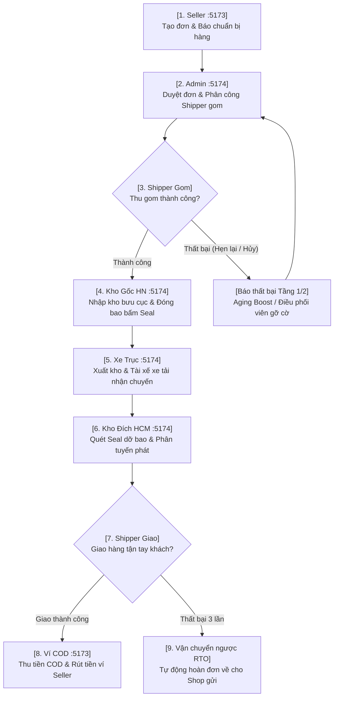

# 🧭 HƯỚNG DẪN KIỂM THỬ TOÀN TRÌNH TRÊN GIAO DIỆN WEB (WEB UI E2E TEST GUIDE)

> **Mục đích:** Tài liệu hướng dẫn chi tiết từng bước (Step-by-Step) cho Tester / Giảng viên / Đánh giá viên thực hiện kiểm thử toàn bộ vòng đời vận đơn trên giao diện Web thực tế bằng chuột và bàn phím, cô đọng thành **4 kịch bản thực tế điển hình** (từ Happy Path đến Sự cố & Hoàn hàng).

---

## 📌 1. BẢNG THÔNG TIN MÔI TRƯỜNG & TÀI KHOẢN ĐĂNG NHẬP

| Cổng Dịch Vụ | Địa Chỉ URL | Đối Tượng Sử Dụng |
| :--- | :--- | :--- |
| **Cổng Khách Hàng / Seller** | `http://localhost:5173` | Chủ shop tạo đơn, quản lý đơn hàng, ví COD, khiếu nại |
| **Cổng Điều Hành / Admin / Kho / Shipper** | `http://localhost:5174` | Điều phối viên, Thủ kho, Tài xế gom/giao (giao diện PWA) |
| **Cổng Backend API** | `http://localhost:5000` | Máy chủ xử lý ngầm |

### Danh sách tài khoản kiểm thử (Mật khẩu chung cho tất cả: `Password123@`)

| Vai Trò | Email Đăng Nhập | Cổng Truy Cập | Mục Đích Kiểm Thử |
| :--- | :--- | :--- | :--- |
| **Chủ Shop (Seller)** | `seller.demo@elogistic.vn` | `:5173` | Tạo đơn lẻ/Excel, chuẩn bị hàng, rút ví COD, mở ticket |
| **Điều Phối Viên / Admin** | `admin.demo@elogistic.vn` | `:5174` | Duyệt đơn hàng, phân tài xế gom, xử lý đơn leo thang |
| **Shipper Gom (First-Mile)** | `shipper.pickup@elogistic.vn` | `:5174` | Nhận đơn gom, báo thất bại phân tầng, xác nhận lấy hàng |
| **Thủ Kho Hà Nội (Origin Hub)** | `staff.hub.hn@elogistic.vn` | `:5174` | Nhập kho gốc, đóng bao tải (Bagging), bấm Seal, tạo chuyến xe |
| **Tài Xế Xe Trục (Linehaul)** | `driver.linehaul@elogistic.vn` | `:5174` | Nhận bàn giao chuyến xe đường trục Hà Nội - TP.HCM |
| **Thủ Kho TP.HCM (Dest Hub)** | `staff.hub.hcm@elogistic.vn` | `:5174` | Quét Seal dỡ bao hàng loạt, nhập kho đích |
| **Shipper Giao (Last-Mile)** | `shipper.delivery@elogistic.vn` | `:5174` | Phát hàng tận tay khách, ký nhận POD, báo giao thất bại |

> [!TIP]
> **Mẹo kiểm thử mượt mà:**
> - Mở **2 cửa sổ trình duyệt riêng biệt** (hoặc 1 cửa sổ Thường cho `:5173` và 1 cửa sổ Ẩn danh Incognito cho `:5174`) để không bị xung đột phiên đăng nhập (Cookie/Token).
> - Khi đăng nhập tài khoản Shipper trên `:5174`, bạn có thể nhấn `F12` $\rightarrow$ bật biểu tượng **Thiết bị di động (Toggle Device Toolbar - Ctrl+Shift+M)** để trải nghiệm đúng giao diện Shipper PWA trên điện thoại.

---

## 🔄 2. SƠ ĐỒ CHUỖI VẬN HÀNH VẬN ĐƠN TOÀN TRÌNH

---

## 🎯 3. BỐN KỊCH BẢN KIỂM THỬ THỰC TẾ TRÊN WEB UI

---

### 🟢 KỊCH BẢN 1: VẬN HÀNH TOÀN TRÌNH HOÀN HẢO (HAPPY PATH)
*Mục tiêu: Đơn hàng từ Hà Nội gửi vào TP.HCM đi qua đầy đủ 7 bước và giao thành công, thu tiền COD.*

#### Bước 1: Seller Tạo Đơn & Báo Chuẩn Bị Xong Hàng
1. Truy cập `http://localhost:5173/auth/login`.
2. Đăng nhập với tài khoản: `seller.demo@elogistic.vn` / `Password123@`.
3. Vào menu **Quản lý đơn hàng** $\rightarrow$ chọn **Tạo đơn hàng** (hoặc truy cập `http://localhost:5173/seller/orders/create`).
4. Nhập thông tin đơn hàng:
   - **Người gửi:** Shop Dược An Bình - Địa chỉ: `1 Tràng Tiền, Phường Tràng Tiền, Hoàn Kiếm, Hà Nội`.
   - **Người nhận:** Nguyễn Văn A - SĐT: `0912345678` - Địa chỉ: `88 Lê Duẩn, Phường Bến Nghé, Quận 1, TP Hồ Chí Minh`.
   - **Hàng hóa:** Serum Dưỡng Da (Khối lượng: `0.5` kg, Dài: `15`, Rộng: `10`, Cao: `5`).
   - **Thu hộ COD:** Tích chọn COD `200.000 đ` (Khai giá: `200.000 đ`).
5. Bấm **Tạo Đơn Hàng**. Hệ thống hiển thị thông báo thành công và cấp Mã vận đơn (ví dụ: `ELG-VN-xxxxxx`). Hãy ghi lại mã này.
6. Tại danh sách đơn hàng (`/seller/orders`), tìm đơn hàng vừa tạo $\rightarrow$ bấm nút **"Báo đã chuẩn bị xong"** (Đơn chuyển sang `PENDING_APPROVAL`).

#### Bước 2: Admin Duyệt Đơn & Phân Công Shipper Gom
1. Mở cửa sổ ẩn danh, truy cập `http://localhost:5174/login`.
2. Đăng nhập với tài khoản Admin: `admin.demo@elogistic.vn` / `Password123@`.
3. Vào menu **Đơn hàng chờ duyệt** (`http://localhost:5174/admin/orders/approval`).
4. Tìm đơn hàng vừa tạo $\rightarrow$ Tích chọn checkbox $\rightarrow$ Bấm nút **"Duyệt đơn đã chọn"** (Đơn chuyển sang `APPROVED` / `READY_TO_PICK`).
5. Chuyển sang menu **Điều phối Shipper** (`http://localhost:5174/admin/dispatch/local`).
6. Tại danh sách đơn cần gom, chọn đơn hàng và gán cho tài xế **"Shipper Gom Hà Nội"** (`shipper.pickup@elogistic.vn`).

#### Bước 3: Shipper Gom Hàng Xác Nhận Đã Lấy
1. Đăng xuất Admin và đăng nhập tài khoản Shipper gom: `shipper.pickup@elogistic.vn` / `Password123@` trên `http://localhost:5174/login`.
2. Vào màn hình **Nhiệm vụ lấy hàng** (`http://localhost:5174/shipper/pickup`).
3. Bạn sẽ thấy thẻ đơn hàng hiển thị địa chỉ Shop tại Hoàn Kiếm, Hà Nội.
4. Bấm vào nút **Quét Barcode / Xác nhận lấy hàng** $\rightarrow$ Hệ thống mô phỏng xác thực mã vận đơn và chữ ký số $\rightarrow$ Đơn hàng chuyển trạng thái **`PICKED_UP`** (Đã lấy hàng).

#### Bước 4: Kho Gốc Hà Nội Nhập Kho & Đóng Bao Niêm Phong Seal
1. Đăng xuất và đăng nhập tài khoản Thủ kho Hà Nội: `staff.hub.hn@elogistic.vn` / `Password123@`.
2. Vào menu **Nhập kho bưu cục** (`http://localhost:5174/warehouse/inbound`).
3. Nhập Mã vận đơn vào ô quét mã $\rightarrow$ Bấm **Xác nhận nhập kho**. Đơn chuyển sang `IN_HUB_ORIGIN`.
4. Vào menu **Đóng bao hàng** (`http://localhost:5174/warehouse/bagging`).
5. Bấm **Tạo bao mới** $\rightarrow$ Chọn bưu cục đích là **Bưu cục Trung tâm TP. Hồ Chí Minh (`HUB_SGN_01`)**.
6. Quét/Nhập Mã vận đơn vào bao $\rightarrow$ Bấm **Bấm Seal Niêm Phong** (Ví dụ mã seal: `SEAL-HN-HCM-01`).

#### Bước 5: Xuất Kho Chuyến Xe Đường Trục & Bàn Giao Tài Xế
1. Vẫn ở tài khoản Thủ kho Hà Nội, vào menu **Xuất kho** (`http://localhost:5174/warehouse/outbound`).
2. Bấm **Tạo chuyến xe trung chuyển** $\rightarrow$ Chọn điểm đến TP.HCM $\rightarrow$ Chọn tài xế xe tải **"Tài xế Xe Trục HN-HCM"** (`driver.linehaul@elogistic.vn`) $\rightarrow$ Thêm bao tải vừa đóng vào chuyến xe.
3. Bấm **Khóa chuyến xe & Bàn giao**.
4. Đăng xuất và đăng nhập tài khoản Tài xế xe tải: `driver.linehaul@elogistic.vn` / `Password123@`.
5. Vào menu **Chuyến xe đường trục** (`http://localhost:5174/linehaul/trips`).
6. Tìm chuyến xe vừa tạo $\rightarrow$ Bấm **Xác nhận nhận bàn giao chuyến đi**. Chuyến xe và các đơn hàng chuyển sang trạng thái **`IN_TRANSIT`** (Đang luân chuyển).

#### Bước 6: Kho Đích TP.HCM Quét Seal Dỡ Bao Hàng Loạt
1. Đăng xuất và đăng nhập tài khoản Thủ kho TP.HCM: `staff.hub.hcm@elogistic.vn` / `Password123@`.
2. Vào menu **Nhập kho** (`http://localhost:5174/warehouse/inbound`).
3. Chọn chế độ **"Quét mã Seal dỡ bao"** $\rightarrow$ Nhập mã Seal đã tạo ở Bước 4 (`SEAL-HN-HCM-01`) $\rightarrow$ Bấm **Xác nhận dỡ bao**.
4. Hệ thống thông báo dỡ bao thành công toàn bộ các kiện hàng bên trong $\rightarrow$ Đơn hàng tự động chuyển sang **`IN_HUB_DEST`** (Đã đến bưu cục phát).

#### Bước 7: Shipper Giao Hàng Theo Bảng Kê Ca Phát (Runsheet DLV) & Thu Tiền COD
1. Đăng xuất và đăng nhập tài khoản Shipper giao: `shipper.delivery@elogistic.vn` / `Password123@` (hoặc tài khoản chuyên giao `shipper.giao.shift1@elogistics.vn`).
2. Vào menu **Nhiệm vụ giao hàng** (`http://localhost:5174/shipper/delivery`).
3. **Quan sát Bảng kê ca làm việc:** Trên header hiển thị badge mã chuyến phát: `Chuyến Giao: DLV-YYYYMMDD-XXXX`, đồng thời trên mỗi thẻ đơn hàng con đều được tự động gắn mã chuyến tương ứng.
4. Bấm nút **Giao Thành Công** $\rightarrow$ Hệ thống cập nhật trạng thái đơn sang **`DELIVERED`** và thu tiền COD.
5. Chuyển sang tab **"Đã Giao Hôm Nay"** để xem danh sách các đơn đã phát thành công trong chuyến giao hiện tại.

#### Bước 8: Seller Kiểm Tra Tiền COD & Yêu Cầu Rút Tiền
1. Quay lại cửa sổ Seller `http://localhost:5173`.
2. Vào menu **Ví tiền & COD** (`http://localhost:5173/seller/wallet`).
3. Bạn sẽ thấy số dư tiền thu hộ COD vừa được cộng thêm `200.000 đ`.
4. Nhập số tiền muốn rút (ví dụ: `200.000 đ`), chọn tài khoản ngân hàng $\rightarrow$ Bấm **Yêu cầu rút tiền**. Số dư lập tức được trừ chính xác và ghi nhận lịch sử giao dịch.

---

### 🟡 KỊCH BẢN 2: XỬ LÝ SỰ CỐ CHẶNG GOM & ĐIỀU PHỐI LEO THANG
*Mục tiêu: Mô phỏng tình huống Shipper đến lấy nhưng Shop chưa chuẩn bị kịp hoặc hủy đơn, kích hoạt cơ chế Aging Boost và Điều phối viên can thiệp.*

#### Nhánh 2A: Thất Bại Tầng 1 (Shop Hẹn Ca Sau) $\rightarrow$ Tự Động Cộng Điểm Ưu Tiên (Aging Boost)
1. Đăng nhập Shipper gom (`shipper.pickup@elogistic.vn`) trên `http://localhost:5174/shipper/pickup`.
2. Trên thẻ đơn hàng cần lấy, click nút **Báo Thất Bại**.
3. Modal 2 tầng hiển thị:
   - Chọn tab **Tầng 1: Hẹn Lấy Lại**.
   - Chọn lý do: *Shop chưa chuẩn bị kịp hàng*.
   - Nhập thời gian hẹn lại và ghi chú: *"Shop hẹn 30 phút nữa mới đóng gói xong"*.
4. Bấm **Gửi Báo Cáo Thất Bại**.
5. **Quan sát kết quả:**
   - Modal đóng lại, thẻ đơn hàng biến mất khỏi danh sách ca gom hiện tại để giải phóng quota cho tài xế.
   - Hệ thống tự động ghi nhận số lần thất bại `pickupFailureCount = 1` và cắm cờ **Aging Boost (+25 điểm ưu tiên)** để đẩy đơn lên đầu hàng đợi ưu tiên gom vào ca tiếp theo.

#### Nhánh 2B: Thất Bại Tầng 2 (Shop Báo Hủy/Vi Phạm) $\rightarrow$ Leo Thang Điều Phối Viên
1. Trên một đơn hàng khác, Shipper bấm nút **Báo Thất Bại**.
2. Chọn tab **Tầng 2: Shop Hủy / Vi Phạm**.
3. Chọn lý do: *Shop báo hết hàng / yêu cầu hủy đơn*.
4. Bấm **Gửi Báo Cáo Thất Bại**.
5. Đăng nhập tài khoản Điều phối viên (`admin.demo@elogistic.vn`) trên `http://localhost:5174/admin/dispatch/local`.
6. **Quan sát kết quả:**
   - Xuất hiện **Banner Cảnh Báo Điều Phối Đỏ rực** với nhãn trạng thái `DISPATCH_ESCALATED`.
   - Điều phối viên xem thông tin giải trình của Shipper và có 2 lựa chọn:
     - **Duyệt Hủy:** Nếu xác nhận Shop thực sự hủy đơn.
     - **Lấy Lại (Retry Pickup):** Nếu đã gọi điện cho Shop và Shop sẵn sàng giao hàng. Click nút **"Lấy Lại"**, cờ cảnh báo được gỡ bỏ và đơn hàng tự động quay lại hàng đợi gom hàng với mức độ ưu tiên cao.

---

### 🔴 KỊCH BẢN 3: SỰ CỐ PHÁT HÀNG & QUY TRÌNH HOÀN HÀNG TỰ ĐỘNG (RTO)
*Mục tiêu: Shipper giao hàng 3 lần không thành công, hệ thống tự động khóa đơn và kích hoạt quy trình vận chuyển ngược trả về Shop.*

1. Đăng nhập Shipper giao (`shipper.delivery@elogistic.vn`) trên `http://localhost:5174/shipper/delivery`.
2. Chọn một đơn hàng đang đi giao, bấm nút **Báo Giao Thất Bại**:
   - **Lần 1:** Chọn nhóm lý do *Không liên lạc được (Gọi 3 cuộc không nghe máy)* $\rightarrow$ Bấm Gửi $\rightarrow$ Trạng thái đơn chuyển sang **`PENDING_REDELIVERY`** (Chờ phát lại).
   - **Lần 2:** Ngày hôm sau đi phát lại, bấm Báo thất bại $\rightarrow$ Chọn *Khách hàng hẹn ngày khác giao lại* $\rightarrow$ Ghi nhận số lần thất bại chạm mốc 2.
   - **Lần 3:** Đi phát lần 3, khách xem hàng nhưng không ưng, bấm Báo thất bại $\rightarrow$ Chọn *Khách hàng từ chối nhận hàng* kèm tải ảnh chụp đối chứng.
3. **Quan sát kết quả tự động:**
   - Hệ thống phát hiện đã chạm ngưỡng tối đa (3 lần phát thất bại).
   - Đơn hàng **TỰ ĐỘNG** chuyển trạng thái sang **`DELIVERY_FAILED_PENDING_RETURN`** và kích hoạt quy trình Hoàn Hàng **`RETURNING`** (Vận chuyển ngược).
   - Shipper không còn quyền bấm giao lại đơn này nữa.
4. Bưu cục TP.HCM lập bao tải hoàn hàng gửi ngược về Bưu cục Hà Nội.
5. Shipper Hà Nội nhận hàng hoàn và mang đến trả tận tay cho Shop gửi $\rightarrow$ Bấm xác nhận **Đã Trả Hàng Cho Shop (`RETURNED`)**.

---

### 💬 KỊCH BẢN 4: HẬU MÃI & KHIẾU NẠI DỊCH VỤ CSKH
*Mục tiêu: Shop khiếu nại về tiền COD hoặc đơn hàng móp méo, Admin/CSKH tiếp nhận và xử lý trực tiếp.*

1. Tại cổng Seller `http://localhost:5173`, vào menu **Khiếu nại / Hỗ trợ** (`/seller/tickets`).
2. Bấm **Tạo Ticket Khiếu Nại**:
   - **Chủ đề:** *"Kiểm tra đối soát tiền COD đơn hàng ELG-VN-xxxxxx"*.
   - **Phân loại:** Khiếu nại tiền COD (COD Dispute) / Hàng móp vỡ.
   - **Mức độ:** Khẩn cấp (HIGH).
   - **Nội dung:** Nhập chi tiết vấn đề cần giải quyết.
3. Bấm **Gửi yêu cầu**. Ticket được tạo với mã số định danh riêng (Ví dụ: `TCK-XXXX`).
4. Đăng nhập Admin (`admin.demo@elogistic.vn`) trên `http://localhost:5174/admin/tickets`.
5. Admin mở ticket của Shop $\rightarrow$ Nhập nội dung phản hồi: *"Bộ phận kế toán đã kiểm tra và đối soát lại tiền COD vào ví cho Shop"* $\rightarrow$ Chuyển trạng thái ticket sang **`RESOLVED`** (Đã giải quyết).
6. Seller F5 trang `/seller/tickets` sẽ thấy ngay câu trả lời của Admin và trạng thái hoàn tất.

---

## 📋 4. BẢNG TRA CỨU TRẠNG THÁI ĐƠN HÀNG TRÊN GIAO DIỆN (STATUS CHEAT SHEET)

Trong quá trình test trên Web, bạn có thể đối chiếu mã trạng thái hiển thị trên màn hình:

| Trạng Thái Trên Web | Ý Nghĩa Thực Tế | Ai Đang Nắm Giữ Trách Nhiệm? |
| :--- | :--- | :--- |
| **`CREATED`** | Đơn hàng mới tạo, chưa báo chuẩn bị | Seller |
| **`PENDING_APPROVAL`** | Shop đã chuẩn bị xong, chờ Admin duyệt | Quản lý đơn hàng (Order Manager) |
| **`READY_TO_PICK`** | Đã duyệt, đang chờ tài xế gom tiếp nhận | Điều phối viên (Dispatcher) |
| **`ASSIGNED_TO_PICKUP`**| Đã gán tài xế gom cụ thể | Shipper Gom |
| **`DISPATCH_ESCALATED`**| Đơn gom gặp sự cố nặng (Shop hủy/hàng vi phạm) | Điều phối viên can thiệp xử lý |
| **`PICKED_UP`** | Shipper đã lấy hàng thành công từ Shop | Shipper Gom (Đang trên đường về kho) |
| **`IN_HUB_ORIGIN`** | Đã quét nhập kho bưu cục gốc (Kho HN) | Nhân viên bưu cục gốc |
| **`IN_TRANSIT`** | Đã đóng bao, niêm phong Seal và lên xe tải | Tài xế xe tải đường trục (Linehaul) |
| **`IN_HUB_DEST`** | Đã tới bưu cục đích (Kho HCM) và dỡ bao | Nhân viên bưu cục đích |
| **`OUT_FOR_DELIVERY`** | Đang được Shipper mang đi phát cho khách | Shipper Giao |
| **`PENDING_REDELIVERY`**| Giao chưa thành công lần 1/2, hẹn phát lại | Shipper Giao / Điều phối |
| **`DELIVERED`** | Giao hàng thành công, đã thu tiền COD | Khách hàng đã nhận (Hoàn tất) |
| **`RETURNING`** | Đủ 3 lần giao thất bại, đang chuyển hoàn | Bưu cục / Vận tải ngược |
| **`RETURNED`** | Đã hoàn trả hàng tận tay cho Shop gửi | Seller nhận lại hàng |
| **`CANCELLED`** | Đơn hàng đã bị hủy bỏ hợp lệ | Kết thúc chu trình |

---

## 🛠️ 5. KHẮC PHỤC SỰ CỐ NHANH KHI TEST TRÊN TRÌNH DUYỆT (FAQ)

1. **Hỏi: Bấm đăng nhập báo lỗi 401 Unauthorized?**
   - *Trả lời:* Đảm bảo bạn nhập đúng mật khẩu: `Password123@`. Nếu vẫn lỗi, hãy kiểm tra Backend Terminal xem server port 5000 có đang chạy không.

2. **Hỏi: Mở trang `/shipper/pickup` nhưng danh sách trống trơn?**
   - *Trả lời:* Đơn hàng chỉ xuất hiện tại màn hình Shipper khi Điều phối viên đã thực hiện gán đơn cho tài xế đó ở trang `/admin/dispatch/local`. Bạn hãy đăng nhập Admin và gán đơn cho `Shipper Gom Hà Nội`.

3. **Hỏi: Muốn hủy một đơn hàng thì Shop có hủy được không?**
   - *Trả lời:* Theo quy chuẩn vận hành, Shop chỉ được hủy khi đơn ở trạng thái `CREATED` hoặc `DRAFT`. Một khi đơn đã có tài xế nhận (`ASSIGNED_TO_PICKUP`) hoặc đã lấy (`PICKED_UP`), nút Hủy của Shop sẽ bị vô hiệu hóa để bảo vệ quyền lợi của tài xế đang di chuyển.

4. **Hỏi: Làm sao để kiểm tra tiền COD đã về ví?**
   - *Trả lời:* Ngay khi Shipper bấm "Giao Hàng Thành Công" tại bước chặng cuối, hệ thống sử dụng WebSocket thông báo thời gian thực và cập nhật số dư vào `/seller/wallet` mà không cần phải chờ đợi đối soát thủ công qua đêm.
