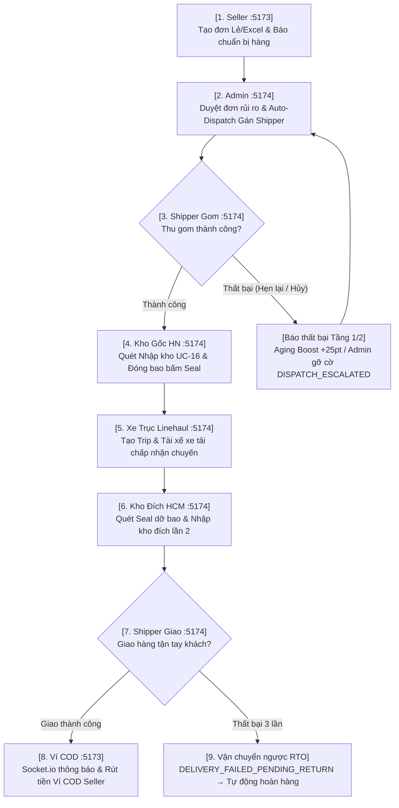

# 🧭 HƯỚNG DẪN KIỂM THỬ TOÀN TRÌNH TRÊN GIAO DIỆN WEB UI (WEB UI E2E TEST GUIDE)

> **Dự án:** Hệ thống E-Logistics (Hub-and-Spoke 3 Cấp)  
> **Ngày cập nhật:** 14/09/2026  
> **Phiên bản:** 2.5 — Đồng bộ Hạ tầng Docker (`e_logistic`), Socket.IO Realtime Gateway, Mobile Navigation Drawer & Active Menu Poka-yoke (`#2563eb`)

---

## 📌 1. BẢNG THÔNG TIN MÔI TRƯỜNG & TÀI KHOẢN ĐĂNG NHẬP

### 1.1 Địa chỉ Cổng Dịch Vụ
| Cổng Dịch Vụ | Địa Chỉ URL | Đối Tượng Sử Dụng | Môi Trường |
| :--- | :--- | :--- | :--- |
| **Cổng Khách Hàng / Seller** | `http://localhost:5173` | Chủ shop tạo đơn (Lẻ/Excel), quản lý ví COD, sản phẩm, ticket khiếu nại | Host OS (React/Vite) |
| **Cổng Điều Hành / Admin / Kho / Shipper** | `http://localhost:5174` | Điều phối viên, Thủ kho, Shipper lấy/giao, Tài xế xe tải (PWA Mobile) | Host OS (React/Vite) |
| **Cổng Backend REST API & Socket.IO** | `http://localhost:5000` | Máy chủ xử lý nghiệp vụ, Socket.io Realtime Push | Host OS (Node.js/Express) |
| **Cổng AI Service Microservice** | `http://localhost:8000` | Dự đoán rủi ro & tối ưu tuyến đường | Host OS (Python FastAPI) |
| **RabbitMQ Management Dashboard** | `http://localhost:15672` | Quản lý Queue & Exchange (User: `guest` / Pass: `guest`) | Docker Container |
| **Cơ Sở Dữ Liệu MongoDB** | `mongodb://localhost:27017/e_logistic` | Database lưu trữ chính (`e_logistic`) | Docker Container |

### 1.2 Danh Sách Tài Khoản Kiểm Thử Nghiệp Vụ (Mật khẩu chung: `Password123@`)

| Vai Trò | Email Đăng Nhập | Cổng Truy Cập | Mục Đích Kiểm Thử Nghiệp Vụ |
| :--- | :--- | :--- | :--- |
| **Chủ Shop (Seller)** | `seller.demo@elogistic.vn` | `:5173` | Tạo đơn lẻ/Excel, chuẩn bị hàng, rút ví COD, sản phẩm, khiếu nại ticket |
| **Điều Phối Viên / Admin** | `admin.demo@elogistic.vn` | `:5174` | Duyệt đơn rủi ro, phân tài xế gom/giao, gỡ cờ leo thang, quản lý cước |
| **Shipper Gom (First-Mile)** | `shipper.pickup@elogistic.vn` | `:5174` | Nhận ca gom, xác nhận ePOH QR code, báo thất bại 2 tầng (Aging Boost) |
| **Thủ Kho Hà Nội (Origin Hub)** | `staff.hub.hn@elogistic.vn` | `:5174` | UC-16 Nhập kho gốc, đo cân lệch, gom bao Bagging Poka-yoke, xuất Trip |
| **Tài Xế Xe Trục (Linehaul)** | `driver.linehaul@elogistic.vn` | `:5174` | Chấp nhận Trip xe tải HN-HCM, truyền GPS live tracking, bàn giao kho đích |
| **Thủ Kho TP.HCM (Dest Hub)** | `staff.hub.hcm@elogistic.vn` | `:5174` | Quét mã Seal dỡ bao hàng loạt, nhập kho đích UC-16, kiểm kê UC-18 |
| **Shipper Giao (Last-Mile)** | `shipper.delivery@elogistic.vn` | `:5174` | Nhận Runsheet DLV ca giao, truyền GPS, xác nhận POD, báo thất bại RTO |

> [!TIP]
> **Mẹo kiểm thử mượt mà & Chế độ Mobile Responsive:**
> - Mở **2 cửa sổ trình duyệt riêng biệt** (hoặc 1 cửa sổ Thường cho `:5173` và 1 cửa sổ Ẩn danh Incognito cho `:5174`) để tránh xung đột Cookie/Token.
> - Khi dùng thiết bị di động hoặc bật giao diện Responsive (`F12` -> `Ctrl+Shift+M`), bạn có thể nhấn vào nút **Hamburger Icon** góc trên để mở **Mobile Navigation Drawer** truy cập nhanh tất cả các trang.

---

## 🔄 2. SƠ ĐỒ CHUỖI VẬN HÀNH VẬN ĐƠN TOÀN TRÌNH

---

## 🎯 3. BỐN KỊCH BẢN KIỂM THỬ THỰC TẾ TRÊN WEB UI

---

### 🟢 KỊCH BẢN 1: VẬN HÀNH TOÀN TRÌNH HOÀN HẢO (HAPPY PATH)
*Mục tiêu: Vận đơn từ Hà Nội gửi vào TP.HCM đi qua đầy đủ các chặng và giao thành công, thu tiền COD.*

#### Bước 1: Seller Tạo Đơn & Báo Chuẩn Bị Xong Hàng
1. Truy cập `http://localhost:5173/auth/login`.
2. Đăng nhập tài khoản Seller: `seller.demo@elogistic.vn` / `Password123@`.
3. Vào menu **Tạo Đơn Vận Chuyển Mới** (`http://localhost:5173/seller/orders/create`).
4. Nhập thông tin đơn hàng:
   - **Địa chỉ lấy:** Shop Dược An Bình - `1 Tràng Tiền, Phường Tràng Tiền, Hoàn Kiếm, Hà Nội`.
   - **Địa chỉ giao:** Nguyễn Văn A - SĐT `0912345678` - `88 Lê Duẩn, Phường Bến Nghé, Quận 1, TP Hồ Chí Minh`.
   - **Hàng hóa:** Serum Dưỡng Da (Khối lượng: `0.5` kg, Dài: `15`, Rộng: `10`, Cao: `5`).
   - **Thu hộ COD:** Tích chọn COD `200.000 đ` (Khai giá: `200.000 đ`).
5. Bấm **Xem Báo Giá (Quote)** $\rightarrow$ Hệ thống hiển thị cước phí 4 vùng cước chuẩn và thời gian ETA.
6. Bấm **Tạo Đơn Hàng**. Hệ thống hiển thị thông báo thành công và cấp Mã vận đơn (Ví dụ: `ELG-VN-xxxxxx`). Hãy ghi lại mã này.
7. Tại danh sách đơn hàng (`/seller/orders`), chọn đơn hàng vừa tạo $\rightarrow$ Bấm nút **"Báo đã chuẩn bị xong"** (Đơn chuyển `PENDING_APPROVAL` hoặc `APPROVED`).

#### Bước 2: Admin Duyệt Đơn Rủi Ro & Auto-Dispatch Gán Shipper
1. Mở cửa sổ ẩn danh trình duyệt, truy cập `http://localhost:5174/login`.
2. Đăng nhập Admin: `admin.demo@elogistic.vn` / `Password123@`.
3. Vào menu **Tất Cả Đơn Hàng** (`http://localhost:5174/admin/orders`) hoặc **Duyệt Đơn Rủi Ro** (`/admin/orders/approval`).
4. Kiểm tra đơn hàng $\rightarrow$ Bấm **Phê Duyệt**. Auto-Dispatch Engine tự động chấm điểm (Capacity + Proximity + Reliability) và gán cho tài xế **"Shipper Gom Hà Nội"** (`shipper.pickup@elogistic.vn`).

#### Bước 3: Shipper Gom Hàng Xác Nhận Lấy Hàng (ePOH)
1. Đăng xuất Admin và đăng nhập tài khoản Shipper gom: `shipper.pickup@elogistic.vn` / `Password123@` trên `http://localhost:5174/login`.
2. Vào màn hình **Ca Lấy Hàng** (`http://localhost:5174/shipper/pickup`).
3. Thấy đơn hàng tại Hoàn Kiếm, Hà Nội $\rightarrow$ Bấm **Bắt đầu lấy** (`PICKING`).
4. Shipper quét mã QR đơn hàng $\rightarrow$ Yêu cầu Seller ký xác nhận ePOH $\rightarrow$ Bấm **Xác Nhận Đã Lấy Hàng** (`POST /api/orders/:id/confirm-pickup`).
5. Đơn hàng chuyển sang trạng thái **`PICKED_UP`** (Đã lấy hàng).

#### Bước 4: Kho Gốc Hà Nội Nhập Kho UC-16 & Gom Bao Niêm Phong Seal
1. Đăng xuất và đăng nhập tài khoản Thủ kho Hà Nội: `staff.hub.hn@elogistic.vn` / `Password123@`.
2. Vào menu **Nhập Kho (Inbound)** (`http://localhost:5174/warehouse/inbound`).
3. Quét/Nhập Mã vận đơn $\rightarrow$ Đặt hàng lên cân đo thực tế $\rightarrow$ Bấm **Xác nhận nhập kho**. Đơn chuyển sang `IN_HUB_ORIGIN` (Đã phân khay kệ `SORT_FOR_TRANSIT`).
4. Vào menu **Gom Bao & Niêm Phong** (`http://localhost:5174/warehouse/bagging`).
5. Bấm **Mở Bao Mới** $\rightarrow$ Chọn Bưu cục đích **Bưu cục Trung tâm TP. Hồ Chí Minh (`HUB_SGN_01`)**.
6. Quét Mã vận đơn vào bao (Thuật toán Poka-yoke còi báo động nếu sai tuyến) $\rightarrow$ Bấm **Niêm Phong Bao** (Mã seal: `SEAL-HN-HCM-01`). Đơn chuyển `BAGGED_SEALED`.

#### Bước 5: Xuất Kho Chuyến Xe Đường Trục UC-17 & Bàn Giao Tài Xế Xe Tải
1. Tại tài khoản Thủ kho Hà Nội, vào menu **Xuất Kho (Outbound)** (`http://localhost:5174/warehouse/outbound`).
2. Bấm **Tạo Chuyến Xe Xuất Kho** $\rightarrow$ Chọn điểm đến TP.HCM $\rightarrow$ Chọn tài xế **"Tài xế Xe Trục HN-HCM"** (`driver.linehaul@elogistic.vn`) $\rightarrow$ Quét mã bao tải vừa đóng vào chuyến.
3. Bấm **Chốt Chuyến Xe & Bàn Giao** (`PENDING_DRIVER_ACCEPT`).
4. Đăng xuất và đăng nhập tài khoản Tài xế xe tải: `driver.linehaul@elogistic.vn` / `Password123@`.
5. Vào menu **Chuyến Xe Vận Chuyển** (`http://localhost:5174/linehaul/trips`).
6. Tìm chuyến xe $\rightarrow$ Bấm **Chấp Nhận Chuyến Xe** (`POST /api/driver/trips/:id/accept`). Chuyến xe và vận đơn tự động chuyển sang trạng thái **`IN_TRANSIT`** (Bật truyền vị trí GPS Live Tracking).

#### Bước 6: Kho Đích TP.HCM Quét Seal Dỡ Bao Hàng Loạt
1. Đăng xuất và đăng nhập tài khoản Thủ kho TP.HCM: `staff.hub.hcm@elogistic.vn` / `Password123@`.
2. Vào menu **Nhập Kho (Inbound)** (`http://localhost:5174/warehouse/inbound`).
3. Chọn chế độ **"Quét mã Seal dỡ bao"** $\rightarrow$ Nhập mã Seal (`SEAL-HN-HCM-01`) $\rightarrow$ Bấm **Xác Nhận Dỡ Bao**.
4. Toàn bộ các kiện hàng trong bao tự động giải nén và chuyển sang trạng thái **`IN_HUB_DEST`** (Đã đến bưu cục phát).

#### Bước 7: Shipper Giao Hàng Ca Phát (Runsheet DLV) & Thu Tiền COD
1. Đăng xuất và đăng nhập tài khoản Shipper giao: `shipper.delivery@elogistic.vn` / `Password123@`.
2. Vào menu **Nhiệm Vụ Giao Hàng** (`http://localhost:5174/shipper/delivery`).
3. Quan sát Bảng kê ca làm việc DLV $\rightarrow$ Bấm **Bắt Đầu Giao** (`OUT_FOR_DELIVERY`).
4. Đến nơi giao $\rightarrow$ Khách thanh toán COD `200.000 đ` $\rightarrow$ Shipper chụp ảnh đối chứng POD $\rightarrow$ Bấm **Xác Nhận Giao Thành Công**.
5. Đơn hàng chuyển sang **`DELIVERED`**. Tín hiệu Socket.io tự động thông báo về Kênh Seller.

#### Bước 8: Seller Kiểm Tra Ví COD & Yêu Cầu Rút Tiền
1. Quay lại cửa sổ Seller `http://localhost:5173`.
2. Vào menu **Ví COD & Doanh Thu** (`http://localhost:5173/seller/wallet`).
3. Số dư Ví COD lập tức hiển thị cộng thêm `200.000 đ`.
4. Nhập số tiền rút `200.000 đ` $\rightarrow$ Chọn tài khoản Ngân hàng $\rightarrow$ Bấm **Yêu Cầu Rút Tiền**. Giao dịch Atomic Session xử lý an toàn, trừ số dư và lưu lịch sử.

---

### 🟡 KỊCH BẢN 2: XỬ LÝ SỰ CỐ CHẶNG GOM & ĐIỀU PHỐI LEO THANG (AGING BOOST)

#### Nhánh 2A: Thất Bại Tầng 1 (Shop Hẹn Ca Sau) $\rightarrow$ Tự Động Cộng Điểm Ưu Tiên
1. Đăng nhập Shipper gom (`shipper.pickup@elogistic.vn`) trên `http://localhost:5174/shipper/pickup`.
2. Trên đơn hàng cần lấy, chọn **Báo Thất Bại**.
3. Tab **Tầng 1: Hẹn Lấy Lại** $\rightarrow$ Lý do: *Shop chưa chuẩn bị kịp hàng* $\rightarrow$ Nhập ghi chú *"Hẹn 30 phút nữa mới đóng gói xong"*.
4. Bấm **Gửi Báo Cáo**. Đơn giải phóng khỏi ca gom hiện tại, ghi nhận `pickupFailureCount = 1` và cắm cờ **Aging Boost (+25 điểm ưu tiên)** đẩy đơn lên đầu ca sau.

#### Nhánh 2B: Thất Bại Tầng 2 (Shop Hủy/Vi Phạm) $\rightarrow$ Leo Thang Điều Phối Viên (DISPATCH_ESCALATED)
1. Shipper bấm **Báo Thất Bại** trên đơn khác $\rightarrow$ Chọn **Tầng 2: Shop Hủy / Vi Phạm**.
2. Đăng nhập Điều phối viên (`admin.demo@elogistic.vn`) tại `http://localhost:5174/admin/dispatch/local`.
3. Xuất hiện **Banner Cảnh Báo Điều Phối Đỏ** (`DISPATCH_ESCALATED`). Điều phối viên gọi kiểm tra Shop và có 2 lựa chọn:
   - **Duyệt Hủy:** Xác nhận Shop hủy đơn.
   - **Lấy Lại (Retry Pickup):** Bấm **"Lấy Lại"**, cờ cảnh báo được gỡ bỏ và đơn quay lại hàng đợi gom với ưu tiên cao.

---

### 🔴 KỊCH BẢN 3: SỰ CỐ PHÁT HÀNG & QUY TRÌNH HOÀN HÀNG TỰ ĐỘNG (RTO)

1. Đăng nhập Shipper giao (`shipper.delivery@elogistic.vn`) tại `http://localhost:5174/shipper/delivery`.
2. Chọn đơn hàng đang đi giao $\rightarrow$ Bấm **Báo Giao Thất Bại**:
   - **Lần 1:** Lý do *Không liên lạc được (Gọi 3 cuộc không nghe)* $\rightarrow$ Đơn chuyển `PENDING_REDELIVERY`.
   - **Lần 2:** Hôm sau đi giao lại $\rightarrow$ Lý do *Khách hẹn ngày khác giao*.
   - **Lần 3:** Giao lần 3 $\rightarrow$ Lý do *Khách từ chối nhận hàng* + Tải ảnh đối chứng.
3. **Cơ chế Tự Động Hoàn Hàng:**
   - Hệ thống phát hiện chốt mốc 3 lần thất bại.
   - Đơn **TỰ ĐỘNG** chuyển trạng thái sang `DELIVERY_FAILED_PENDING_RETURN` và kích hoạt luồng vận chuyển ngược `RETURNING`.
4. Kho TP.HCM đóng bao hoàn gửi ngược về Kho Hà Nội. Shipper Hà Nội mang trả tận tay Shop $\rightarrow$ Bấm xác nhận **Đã Trả Hàng Cho Shop (`RETURNED`)**.

---

### 💬 KỊCH BẢN 4: HẬU MÃI & KHIẾU NẠI DỊCH VỤ CSKH (SUPPORT TICKET)

1. Tại Kênh Seller `http://localhost:5173/seller/tickets`, bấm **Tạo Ticket Khiếu Nại**.
2. Chọn Mã đơn hàng $\rightarrow$ Phân loại *Khiếu nại cước / Hàng móp vỡ* $\rightarrow$ Mức độ *HIGH* $\rightarrow$ Nhập nội dung.
3. Đăng nhập Admin/CSKH (`admin.demo@elogistic.vn`) tại `http://localhost:5174/admin/tickets`.
4. CSKH phản hồi giải quyết $\rightarrow$ Bấm **Hoàn Tiền Đền Bù** vào Ví COD Seller $\rightarrow$ Đóng ticket (`RESOLVED`).

---

## 📋 4. BẢNG TRA CỨU TRẠNG THÁI ĐƠN HÀNG TRÊN GIAO DIỆN (STATUS CHEAT SHEET)

| Trạng Thái Trên UI | Ý Nghĩa Thực Tế Nghiệp Vụ | Trách Nhiệm Xử Lý |
| :--- | :--- | :--- |
| **`CREATED`** | Đơn hàng mới tạo, chưa báo chuẩn bị | Seller |
| **`PENDING_APPROVAL`** | Shop đã chuẩn bị xong, chờ Admin duyệt | Order Manager / Admin |
| **`READY_TO_PICK`** | Đã duyệt, chờ Auto-Dispatch gán Shipper | Dispatch Engine |
| **`ASSIGNED_TO_PICKUP`**| Đã gán Shipper gom cụ thể | Shipper Gom |
| **`DISPATCH_ESCALATED`**| Sự cố gom hàng nghiêm trọng (Shop hủy/hàng vi phạm) | Điều phối viên nội vùng |
| **`PICKED_UP`** | Shipper đã lấy hàng thành công từ Shop (Có ePOH) | Shipper Gom |
| **`IN_HUB_ORIGIN`** | Đã quét nhập kho bưu cục gốc UC-16 (Kho HN) | Thủ kho Hà Nội |
| **`BAGGED_SEALED`** | Đã gom vào bao tải và bấm mã Seal niêm phong | Thủ kho Hà Nội |
| **`IN_TRANSIT`** | Đã lên xe tải đường trục & Tài xế chấp nhận Trip | Tài xế xe tải Linehaul |
| **`IN_HUB_DEST`** | Đã tới bưu cục đích UC-16 (Kho HCM) và dỡ bao | Thủ kho TP.HCM |
| **`OUT_FOR_DELIVERY`** | Đang được Shipper mang đi phát cho khách (Có GPS) | Shipper Giao |
| **`PENDING_REDELIVERY`**| Giao chưa thành công lần 1/2, hẹn phát lại ca sau | Shipper Giao / Điều phối |
| **`DELIVERED`** | Giao thành công, đã thu COD & có ảnh đối chứng POD | Khách hàng đã nhận |
| **`RETURNING`** | Đủ 3 lần giao thất bại, đang chuyển hoàn ngược | Bưu cục / Vận tải ngược |
| **`RETURNED`** | Đã hoàn trả hàng tận tay cho Shop gửi | Seller nhận lại hàng |
| **`CANCELLED`** | Đơn hàng bị hủy hợp lệ | Kết thúc |
