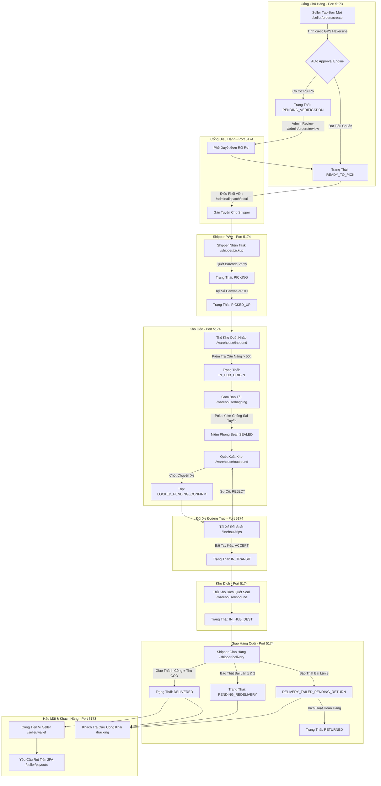

# 🌐 CẨM NANG KIỂM THỬ TOÀN TRÌNH TRÊN GIAO DIỆN WEB (WEB E2E TESTING PLAYBOOK)
## Hướng Dẫn Chi Tiết Quy Trình Vận Hành & Bộ Kịch Bản Test Thực Tế Trên Giao Diện Web E-Logistics Platform

> **Dự án**: E-Logistics Brownfield Enterprise Architecture  
> **Phiên bản tài liệu**: 4.0 — Master Web Testing Edition  
> **Phạm vi kiểm thử**: Toàn bộ luồng người dùng trên giao diện Web (`frontend_web` & `frontend_admin`)  
> **Mục tiêu**: Hướng dẫn Tester / QA / Giảng viên / Đánh giá viên thực hiện kiểm thử hệ thống 100% bằng thao tác click, nhập liệu, quét mã, ký số và đối soát trực tiếp trên trình duyệt Web mà không cần dùng Postman hay dòng lệnh cURL.

---

# 📑 MỤC LỤC TỔNG QUAN

1. [Thiết Lập Môi Trường & Danh Sách Tài Khoản Đăng Nhập Web](#1-thiết-lập-môi-trường--danh-sách-tài-khoản-đăng-nhập-web)
2. [Bản Đồ Phân Quyền & Cổng Truy Cập Web (Web Access Matrix)](#2-bản-đồ-phân-quyền--cổng-truy-cập-web-web-access-matrix)
3. [Sơ Đồ Chuỗi Vận Hành Toàn Trình Trên Web (Web Lifecycle State Machine)](#3-sơ-đồ-chuỗi-vận-hành-toàn-trình-trên-web-web-lifecycle-state-machine)
4. [GIAI ĐOẠN 1: Đăng Ký, Đăng Nhập & Hồ Sơ Shop (Auth & Seller Profile)](#giai-đoạn-1-đăng-ký-đăng-nhập--hồ-sơ-shop-auth--seller-profile)
5. [GIAI ĐOẠN 2: Tạo Đơn Hàng & Tính Cước Động (Order Creation & Dynamic Pricing)](#giai-đoạn-2-tạo-đơn-hàng--tính-cước-động-order-creation--dynamic-pricing)
6. [GIAI ĐOẠN 3: Thẩm Duyệt Đơn Rủi Ro & Điều Phối Tuyến (Admin Review & Dispatch)](#giai-đoạn-3-thẩm-duyệt-đơn-rủi-ro--điều-phối-tuyến-admin-review--dispatch)
7. [GIAI ĐOẠN 4: Thu Gom Chặng Đầu & Ký Số ePOH (Shipper PWA Pickup)](#giai-đoạn-4-thu-gom-chặng-đầu--ký-số-epoh-shipper-pwa-pickup)
8. [GIAI ĐOẠN 5: Quét Nhập Kho Gốc & Phân Luồng Staging (Warehouse Inbound UC-16)](#giai-đoạn-5-quét-nhập-kho-gốc--phân-luồng-staging-warehouse-inbound-uc-16)
9. [GIAI ĐOẠN 6: Gom Bao Tải & Chống Nhầm Tuyến Poka-Yoke (Warehouse Bagging)](#giai-đoạn-6-gom-bao-tải--chống-nhầm-tuyến-poka-yoke-warehouse-bagging)
10. [GIAI ĐOẠN 7: Quét Xuất Kho & Bắt Tay Kép Tài Xế (Warehouse Outbound & Handshake)](#giai-đoạn-7-quét-xuất-kho--bắt-tay-kép-tài-xế-warehouse-outbound--handshake)
11. [GIAI ĐOẠN 8: Quét Nhập Kho Đích & Giao Hàng Chặng Cuối (Inbound Dest & Last-Mile)](#giai-đoạn-8-quét-nhập-kho-đích--giao-hàng-chặng-cuối-inbound-dest--last-mile)
12. [GIAI ĐOẠN 9: Kiểm Kê Kho Nâng Cao & Giám Sát Tồn Kho SLA (Audit UC-18 & Inventory UC-19)](#giai-đoạn-9-kiểm-kê-kho-nâng-cao--giám-sát-tồn-kho-sla-audit-uc-18--inventory-uc-19)
13. [GIAI ĐOẠN 10: Ví COD, Rút Tiền & Tra Cứu Công Khai PII (Wallet & Public Tracking)](#giai-đoạn-10-ví-cod-rút-tiền--tra-cứu-công-khai-pii-wallet--public-tracking)
14. [Ma Trận Nghiệm Thu Kiểm Thử Web (Web QA Acceptance Matrix)](#14-ma-trận-nghiệm-thu-kiểm-thử-web-web-qa-acceptance-matrix)
15. [Hướng Dẫn Khắc Phục Sự Cố Trên Trình Duyệt (Web Troubleshooting & FAQs)](#15-hướng-dẫn-khắc-phục-sự-cố-trên-trình-duyệt-web-troubleshooting--faqs)

---

# 1. THIẾT LẬP MÔI TRƯỜNG & DANH SÁCH TÀI KHOẢN ĐĂNG NHẬP WEB

### 1.1. Khởi Động 3 Cổng Dịch Vụ
Mở 3 cửa sổ Terminal (PowerShell / Command Prompt) tại thư mục gốc của dự án `e_logistic`:

```bash
# TERMINAL 1: Khởi động Backend API & Socket Server (Cổng 5000)
cd backend
npm install
npm run dev

# TERMINAL 2: Khởi động Cổng Khách Hàng & Chủ Hàng Seller Web (Cổng 5173)
cd frontend_web
npm install
npm run dev

# TERMINAL 3: Khởi động Cổng Vận Hành & Điều Phối Admin Portal (Cổng 5174)
cd frontend_admin
npm install
npm run dev
```

### 1.2. Nạp Dữ Liệu Test Tự Động (Seed Data)
Trước khi test, hãy chạy script nạp toàn bộ các tài khoản, bưu cục và đơn hàng mẫu:
```bash
# Mở một terminal mới tại thư mục backend:
node backend/scripts/seed-demo-accounts.js
node backend/seed-test-data.js
```

### 1.3. Bảng Tài Khoản Test Trên Web Chuẩn Hóa
Tất cả các tài khoản demo dưới đây được khởi tạo với mật khẩu đăng nhập đồng bộ: **`Password123@`** (hoặc `Test@123456` với các tài khoản đuôi `@test.local`).

| STT | Vai Trò (Role) | Email Đăng Nhập | Cổng Web | URL Đăng Nhập | Mục Đích Sử Dụng |
|:---:|---|---|:---:|---|---|
| **1** | **Chủ hàng (SELLER)** | `seller.demo@elogistic.vn` | **5173** | `http://localhost:5173/auth/login` | Tạo đơn lẻ, nạp Excel hàng loạt, ví COD, quản lý khiếu nại |
| **2** | **Quản trị viên (ADMIN)** | `admin.demo@elogistic.vn` | **5174** | `http://localhost:5174/admin/login` | Quản trị người dùng, audit an ninh, duyệt rủi ro, báo cáo SLA |
| **3** | **Quản lý Đơn & NCC (VENDOR_MGR)** | `vendormgr.demo@elogistic.vn` | **5174** | `http://localhost:5174/admin/login` | Quản lý nhà cung cấp, đối tác bán hàng, review đơn rủi ro |
| **4** | **Điều phối Shipper (LAST_MILE_DISPATCHER)** | `dispatcher.demo@elogistic.vn` | **5174** | `http://localhost:5174/admin/login` | Giám sát tuyến bưu tá, phân bổ đơn lấy và đơn giao chặng cuối |
| **5** | **Điều phối Xe tải (LINE_HAUL_DISPATCHER)** | `linehaul.demo@elogistic.vn` | **5174** | `http://localhost:5174/admin/login` | Lập lịch xe tải đường trục, ghép chuyến xe trung chuyển liên tỉnh |
| **6** | **Thủ kho / Khai thác (HUB_STAFF)** | `hub.demo@elogistic.vn` | **5174** | `http://localhost:5174/admin/login` | Quét nhập kho UC-16, đóng bao seal Poka-Yoke, xuất kho UC-17, kiểm kê |
| **7** | **Shipper Nội thành (LOCAL_SHIPPER)** | `shipper.demo@elogistic.vn` | **5174** | `http://localhost:5174/admin/login` | Nhận đơn thu gom, ký ePOH, giao hàng chặng cuối, báo thất bại |
| **8** | **Tài xế Đường trục (LINE_HAUL_DRIVER)** | `driver.demo@elogistic.vn` | **5174** | `http://localhost:5174/admin/login` | Nhận chuyến xe đường dài, xác nhận bắt tay kép (Accept/Reject) |
| **9** | **Người Mua Hàng (PUBLIC BUYER)** | *Không cần đăng nhập* | **5173** | `http://localhost:5173/tracking` | Tra cứu hành trình vận đơn công khai, mở khóa PII bằng 4 số cuối SĐT |

---

# 2. BẢN ĐỒ PHÂN QUYỀN & CỔNG TRUY CẬP WEB (WEB ACCESS MATRIX)

Hệ thống được thiết kế phân chia 2 cổng Web chuyên biệt:

```
                                  E-LOGISTICS WEB PLATFORM
                                             │
                  ┌──────────────────────────┴──────────────────────────┐
                  ▼                                                     ▼
      PORT 5173 (FRONTEND_WEB)                              PORT 5174 (FRONTEND_ADMIN)
      Dành cho Khách & Chủ Hàng                             Dành cho Cán Bộ Vận Hành Nội Bộ
 ┌─────────────────────────────────┐                   ┌───────────────────────────────────────┐
 │ • Landing Page / Báo giá cước   │                   │ • Quản Trị Hệ Thống (/admin/*)        │
 │ • Tra cứu vận đơn công khai     │                   │ • Khai Thác Kho Vận (/warehouse/*)    │
 │ • Đăng ký / Đăng nhập Seller    │                   │ • Điều Phối Tuyến Xe (/admin/dispatch)│
 │ • Tạo đơn hàng lẻ & Hàng loạt   │                   │ • Shipper PWA Mobile (/shipper/*)     │
 │ • Ví tiền COD & Lịch sử rút tiền│                   │ • Tài Xế Xe Tải PWA (/linehaul/*)     │
 └─────────────────────────────────┘                   └───────────────────────────────────────┘
```

### Quy Tắc Chuyển Hướng Tự Động (Root Redirect) Trên Cổng Admin (Port 5174):
Khi đăng nhập tại `http://localhost:5174/admin/login`, hệ thống tự động nhận diện Role và chuyển hướng:
- Đăng nhập tài khoản `HUB_STAFF` $\rightarrow$ Tự chuyển sang `/warehouse/inbound` (Khai thác kho).
- Đăng nhập tài khoản `LOCAL_SHIPPER` $\rightarrow$ Tự chuyển sang `/shipper/zone` (Giao diện bưu tá di động).
- Đăng nhập tài khoản `LINE_HAUL_DRIVER` $\rightarrow$ Tự chuyển sang `/linehaul/trips` (Giao diện tài xế xe tải).
- Đăng nhập tài khoản `LAST_MILE_DISPATCHER` $\rightarrow$ Tự chuyển sang `/admin/dispatch/local`.
- Đăng nhập tài khoản `LINE_HAUL_DISPATCHER` $\rightarrow$ Tự chuyển sang `/admin/dispatch/linehaul`.
- Đăng nhập tài khoản `ORDER_VENDOR_MANAGER` $\rightarrow$ Tự chuyển sang `/admin/vendor-ops`.
- Đăng nhập tài khoản `ADMIN` $\rightarrow$ Tự chuyển sang `/admin/dashboard`.

> [!NOTE]
> Giao diện dành cho Shipper và Tài xế được thiết kế theo chuẩn **PWA Mobile-first Responsive**. Khi kiểm thử các vai trò này trên máy tính, bạn có thể nhấn phím `F12`, chọn biểu tượng **Toggle Device Toolbar** (Ctrl + Shift + M) trên Chrome DevTools và chọn thiết bị `iPhone 14 Pro` hoặc `Pixel 7` để có trải nghiệm giao diện chuẩn như trên điện thoại.

---

# 3. SƠ ĐỒ CHUỖI VẬN HÀNH TOÀN TRÌNH TRÊN WEB



---

# GIAI ĐOẠN 1: ĐĂNG KÝ, ĐĂNG NHẬP & HỒ SƠ SHOP (AUTH & SELLER PROFILE)

**Môi trường**: Cổng Web Chủ hàng `http://localhost:5173`

---

### 🟢 Kịch bản 1.1: Đăng Ký Tài Khoản Seller Mới & Xác Thực OTP
* **Mục tiêu**: Xác minh luồng đăng ký tài khoản Seller mới, nhận thông báo mã OTP và hoàn tất kích hoạt tài khoản.
* **URL**: `http://localhost:5173/auth/register`
* **Các bước thao tác**:
  1. Truy cập trang đăng ký, điền các thông tin:
     - **Họ và tên**: `Trần Văn An`
     - **Email**: `seller.newtest@elogistic.vn`
     - **Số điện thoại**: `0933112233`
     - **Mật khẩu**: `Password123@`
     - **Nhập lại mật khẩu**: `Password123@`
  2. Tích chọn ô *"Tôi đồng ý với Điều khoản sử dụng và Chính sách bảo mật"*.
  3. Bấm nút **"Đăng ký tài khoản"**.
  4. Hệ thống hiển thị Modal yêu cầu nhập mã OTP (6 chữ số). Nhập mã OTP hiển thị trên thông báo Toast demo (hoặc kiểm tra log backend `OTP sent: XXXXXX`).
  5. Bấm nút **"Xác nhận OTP"**.
* **Kỳ vọng hiển thị trên Web**:
  - Toast thông báo màu xanh: *"Đăng ký và xác thực tài khoản thành công!"*.
  - Tự động chuyển hướng người dùng sang trang Đăng nhập `/auth/login`.

---

### 🔴 Kịch bản 1.2: Validation Lỗi Form Đăng Ký
* **Mục tiêu**: Kiểm tra hệ thống bắt lỗi các trường dữ liệu sai quy chuẩn trên giao diện Web.
* **URL**: `http://localhost:5173/auth/register`
* **Các bước & Kỳ vọng**:
  - **Nhập Email sai**: Điền `abc@` $\rightarrow$ Nhấp chuột ra ngoài $\rightarrow$ Dòng chữ đỏ báo lỗi dưới ô: *"Email không đúng định dạng"*.
  - **Mật khẩu yếu**: Nhập `123` $\rightarrow$ Báo lỗi: *"Mật khẩu phải chứa ít nhất 8 ký tự, bao gồm chữ hoa, số và ký tự đặc biệt"*.
  - **Mật khẩu không khớp**: Mật khẩu `Password123@`, ô nhập lại `Password1234@` $\rightarrow$ Báo lỗi: *"Mật khẩu xác nhận không trùng khớp"*.
  - **Bỏ trống trường bắt buộc**: Nhấn "Đăng ký" khi chưa nhập số điện thoại $\rightarrow$ Ô SĐT viền đỏ, nút submit bị chặn.

---

### 🟢 Kịch bản 1.3: Đăng Nhập Seller & Truy Cập Dashboard
* **Mục tiêu**: Đăng nhập bằng tài khoản Seller chính thức, lưu token và hiển thị tổng quan tài khoản.
* **URL**: `http://localhost:5173/auth/login`
* **Các bước thao tác**:
  1. Nhập **Email / SĐT**: `seller.demo@elogistic.vn`
  2. Nhập **Mật khẩu**: `Password123@`
  3. Bấm nút **"Đăng nhập"**.
* **Kỳ vọng hiển thị trên Web**:
  - Toast: *"Đăng nhập thành công! Chào mừng Shop Dược An Bình"*.
  - Tự động chuyển hướng vào `/seller/dashboard`.
  - Thanh Navbar phía trên hiển thị tên tài khoản: `Shop Dược An Bình` cùng nhãn huy hiệu xanh `Đã xác thực KYC`.
  - Bảng thống kê hiển thị: Tổng đơn hàng, Doanh thu COD, Biểu đồ giao nhận.

---

### 🟢 Kịch bản 1.4: Cấu Hình Kho Gửi Hàng & Bảo Mật 2FA
* **Mục tiêu**: Thiết lập địa chỉ kho lấy hàng mặc định và cài đặt xác thực 2 bước (2FA Google Authenticator).
* **URL**: `http://localhost:5173/seller/profile`
* **Các bước thao tác**:
  1. Tại menu bên trái, nhấp chọn **"Cài đặt tài khoản"** (`/seller/profile`).
  2. Chuyển sang Tab **"Kho lấy hàng" (Pickup Addresses)**:
     - Bấm nút **"+ Thêm kho mới"**.
     - Nhập Tên kho: `Kho Tổng Tân Bình`, Người liên hệ: `Nguyễn Quản Kho`, SĐT: `0901234567`.
     - Địa chỉ: `123 Đường Tân Bình`, Tỉnh/Thành: `TP Hồ Chí Minh`, Quận/Huyện: `Quận Tân Bình`, Phường/Xã: `Phường 12`.
     - Bấm **"Lưu địa chỉ"** $\rightarrow$ Thẻ kho xuất hiện trên danh sách kèm nhãn `Kho mặc định`.
  3. Chuyển sang Tab **"Bảo mật 2FA"**:
     - Bấm nút **"Kích hoạt 2FA TOTP"**.
     - Hệ thống hiển thị Modal chứa mã QR và chuỗi Secret Key.
     - Dùng ứng dụng Google Authenticator trên điện thoại quét mã (hoặc nhập mã 6 số hiển thị để xác nhận).
     - Bấm **"Xác nhận kích hoạt"** $\rightarrow$ Trạng thái chuyển sang thẻ xanh: `2FA Đang Hoạt Động`.

---

# GIAI ĐOẠN 2: TẠO ĐƠN HÀNG & TÍNH CƯỚC ĐỘNG (ORDER CREATION & DYNAMIC PRICING)

**Môi trường**: Cổng Web Chủ hàng `http://localhost:5173` — Tài khoản: `seller.demo@elogistic.vn`

---

### 🟢 Kịch bản 2.1: Happy Path — Tạo Đơn Hàng Liên Miền (Hà Nội $\rightarrow$ Cần Thơ)
* **Mục tiêu**: Kiểm thử giao diện tạo đơn hàng lẻ, định tuyến GPS Haversine liên miền, tự động tính cước 35.000 đ và sinh mã vận đơn.
* **URL**: `http://localhost:5173/seller/orders/create` (hoặc `/web/tao-don-hang`)
* **Các bước thao tác**:
  1. **Bước 1 — Thông tin Người gửi (Pickup)**:
     - Chọn kho gửi: `Kho Tổng Tân Bình` (hoặc chọn nhập tay: Tỉnh `Hà Nội`, Quận `Hoàn Kiếm`, Phường `Tràng Tiền`, Địa chỉ `1 Tràng Tiền`, Người gửi: `Tổng kho Hà Nội`, SĐT: `0911223344`).
  2. **Bước 2 — Thông tin Người nhận (Delivery)**:
     - Nhập Tên người nhận: `Anh Bình Cần Thơ`
     - Số điện thoại: `0988776655`
     - Chọn Tỉnh/Thành: `Cần Thơ`
     - Chọn Quận/Huyện: `Quận Ninh Kiều`
     - Chọn Phường/Xã: `Phường Xuân Khánh`
     - Địa chỉ chi tiết: `123 Đường 30/4`
  3. **Bước 3 — Thông tin Hàng hóa & Cước Phí**:
     - Nhập Tên hàng: `Laptop ThinkPad T14`
     - Số lượng: `1`
     - Trọng lượng thực: `2.0` kg
     - Kích thước 3 chiều: Dài `35` cm, Rộng `25` cm, Cao `5` cm.
     - Nhập Tiền thu hộ COD: `5.000.000` VNĐ
     - Giá trị hàng hóa: `15.000.000` VNĐ
  4. **Bước 4 — Xem Bảng Tính Cước Tự Động (Realtime Quote Box)**:
     - Quan sát khung xem trước cước phí bên phải màn hình:
       * Cự ly định tuyến: Khoảng cách Haversine liên miền $\approx 1.705\text{ km}$.
       * Phân hạng vùng: Thẻ badge màu tím hiển thị `INTER_REGION` (Liên miền).
       * Cước phí cơ bản: `35.000` VNĐ.
       * Dự kiến giao hàng (ETA): `2 - 3 ngày`.
  5. **Bước 5 — Hoàn Tất Tạo Đơn**:
     - Bấm nút xanh **"Tạo đơn hàng ngay"**.
* **Kỳ vọng hiển thị trên Web**:
  - Modal **"Tạo đơn hàng thành công"** (`OrderSuccessModal`) bật lên.
  - Hiển thị mã vận đơn dạng: `ELG-VN-XXXXXX` (VD: `ELG-VN-882910`).
  - Trạng thái đơn: Badge xanh lá `READY_TO_PICK` (Sẵn sàng lấy hàng).
  - Có sẵn 2 nút: **"In phiếu gửi (A5/A6)"** và **"Về danh sách đơn hàng"**.

---

### 🟢 Kịch bản 2.2: Happy Path — Tạo Đơn Hàng Nội Tỉnh (Hà Nội $\rightarrow$ Hà Nội)
* **Mục tiêu**: Kiểm tra hệ thống nhận diện cùng tỉnh/thành, áp dụng cước nội tỉnh 16.500 đ.
* **URL**: `http://localhost:5173/seller/orders/create`
* **Các bước thao tác**:
  1. Người gửi: Tỉnh `Hà Nội`, Quận `Cầu Giấy`, Phường `Dịch Vọng`.
  2. Người nhận: Tỉnh `Hà Nội`, Quận `Đống Đa`, Phường `Láng Thượng`.
  3. Cân nặng: `0.5` kg, Kích thước: `20 x 15 x 5` cm.
  4. Quan sát khung tính cước bên phải:
     - Phân vùng hiển thị: `INTRA_PROVINCE` (Nội tỉnh).
     - Cước phí: `16.500` VNĐ.
  5. Bấm **"Tạo đơn hàng"** $\rightarrow$ Thành công với trạng thái `READY_TO_PICK`.

---

### 🟡 Kịch bản 2.3: Tính Cước Quy Đổi Thể Tích (Volumetric Weight)
* **Mục tiêu**: Kiểm tra kiện hàng to cồng kềnh nhưng nhẹ cân, hệ thống tự lấy trọng lượng lớn hơn để tính cước.
* **URL**: `http://localhost:5173/seller/orders/create`
* **Các bước thao tác**:
  1. Nhập hàng hóa: `Thùng xốp EPS giữ nhiệt`.
  2. Cân nặng thực tế: Chỉ `1.0` kg.
  3. Kích thước 3 chiều: Dài `50` cm, Rộng `40` cm, Cao `30` cm.
  4. Quan sát bảng tính cước:
     - Hệ thống tự động tính: $V = (50 \times 40 \times 30) / 5000 = 12.0\text{ kg}$.
     - Trọng lượng tính cước hiển thị: `12.0 kg (Quy đổi thể tích)` thay vì `1.0 kg`.
     - Cước phí được tự động điều chỉnh tăng lên tương ứng với bậc 12kg.

---

### 🔴 Kịch bản 2.4: Tự Động Kích Hoạt Cờ Rủi Ro (Auto-Approval Risk Flags)
* **Mục tiêu**: Khi đơn hàng vượt các ngưỡng an toàn, hệ thống tự động gắn cờ cảnh báo và chuyển sang `PENDING_VERIFICATION` chờ Admin duyệt.
* **URL**: `http://localhost:5173/seller/orders/create`
* **Các bước kiểm tra từng trường hợp**:
  - **Trường hợp A (COD > 10 triệu)**: Điền COD = `12.000.000` VNĐ $\rightarrow$ Bấm tạo đơn $\rightarrow$ Modal thông báo: Đơn hàng ở trạng thái vàng `PENDING_VERIFICATION`, có cờ `HIGH_COD_VALUE`.
  - **Trường hợp B (Khai giá > 20 triệu)**: Điền Khai giá hàng hóa = `25.000.000` VNĐ $\rightarrow$ Tạo đơn $\rightarrow$ Chuyển `PENDING_VERIFICATION`, có cờ `HIGH_DECLARED_VALUE`.
  - **Trường hợp C (Quá tải xe máy > 20kg)**: Điền cân nặng = `25.0` kg $\rightarrow$ Tạo đơn $\rightarrow$ Chuyển `PENDING_VERIFICATION`, có cờ `OVERWEIGHT_MOTORCYCLE`.

---

### 🟢 Kịch bản 2.5: Tạo Đơn Hàng Hàng Loạt Bằng File Excel (Batch Order Upload)
* **Mục tiêu**: Tải file Excel mẫu, nhập danh sách 5 đơn hàng cùng lúc, tải lên và hệ thống tự động kiểm tra, tạo hàng loạt.
* **URL**: `http://localhost:5173/seller/orders/batch`
* **Các bước thao tác**:
  1. Bấm nút **"Tải file mẫu (.xlsx)"** về máy tính.
  2. Mở file Excel, điền 5 dòng vận đơn với các địa chỉ hợp lệ.
  3. Kéo thả file Excel vào vùng upload trên giao diện Web.
  4. Bảng **Xem trước dữ liệu (Preview Table)** hiển thị 5 dòng:
     - Các dòng hợp lệ hiển thị biểu tượng tích xanh `Hợp lệ`.
     - Nếu có dòng sai SĐT hoặc thiếu địa chỉ, dòng đó hiển thị màu đỏ kèm lý do lỗi.
  5. Bấm nút **"Xác nhận tạo 5 đơn hàng"**.
* **Kỳ vọng hiển thị trên Web**:
  - Thanh tiến trình (Progress Bar) chạy từ 0% đến 100%.
  - Thông báo: *"Đã tạo thành công 5/5 đơn hàng!"*. Danh sách mã vận đơn được liệt kê để tải về hoặc in tem hàng loạt.

---

### 🟢 Kịch bản 2.6: Quản Lý Đơn Hàng & In Vận Đơn (Waybill Print)
* **Mục tiêu**: Tìm kiếm, lọc đơn theo trạng thái và mở bản in tem vận đơn chuẩn bưu chính.
* **URL**: `http://localhost:5173/seller/orders`
* **Các bước thao tác**:
  1. Xem danh sách đơn hàng:
     - Nhập mã vận đơn vừa tạo vào ô tìm kiếm $\rightarrow$ Danh sách lọc đúng đơn đó.
     - Nhấp chọn tab lọc: `Sẵn sàng lấy hàng` (`READY_TO_PICK`).
  2. Bấm vào biểu tượng **"Máy in" (Print Waybill)** tại cột thao tác.
  3. Modal `PrintWaybillModal` mở ra hiển thị bản thiết kế tem in:
     - Barcode chuẩn Code 128 sắc nét.
     - Mã QR chứa link tra cứu công khai.
     - Thông tin Người gửi, Người nhận, Tiền COD, Chỉ dẫn giao hàng.
  4. Bấm nút **"In vận đơn (Khổ A6)"** $\rightarrow$ Hộp thoại in của trình duyệt mở ra.
  5. Thao tác Hủy đơn: Nhấp nút **"Hủy đơn"** đối với đơn đang `READY_TO_PICK` $\rightarrow$ Xác nhận lý do $\rightarrow$ Đơn đổi sang thẻ xám `CANCELLED`.

---

# GIAI ĐOẠN 3: THẨM DUYỆT ĐƠN RỦI RO & ĐIỀU PHỐI TUYẾN (ADMIN REVIEW & DISPATCH)

**Môi trường**: Cổng Web Điều hành `http://localhost:5174`

---

### 🟢 Kịch bản 3.1: Admin Thẩm Duyệt Đơn Rủi Ro (Risk Review)
* **Mục tiêu**: Quản trị viên kiểm tra đơn có cờ rủi ro tài chính / hàng quá tải và bấm phê duyệt chuyển sang trạng thái lấy hàng.
* **Đăng nhập**: `admin.demo@elogistic.vn` / `Password123@` tại `http://localhost:5174/admin/login`.
* **URL**: `http://localhost:5174/admin/orders` $\rightarrow$ Chọn đơn `PENDING_VERIFICATION` $\rightarrow$ `/admin/orders/:id/review`.
* **Các bước thao tác**:
  1. Màn hình chi tiết thẩm định rủi ro hiển thị:
     - Thẻ cảnh báo vi phạm đỏ: `HIGH_COD_VALUE (Tiền COD 12.000.000đ vượt ngưỡng 10.000.000đ)`.
     - Thông tin định danh Seller: `Shop Dược An Bình (Đã KYC Verified)`.
  2. Tại khung **Quyết định thẩm định (Resolution)**:
     - Chọn Bưu cục phụ trách giao: `HUB_SGN_01 (Kho Tổng TP.HCM)`.
     - Nhập Ghi chú phê duyệt: *"Đã gọi điện xác minh chủ shop uy tín, đồng ý cấp hạn mức COD cao"*.
  3. Bấm nút xanh **"Phê duyệt đơn hàng" (Approve Order)**.
* **Kỳ vọng hiển thị trên Web**:
  - Toast thông báo: *"Đơn hàng đã được duyệt và chuyển sang trạng thái READY_TO_PICK!"*.
  - Đơn chuyển sang trạng thái xanh `READY_TO_PICK` và tự động xuất hiện trên bảng điều phối bưu tá.

---

### 🟢 Kịch bản 3.2: Điều Phối Shipper Lấy Hàng (Local Dispatch Control)
* **Mục tiêu**: Điều phối viên Last-Mile theo dõi các Shipper trong khu vực và gán đơn hàng cần lấy cho Shipper phù hợp.
* **Đăng nhập**: `dispatcher.demo@elogistic.vn` / `Password123@` tại `http://localhost:5174/admin/login`.
* **URL**: `http://localhost:5174/admin/dispatch/local`
* **Các bước thao tác**:
  1. Màn hình hiển thị bản đồ số và 2 danh sách:
     - Khung trái: **Danh sách Shipper trực tuyến** trong cụm tuyến (VD: `Lê Văn Giao`, tải trọng còn lại `39/45 kg`, quota lấy `3/25`).
     - Khung phải: **Danh sách đơn hàng chờ gán tuyến** (`READY_TO_PICK`).
  2. Chọn đơn hàng cần lấy: Bấm nút **"Gán Shipper"**.
  3. Chọn Shipper: `Lê Văn Giao (0900000011)`.
  4. Bấm **"Xác nhận điều phối"**.
* **Kỳ vọng hiển thị trên Web**:
  - Toast: *"Đã phân bổ đơn hàng cho Shipper Lê Văn Giao thành công!"*.
  - Đơn hàng xuất hiện ngay lập tức trên App Web của Shipper Lê Văn Giao.

---

# GIAI ĐOẠN 4: THU GOM CHẶNG ĐẦU & KÝ SỐ ePOH (SHIPPER PWA PICKUP)

**Môi trường**: Cổng Web Điều hành `http://localhost:5174` (Chế độ Mobile Responsive `Ctrl + Shift + M`)  
**Tài khoản**: `shipper.demo@elogistic.vn` / `Password123@`

---

### 🟢 Kịch bản 4.1: Happy Path — Quét Barcode & Ký Biên Bản Bàn Giao Điện Tử (ePOH)
* **Mục tiêu**: Shipper tiếp cận shop, quét mã vận đơn, kiểm tra cân nặng và cho chủ shop ký số trực tiếp trên màn hình cảm ứng để hoàn tất lấy hàng.
* **URL**: `http://localhost:5174/shipper/pickup`
* **Các bước thao tác**:
  1. Sau khi đăng nhập, hệ thống tự chuyển vào `/shipper/zone` $\rightarrow$ Nhấp chọn tab dưới cùng: **"Lấy hàng"** (`/shipper/pickup`).
  2. Thẻ đơn hàng cần lấy hiển thị: Tên shop `Shop Dược An Bình`, SĐT, Địa chỉ lấy hàng.
  3. Thực hiện Quét mã:
     - Cách A (Camera): Bấm nút **"Bật Camera"**, đưa mã Barcode trên phiếu gửi vào khung quét.
     - Cách B (Nhập tay): Nhập mã vận đơn vào ô input (VD: `ELG-VN-882910`).
  4. Nhập Cân nặng đo thực tế tại shop: `2.0` kg.
  5. Bấm nút **"Xác minh đơn" (Verify Scan)**:
     - Hệ thống kiểm tra hợp lệ $\rightarrow$ Trạng thái đơn chuyển sang `PICKING`.
  6. Khung **Ký số điện tử (Canvas Signature Pad)** mở ra:
     - Người gửi dùng ngón tay (hoặc chuột) vẽ chữ ký vào ô ký màu trắng.
  7. Bấm nút xanh **"Xác nhận lấy hàng (Ký ePOH)"**.
* **Kỳ vọng hiển thị trên Web**:
  - Toast: *"✅ Đã lấy hàng thành công đơn [ELG-VN-XXXXXX]! Đã lập biên bản ePOH"*.
  - Trạng thái đơn hàng trong DB chuyển thành `PICKED_UP`.
  - Đơn hàng tự động biến mất khỏi danh sách chờ lấy của Shipper và chuyển sang trạng thái chờ nhập kho.

---

### 🟡 Kịch bản 4.2: Xử Lý Lệch Cân Khi Lấy Hàng (Weight Discrepancy)
* **Mục tiêu**: Phát hiện kiện hàng nặng hơn khai báo ban đầu, hệ thống yêu cầu chụp ảnh đối chứng trước khi cho phép xác nhận lấy.
* **URL**: `http://localhost:5174/shipper/pickup`
* **Các bước thao tác**:
  1. Chọn đơn hàng có khai báo `1.0 kg`.
  2. Tại ô "Cân nặng thực tế", Shipper nhập: `3.5` kg (chênh lệch lớn).
  3. Bấm "Xác nhận lấy hàng":
     - Hệ thống phát hiện chênh lệch $> 500\text{g}$ $\rightarrow$ Hiển thị cảnh báo vàng: *"Phát hiện chênh lệch trọng lượng (+2.5 kg). Vui lòng chụp ảnh kiện hàng trên bàn cân đối chứng!"*.
  4. Bấm nút **"Chụp ảnh kiện hàng"** $\rightarrow$ Tải lên 1 ảnh kiện hàng trên cân.
  5. Cho khách ký tên và bấm Xác nhận.
* **Kỳ vọng hiển thị trên Web**:
  - Xác nhận thành công với cờ `weightDiscrepancy: true`.
  - Hệ thống tự động ghi nhận nhật ký để tính bổ sung phụ phí vận chuyển.

---

### 🔴 Kịch bản 4.3: Báo Lấy Hàng Thất Bại (Pickup Failed)
* **Mục tiêu**: Shipper đến nơi nhưng shop đóng cửa hoặc hàng chưa đóng xong, báo lấy thất bại trên Web.
* **URL**: `http://localhost:5174/shipper/pickup`
* **Các bước thao tác**:
  1. Tại thẻ đơn hàng, bấm nút đỏ **"Báo sự cố lấy hàng"**.
  2. Chọn lý do từ danh sách:
     - `SHOP_CLOSED` (Cửa hàng đóng cửa / Không có người).
     - `GOODS_NOT_READY` (Hàng chưa đóng gói xong).
     - `CANNOT_CONTACT_SELLER` (Không gọi được cho người gửi).
  3. Nhập ghi chú: *"Gọi 3 cuộc chuông reo nhưng không ai bắt máy"*.
  4. Bấm **"Gửi báo cáo sự cố"**.
* **Kỳ vọng hiển thị trên Web**:
  - Toast thông báo: *"Đã ghi nhận lấy hàng thất bại. Đơn chuyển trạng thái PICKUP_FAILED"*.
  - Thông báo tự động gửi về màn hình Dashboard của Seller.

---

# GIAI ĐOẠN 5: QUÉT NHẬP KHO GỐC & PHÂN LUỒNG STAGING (WAREHOUSE INBOUND UC-16)

**Môi trường**: Cổng Web Điều hành `http://localhost:5174`  
**Tài khoản**: `hub.demo@elogistic.vn` / `Password123@` (Role: `HUB_STAFF`)

---

### 🟢 Kịch bản 5.1: Happy Path — Quét Nhập Kho Đơn Lẻ Kiện Hàng Nguyên Vẹn
* **Mục tiêu**: Thủ kho quét nhập kiện hàng từ Shipper mang về, hệ thống tự gán Zone phân loại và chuyển trạng thái `IN_HUB_ORIGIN`.
* **URL**: `http://localhost:5174/warehouse/inbound`
* **Các bước thao tác**:
  1. Truy cập màn hình **Quét Nhập Kho (Inbound Operations)**.
  2. Chọn chế độ quét: `Quét đơn lẻ` (`scanMode = single`).
  3. Tình trạng hàng hóa: Chọn radio xanh `INTACT` (Nguyên vẹn).
  4. Nhập mã vận đơn đã lấy ở Giai đoạn 4 (VD: `ELG-VN-882910` hoặc `TEST-INBOUND-001`).
  5. Nhập Cân bàn kho đối soát: `2010` g (Lệch $10\text{g} < 50\text{g}$ cho phép).
  6. Bấm nút **"Quét Nhập Kho"** (hoặc nhấn phím `Enter`).
* **Kỳ vọng hiển thị trên Web**:
  - Hộp thông báo màu xanh lá:
    * *"✅ Quét nhập kho thành công đơn hàng [ELG-VN-XXXXXX]"*.
    * Trạng thái mới: `IN_HUB_ORIGIN`.
    * Vị trí lưu kho gợi ý: `STAGING_TRANSFER` (Khu chờ đóng bao trung chuyển).
    * Hành động tiếp theo: `SORT_FOR_TRANSIT` (Phân loại đi liên tỉnh).
  - Bảng Lịch sử quét phía dưới (`InboundLogTable`) lập tức cập nhật thêm dòng mới với nhãn xanh `Thành công`.
  - Bộ đếm thống kê: `Tổng quét: +1`, `Thành công: +1`.

---

### 🟢 Kịch bản 5.2: Nhập Kho Đơn Hàng Nội Tỉnh (Cùng Bưu Cục Đích)
* **Mục tiêu**: Đơn hàng có người gửi và người nhận cùng tỉnh, khi quét nhập kho gốc hệ thống tự chuyển thẳng sang `IN_HUB_DEST` để giao luôn.
* **URL**: `http://localhost:5174/warehouse/inbound`
* **Các bước thao tác**:
  1. Quét mã vận đơn của đơn nội tỉnh (tạo ở Kịch bản 2.2).
  2. Bấm "Quét Nhập Kho".
* **Kỳ vọng hiển thị trên Web**:
  - Trạng thái đơn: Chuyển thẳng thành `IN_HUB_DEST` (thay vì `IN_HUB_ORIGIN`).
  - Zone gợi ý: `STAGING_DELIVERY` (Khu chờ giao hàng).
  - Hành động tiếp theo: `WAITING_FOR_DELIVERY` (Sẵn sàng đưa lên chuyến xe bưu tá giao hàng).

---

### 🟡 Kịch bản 5.3: Lệch Cân Vượt Ngưỡng 50g & Cảnh Báo Phụ Phí
* **Mục tiêu**: Cân bàn kho phát hiện trọng lượng thực tế lớn hơn khai báo ban đầu $> 50\text{g}$, hệ thống tự động tính bổ sung phụ phí.
* **URL**: `http://localhost:5174/warehouse/inbound`
* **Các bước thao tác**:
  1. Nhập mã đơn có trọng lượng khai báo `2.0 kg` (`2000g`).
  2. Tại ô "Cân nặng tại kho (gam)", nhập: `3200` g (Chênh lệch `1200g` $\rightarrow$ vượt $2$ nấc $0.5\text{kg}$).
  3. Bấm "Quét Nhập Kho".
* **Kỳ vọng hiển thị trên Web**:
  - Hộp thông báo hiển thị dải màu vàng cảnh báo:
    * *"⚠️ Cảnh báo chênh lệch trọng lượng: Khai báo 2000g ➔ Thực tế 3200g (Lệch +1200g)"*.
    * Cước phụ thu tự động tính: `+17.000 VNĐ` (bậc liên miền).
    * Cờ phụ thu kích hoạt: `flag_fee_warning: true`.

---

### 🔴 Kịch bản 5.4: Xử Lý Sự Cố Hàng Rách Vỡ / Hỏng Niêm Phong (Exception Inbound)
* **Mục tiêu**: Phát hiện kiện hàng bị rách nát hoặc bung tem khi Shipper bàn giao về kho, chuyển trạng thái sự cố và cách ly vào khu vực Incident.
* **URL**: `http://localhost:5174/warehouse/inbound`
* **Các bước thao tác**:
  1. Chọn tình trạng hàng hóa: Chọn radio đỏ `DAMAGED` (Móp méo/Hư hỏng) hoặc `TORN_SEAL` (Rách niêm phong).
  2. Khung **"Báo cáo sự cố hàng hóa" (Incident Report Panel)** tự động trượt mở ra.
  3. Nhập mã vận đơn (VD: `TEST-INBOUND-003`).
  4. Nhập ghi chú sự cố: *"Hộp carton bị móp méo góc phải, có dấu hiệu rách băng dính niêm phong"*.
  5. Bấm nút Tải ảnh: Tải lên 1 ảnh hiện trường rách vỏ hộp.
  6. Bấm **"Ghi nhận Nhập kho & Báo Sự Cố"**.
* **Kỳ vọng hiển thị trên Web**:
  - Thông báo màu đỏ: *"Kiện hàng đã chuyển sang trạng thái EXCEPTION_INBOUND và đưa vào khu vực INCIDENT để giám định bồi thường"*.
  - Kiện hàng bị khóa (`isFlagged = true`), không cho phép đóng vào bao tải hay xuất bến.

---

### 🔴 Kịch bản 5.5: Kiểm Thử Chống Quét Trùng (Double Scan Idempotency)
* **Mục tiêu**: Nhân viên vô tình quét 2 lần liên tiếp cùng một mã kiện, hệ thống ngăn chặn cập nhật trùng.
* **URL**: `http://localhost:5174/warehouse/inbound`
* **Các bước thao tác**:
  1. Quét lại chính mã vận đơn vừa nhập thành công ở Kịch bản 5.1.
  2. Bấm "Quét Nhập Kho".
* **Kỳ vọng hiển thị trên Web**:
  - Báo lỗi viền đỏ: *"Lỗi: Đơn hàng đã ở trạng thái IN_HUB_ORIGIN. Không thể quét nhập kho lại!"* (Mã lỗi: `INVALID_STATE_TRANSITION`).
  - Hệ thống giữ nguyên trạng thái cũ, bộ đếm thất bại tăng lên +1.

---

# GIAI ĐOẠN 6: GOM BAO TẢI & CHỐNG NHẦM TUYẾN POKA-YOKE (WAREHOUSE BAGGING)

**Môi trường**: Cổng Web Điều hành `http://localhost:5174`  
**Tài khoản**: `hub.demo@elogistic.vn` / `Password123@` (Role: `HUB_STAFF`)

---

### 🟢 Kịch bản 6.1: Mở Bao Tải Mới & Đóng Kiện Hàng Hợp Lệ
* **Mục tiêu**: Tạo bao tải gom hàng mới đi tuyến miền Nam (TP.HCM), quét thả các kiện hàng đi TP.HCM vào bao.
* **URL**: `http://localhost:5174/warehouse/bagging`
* **Các bước thao tác**:
  1. Tại khung **"Khởi tạo bao tải mới"**:
     - Nhập Mã Seal niêm phong: `SEAL-HCM-001`.
     - Chọn Bưu cục đích: `Kho Tổng TP.HCM (Miền Nam) - HUB_SGN_01`.
     - Sức chứa tối đa: `30` kiện, Tải trọng tối đa: `25` kg.
     - Bấm nút **"+ Mở Bao Tải"**.
  2. Khung **"Bao Tải Đang Mở (Active Bag)"** hiển thị với trạng thái nhãn vàng: `OPEN`:
     - Mã Seal: `SEAL-HCM-001`.
     - Bưu cục nhận: `Kho Tổng TP.HCM`.
     - Số lượng hiện tại: `0/30 kiện | 0/25 kg`.
  3. Thao tác thả kiện vào bao:
     - Nhập mã vận đơn đi TP.HCM / Cần Thơ (VD: `ELG-VN-882910`).
     - Bấm nút **"Thêm vào bao"** (hoặc Enter).
* **Kỳ vọng hiển thị trên Web**:
  - Toast xanh: *"✅ Đã thêm kiện [ELG-VN-XXXXXX] vào bao SEAL-HCM-001"*.
  - Số kiện tăng lên: `1/30 kiện`. Khối lượng bao cập nhật: `2.0 kg`.
  - Danh sách kiện con bên trong bao hiển thị mã vận đơn, điểm đến và cân nặng.

---

### 🔴 Kịch bản 6.2: Kiểm Thử Cơ Chế Poka-Yoke Chống Nhầm Tuyến (Wrong Destination Route Guard)
* **Mục tiêu**: Cố tình quét thả 1 kiện hàng đi Hải Phòng / Hà Nội vào bao tải đi TP.HCM, kiểm tra còi cảnh báo Poka-Yoke ngăn chặn nhầm lẫn.
* **URL**: `http://localhost:5174/warehouse/bagging`
* **Các bước thao tác**:
  1. Đang mở bao `SEAL-HCM-001` (Tuyến đi Miền Nam).
  2. Nhập mã vận đơn của một đơn hàng nội thành Hà Nội hoặc đi Hải Phòng (Tuyến Miền Bắc).
  3. Bấm **"Thêm vào bao"**.
* **Kỳ vọng hiển thị trên Web**:
  - Hộp thoại cảnh báo màu đỏ rung lắc mạnh:
    * *"❌ CẢNH BÁO POKA-YOKE: SAI TUYẾN ĐỊNH TUYẾN!"*.
    * Lý do: Kiện hàng có hướng đi Miền Bắc, không thuộc lộ trình downstream của Kho Tổng TP.HCM (`WRONG_DESTINATION_ROUTE`).
  - Hệ thống **từ chối** thêm kiện vào bao. Số lượng kiện trong bao không đổi.

---

### 🟢 Kịch bản 6.3: Khóa Niêm Phong Mã Seal (Seal Bag)
* **Mục tiêu**: Hoàn tất gom hàng và bấm niêm phong bao tải điện tử để sẵn sàng đưa lên xe tải.
* **URL**: `http://localhost:5174/warehouse/bagging`
* **Các bước thao tác**:
  1. Sau khi đã gom đủ các kiện hàng hợp lệ vào bao.
  2. Bấm nút màu cam **"Khóa Niêm Phong (Seal Bag)"**.
  3. Modal xác nhận mở ra: *"Bạn có chắc chắn muốn niêm phong bao SEAL-HCM-001 với 1 kiện (2.0kg)?"*.
  4. Bấm **"Xác nhận khóa"**.
* **Kỳ vọng hiển thị trên Web**:
  - Trạng thái bao tải chuyển từ `OPEN` sang nhãn xanh tím: `SEALED`.
  - Nút thêm/xóa kiện bị khóa hoàn toàn.
  - Bao tải được thêm vào danh sách sẵn sàng xuất kho chuyển tiếp.

---

# GIAI ĐOẠN 7: QUÉT XUẤT KHO & BẮT TAY KÉP TÀI XẾ (WAREHOUSE OUTBOUND & HANDSHAKE)

**Môi trường**: Cổng Web Điều hành `http://localhost:5174`

---

### 🟢 Kịch bản 7.1: Tạo Chuyến Xe & Quét Xuất Kho (Warehouse Outbound UC-17)
* **Thực hiện bởi**: Thủ kho (`hub.demo@elogistic.vn` / `Password123@`)
* **URL**: `http://localhost:5174/warehouse/outbound`
* **Các bước thao tác**:
  1. Bấm nút **"+ Tạo Chuyến Xe Mới"**:
     - Loại chuyến: Chọn `Chuyển tiếp trung chuyển (MID_MILE_TRANSFER / LINEHAUL)`.
     - Kho đến: `Kho Tổng TP.HCM (HUB_SGN_01)`.
     - Tài xế phụ trách: Chọn `Phạm Quốc Bảo (driver.demo@elogistic.vn)`.
     - Bấm **"Tạo chuyến"** $\rightarrow$ Sinh mã chuyến xe (VD: `TRIP-2026-0907-001`).
  2. Đặt chuyến xe làm **Chuyến hiện tại (Active Trip)**.
  3. Quét hàng xuất lên xe:
     - Cách 1: Quét mã Seal bao tải `SEAL-HCM-001` $\rightarrow$ Toàn bộ kiện trong bao được ghi nhận xuất lên xe.
     - Cách 2: Quét mã vận đơn lẻ `TEST-OUTBOUND-001`, `TEST-OUTBOUND-002`, `TEST-OUTBOUND-003`.
  4. Quan sát danh sách kiện đã quét: Cả 3 mã hiển thị tích xanh `Đã xếp lên xe`.
  5. Bấm nút màu tím **"Chốt Danh Sách & Khóa Niêm Phong Chuyến" (Commit Trip)**.
* **Kỳ vọng hiển thị trên Web**:
  - Toast thông báo: *"Chuyến xe đã được khóa. Đang chờ Tài xế đối soát xác nhận!"*.
  - Trạng thái chuyến xe chuyển thành: `LOCKED_PENDING_DRIVER_CONFIRM`.

---

### 🟡 Kịch bản 7.2: Chốt Chuyến Có Hàng Bị Thiếu (Shortage Handling)
* **Mục tiêu**: Kế hoạch vận chuyển có 4 đơn nhưng thủ kho chỉ tìm thấy và quét được 3 đơn, đơn còn lại tự động đưa vào danh sách tìm kiếm.
* **URL**: `http://localhost:5174/warehouse/outbound`
* **Các bước thao tác**:
  1. Chuyến xe có kế hoạch gồm `TEST-OUTBOUND-001` đến `TEST-OUTBOUND-004`.
  2. Thủ kho chỉ quét 3 đơn đầu, bỏ qua đơn `TEST-OUTBOUND-004`.
  3. Bấm **"Chốt chuyến xe"**.
  4. Hệ thống cảnh báo: *"Chuyến xe còn thiếu 1 kiện hàng so với kế hoạch ban đầu. Bạn có muốn kích hoạt cơ chế Shortage?"*.
  5. Bấm **"Tiếp tục chốt (Ghi nhận thiếu hàng)"**.
* **Kỳ vọng hiển thị trên Web**:
  - Chuyến xe vẫn được khóa để khởi hành.
  - Kiện hàng bị thiếu (`TEST-OUTBOUND-004`) tự động chuyển trạng thái sang `SEARCH_ZONE` (Khu vực tìm kiếm hàng lạc).

---

### 🟢 Kịch bản 7.3: Tài Xế Xác Nhận Bắt Tay Kép — Chấp Nhận Chuyến (Double Handshake ACCEPT)
* **Thực hiện bởi**: Tài xế xe tải (`driver.demo@elogistic.vn` / `Password123@`)
* **URL**: `http://localhost:5174/linehaul/trips`
* **Các bước thao tác**:
  1. Đăng nhập tài khoản tài xế $\rightarrow$ Hệ thống tự mở màn hình **Danh sách chuyến xe** (`/linehaul/trips`).
  2. Thẻ chuyến xe `TRIP-2026-0907-001` hiển thị với nhãn cam: `Chờ tài xế xác nhận`.
  3. Xem chi tiết: Lộ trình `Kho Hà Nội ➔ Kho TP.HCM`, Tổng số bao: `1 bao`, Tổng số kiện: `3 kiện`.
  4. Tài xế đối soát thực tế trên thùng xe, thấy khớp số lượng.
  5. Bấm nút xanh **"Chấp nhận chuyến xe (ACCEPT)"**.
* **Kỳ vọng hiển thị trên Web**:
  - Toast thông báo: *"✅ Đã chấp nhận chuyến xe [TRIP-XXXX]. Sẵn sàng xuất bến!"*.
  - Trạng thái chuyến xe chuyển sang `CONFIRMED`.
  - Toàn bộ các đơn hàng nằm trên chuyến xe tự động chuyển trạng thái sang: `IN_TRANSIT` (Đang vận chuyển liên tỉnh).

---

### 🔴 Kịch bản 7.4: Tài Xế Từ Chối Chuyến Xe (Double Handshake REJECT)
* **Mục tiêu**: Xe gặp sự cố hoặc niêm phong bao bị rách, tài xế bấm Từ chối để hủy nhận chuyến và hoàn trả hàng về kho.
* **URL**: `http://localhost:5174/linehaul/trips`
* **Các bước thao tác**:
  1. Tại thẻ chuyến xe chờ xác nhận, tài xế bấm nút đỏ **"Từ chối (REJECT)"**.
  2. Hộp thoại yêu cầu nhập lý do: Nhập *"Xe tải bị hỏng lốp trước, không thể khởi hành đúng giờ"*.
  3. Bấm **"Xác nhận từ chối"**.
* **Kỳ vọng hiển thị trên Web**:
  - Chuyến xe chuyển trạng thái sang `REJECTED`.
  - Các đơn hàng tự động rollback, gỡ bỏ liên kết chuyến xe và quay về trạng thái lưu kho `IN_HUB_ORIGIN` để thủ kho xếp sang xe khác.

---

# GIAI ĐOẠN 8: QUÉT NHẬP KHO ĐÍCH & GIAO HÀNG CHẶNG CUỐI (INBOUND DEST & LAST-MILE)

**Môi trường**: Cổng Web Điều hành `http://localhost:5174`

---

### 🟢 Kịch bản 8.1: Quét Nhập Bao Tải Tại Kho Đích (Inbound Scan Seal)
* **Thực hiện bởi**: Thủ kho bưu cục đích (`hub.demo@elogistic.vn`)
* **URL**: `http://localhost:5174/warehouse/inbound`
* **Các bước thao tác**:
  1. Chọn chế độ quét: `Quét theo mã Seal bao tải` (`scanMode = seal`).
  2. Nhập mã Seal bao tải vừa đến kho: `SEAL-HCM-001`.
  3. Bấm **"Quét Nhập Seal"**.
* **Kỳ vọng hiển thị trên Web**:
  - Thông báo: *"✅ Đã quét nhập thành công Bao tải [SEAL-HCM-001]. Tự động giải nén và nhập kho 3 kiện hàng con!"*.
  - Trạng thái của toàn bộ đơn con trong bao chuyển sang: `IN_HUB_DEST` (Tại kho đích).
  - Vị trí Zone được gán: `STAGING_DELIVERY` (Khu chờ bưu tá lấy đi giao).

---

### 🟢 Kịch bản 8.2: Shipper Giao Hàng Thành Công & Thu Tiền COD (Last-Mile Delivered)
* **Thực hiện bởi**: Shipper giao hàng (`shipper.demo@elogistic.vn`)
* **URL**: `http://localhost:5174/shipper/delivery`
* **Các bước thao tác**:
  1. Đăng nhập tài khoản Shipper $\rightarrow$ Nhấp chọn tab **"Giao hàng"** (`/shipper/delivery`).
  2. Danh sách nhiệm vụ giao hàng hiển thị thẻ đơn hàng: Người nhận `Anh Bình Cần Thơ`, Tiền thu COD `5.000.000 đ`.
  3. Shipper gọi điện cho khách, giao hàng và nhận tiền mặt COD.
  4. Bấm nút xanh **"Giao thành công" (Complete Delivery)**.
  5. Modal xác nhận thu tiền COD bật lên: Nhập đúng số tiền `5.000.000` VNĐ.
  6. Bấm **"Xác nhận bàn giao"**.
* **Kỳ vọng hiển thị trên Web**:
  - Toast thông báo: *"✅ Đã giao thành công đơn [ELG-VN-XXXXXX]! Thu tiền COD: 5.000.000 đ"*.
  - Trạng thái đơn hàng chuyển sang: `DELIVERED` (Giao thành công).
  - Tiền thu COD được ghi nhận tự động vào số dư ví của Seller.

---

### 🟡 Kịch bản 8.3: Báo Giao Hàng Thất Bại Lần 1 & 2 (Pending Redelivery)
* **Mục tiêu**: Khách bận không nhận hàng, Shipper báo thất bại, hệ thống lưu lịch sử và lên lịch giao lại.
* **URL**: `http://localhost:5174/shipper/delivery`
* **Các bước thao tác**:
  1. Tại thẻ đơn hàng, Shipper bấm nút cam **"Báo giao thất bại"**.
  2. Chọn lý do:
     - `CANNOT_CONTACT` (Gọi điện khách không nghe máy / Thuê bao).
     - `CUSTOMER_RESCHEDULE` (Khách hẹn giao lại vào ngày mai).
     - `CUSTOMER_REFUSED` (Khách từ chối nhận hàng $\rightarrow$ Bắt buộc tải ảnh chụp gói hàng và màn hình cuộc gọi).
  3. Bấm **"Gửi báo cáo thất bại"**.
* **Kỳ vọng hiển thị trên Web**:
  - Thông báo: *"⚠️ Đã ghi nhận giao thất bại lần 1. Đơn chuyển trạng thái PENDING_REDELIVERY"*.
  - Số lần giao thất bại tăng lên: `deliveryFailureCount = 1`. Đơn được giữ lại kho đích để giao ca sau.

---

### 🔴 Kịch bản 8.4: Báo Giao Thất Bại Lần 3 $\rightarrow$ Tự Động Kích Hoạt Hoàn Hàng (Trigger Return)
* **Mục tiêu**: Báo giao thất bại đến lần thứ 3 (đạt ngưỡng tối đa `MAX_DELIVERY_FAILURE_COUNT = 3`), hệ thống tự động khóa đơn và kích hoạt quy trình chuyển hoàn về cho Shop.
* **URL**: `http://localhost:5174/shipper/delivery`
* **Các bước thao tác**:
  1. Thực hiện báo giao thất bại tiếp lần thứ 2 và lần thứ 3 cho đơn hàng.
  2. Tại lần thứ 3, bấm Xác nhận báo thất bại.
* **Kỳ vọng hiển thị trên Web**:
  - Thông báo cảnh báo màu đỏ: *"Đơn hàng đã giao thất bại 3 lần. Tự động chuyển trạng thái DELIVERY_FAILED_PENDING_RETURN và kích hoạt luồng hoàn hàng về cho Người gửi"*.
  - Đơn hàng xuất hiện trên bảng điều phối xe chuyển hoàn về kho gốc.

---

# GIAI ĐOẠN 9: KIỂM KÊ KHO NÂNG CAO & GIÁM SÁT TỒN KHO SLA (AUDIT UC-18 & INVENTORY UC-19)

**Môi trường**: Cổng Web Điều hành `http://localhost:5174`  
**Tài khoản**: `hub.demo@elogistic.vn` / `Password123@` (Role: `HUB_STAFF`)

---

### 🟢 Kịch bản 9.1: Khởi Tạo Phiên Kiểm Kê Kho Tự Động (UC-18 Audit Session)
* **Mục tiêu**: Tạo phiên kiểm kê kho định kỳ, quét mã Seal để khớp hàng loạt và quét mã lẻ đối soát.
* **URL**: `http://localhost:5174/warehouse/audit`
* **Các bước thao tác**:
  1. Truy cập màn hình **Kiểm Kê Kho (Warehouse Audit)**.
  2. Bấm nút xanh **"Bắt Đầu Phiên Kiểm Kê" (Start Audit)**.
  3. Trạng thái phiên chuyển sang `IN_PROGRESS`:
     - Hệ thống tự động chụp ảnh số dư tồn kho thời điểm hiện tại (`Snapshot`).
     - Hiển thị: Mã phiên kiểm kê (VD: `AUD-20260907-01`), Thời gian bắt đầu.
  4. Quét mã hàng thực tế tại kho:
     - Quét mã Seal `SEAL-HCM-001` $\rightarrow$ Hệ thống tự mở rộng và khớp toàn bộ 3 kiện con bên trong bao.
     - Quét mã vận đơn lẻ `TEST-AUDIT-001`, `TEST-AUDIT-002`.
* **Kỳ vọng hiển thị trên Web**:
  - Bộ đếm hiển thị: `Đã quét: 5 kiện`.
  - Danh sách quét bên dưới hiển thị tích xanh từng kiện hàng.

---

### 🟡 Kịch bản 9.2: Tự Động Di Dời Hàng Để Lệch Vị Trí & Phục Hồi Hàng Thất Lạc
* **Mục tiêu**: Kiểm tra tính năng tự động di dời vị trí khi quét thấy hàng nằm sai Zone và tự động hồi sinh hàng đang ở trạng thái mất.
* **URL**: `http://localhost:5174/warehouse/audit`
* **Các bước thao tác**:
  1. Trong phiên kiểm kê đang mở, chọn Zone quét hiện tại: `Khu vực Staging Delivery`.
  2. Quét một mã đơn hàng đang được ghi nhận ở `Khu vực Staging Transfer`.
  3. Bật tùy chọn: `Tự động di dời vị trí (auto_relocate_zone = true)`.
  4. Quét tiếp mã đơn hàng `TEST-INV-CRITICAL-001` (đang ở trạng thái `SEARCH_ZONE`).
* **Kỳ vọng hiển thị trên Web**:
  - Thông báo: *"Phát hiện kiện hàng để lệch khu vực. Đã tự động cập nhật vị trí mới về Zone Staging Delivery"*.
  - Kiện hàng đang ở `SEARCH_ZONE` được tự động phục hồi về trạng thái bình thường `IN_HUB_ORIGIN`.

---

### 🟢 Kịch bản 9.3: Chốt Phiên Kiểm Kê & Báo Cáo Thất Thoát Tiền Hàng (VND)
* **Mục tiêu**: Kết thúc kiểm kê, xem bảng tổng hợp Khớp / Thừa / Thiếu và giá trị tiền bồi thường.
* **URL**: `http://localhost:5174/warehouse/audit`
* **Các bước thao tác**:
  1. Bấm nút đỏ **"Hoàn Tất Phiên Kiểm Kê" (Complete Audit)**.
  2. Bảng kết quả tổng kết hiển thị:
     - **Số kiện khớp (Matched)**: Hiển thị số lượng và danh sách màu xanh.
     - **Số kiện thừa (Surplus)**: Các kiện không có trong sổ sách nhưng quét thấy tại kho.
     - **Số kiện thiếu (Missing)**: Các kiện có trong tồn kho nhưng không quét thấy $\rightarrow$ Tự động chuyển sang `SEARCH_ZONE`.
     - **Tổng giá trị thất thoát**: Hệ thống tự cộng dồn `goodsValue` của các kiện thiếu (VD: `500.000 VNĐ`) để chuyển Ban Giám đốc phê duyệt xử lý.

---

### 🟢 Kịch bản 9.4: Giám Sát Dashboard Tồn Kho & Cảnh Báo Quá Hạn SLA (UC-19)
* **Mục tiêu**: Giám sát thời gian lưu kho Dwell Time, tỷ lệ lấp đầy khay kệ và sử dụng tính năng gom xe 1-chạm.
* **URL**: `http://localhost:5174/warehouse/inventory`
* **Các bước thao tác**:
  1. Màn hình Dashboard hiển thị biểu đồ và các chỉ số thời gian thực:
     - **Phân loại Dwell Time**:
       * Thẻ xanh `NORMAL` (< 24h): Đơn hàng an toàn.
       * Thẻ vàng `WARNING` (24h - 48h): Cần ưu tiên xếp xe xuất sớm.
       * Thẻ đỏ nhấp nháy `CRITICAL` (> 48h): Quá hạn lưu kho nghiêm trọng.
     - **Thanh đo sức chứa từng Zone (% Utilization)**: Zone nào đạt trên $90\%$ hiển thị vạch đỏ cảnh báo quá tải.
  2. Bấm nút **"Gợi Ý Gom Xe 1-Chạm" (Smart Auto-Trip)**:
     - Hệ thống tự động phân tích và nhóm các kiện chờ đi cùng hướng (VD: Gom 15 đơn đi TP.HCM).
     - Bấm nút **"Tạo Ngay Chuyến Xe Tuyến TP.HCM"** $\rightarrow$ Tự động chuyển sang màn hình Outbound với danh sách đơn đã điền sẵn.
  3. Thao tác hàng loạt (Batch Action):
     - Tích chọn 3 đơn hàng quá hạn.
     - Bấm nút **"Thao tác hàng loạt"** $\rightarrow$ Chọn `Chuyển hoàn hàng loạt (Batch Return)` hoặc `Thanh lý hàng loạt (Batch Liquidate)`.

---

# GIAI ĐOẠN 10: VÍ COD, RÚT TIỀN & TRA CỨU CÔNG KHAI PII (WALLET & PUBLIC TRACKING)

**Môi trường**: Cổng Web Chủ hàng `http://localhost:5173`

---

### 🟢 Kịch bản 10.1: Kiểm Tra Biến Động Số Dư Ví COD Seller
* **Thực hiện bởi**: Chủ hàng (`seller.demo@elogistic.vn`)
* **URL**: `http://localhost:5173/seller/wallet`
* **Các bước thao tác**:
  1. Đăng nhập tài khoản Seller, chọn menu **"Ví tiền COD"** (`/seller/wallet`).
  2. Màn hình hiển thị:
     - **Số dư khả dụng**: Đã được cộng thêm `5.000.000` VNĐ từ đơn hàng giao thành công ở Kịch bản 8.2.
     - **Số dư đóng băng / Chờ đối soát**: Tiền COD của các đơn đang trên đường đi giao.
  3. Bảng Lịch sử giao dịch hiển thị dòng biến động:
     - Loại giao dịch: `CỘNG TIỀN COD`.
     - Số tiền: `+5.000.000 đ`.
     - Mã vận đơn đối chiếu: `ELG-VN-882910`.
     - Trạng thái: Badge xanh `Đã quyết toán`.

---

### 🟢 Kịch bản 10.2: Yêu Cầu Rút Tiền Về Tài Khoản Ngân Hàng Kèm Xác Thực 2FA
* **Mục tiêu**: Rút tiền từ ví về ngân hàng, hệ thống bắt buộc nhập mã xác thực OTP 2FA để đảm bảo an toàn tài chính.
* **URL**: `http://localhost:5173/seller/payouts`
* **Các bước thao tác**:
  1. Chọn menu **"Yêu cầu rút tiền"** (`/seller/payouts`).
  2. Điền thông tin rút tiền:
     - **Số tiền muốn rút**: `3.000.000` VNĐ.
     - **Ngân hàng thụ hưởng**: Chọn `Vietcombank`.
     - **Số tài khoản**: `0011001234567`.
     - **Tên chủ tài khoản**: `SHOP DUOC AN BINH`.
  3. Bấm nút **"Tiếp tục"**:
     - Modal bảo mật **"Xác thực giao dịch 2FA"** mở ra.
  4. Mở ứng dụng Google Authenticator trên điện thoại, lấy mã 6 chữ số (hoặc mã SMS) và nhập vào 6 ô input.
  5. Bấm **"Xác nhận rút tiền"**.
* **Kỳ vọng hiển thị trên Web**:
  - Toast thông báo: *"✅ Yêu cầu rút tiền 3.000.000đ đã được gửi thành công! Kế toán sẽ duyệt lệnh chuyển khoản"*.
  - Số dư khả dụng trong ví giảm từ `5.000.000 đ` xuống `2.000.000 đ`.
  - Dòng lịch sử hiển thị trạng thái vàng `Đang xử lý (Pending)`.

---

### 🟢 Kịch bản 10.3: Tra Cứu Hành Trình Vận Đơn Công Khai & Bảo Mật PII (Public Tracking)
* **Thực hiện bởi**: Người mua hàng / Khách vãng lai (*Không cần đăng nhập*)
* **URL**: `http://localhost:5173/tracking`
* **Các bước thao tác**:
  1. Truy cập trang Tra Cứu Vận Đơn: `http://localhost:5173/tracking`.
  2. Nhập mã vận đơn vào ô tra cứu (VD: `ELG-VN-882910`).
  3. **Bước 1 — Xem ở chế độ ẩn danh (Bảo vệ thông tin cá nhân PII)**:
     - Tên người nhận hiển thị bị che: `A*** B***` (thay vì `Anh Bình Cần Thơ`).
     - Số điện thoại hiển thị bị che: `***6655` (chỉ hiện 4 số cuối).
     - Địa chỉ hiển thị bị che bớt số nhà.
     - Dòng thời gian (Timeline) hiển thị đầy đủ các mốc: `Tạo đơn ➔ Lấy hàng ➔ Nhập kho gốc ➔ Chuyển xe liên tỉnh ➔ Nhập kho đích ➔ Giao thành công`.
  4. **Bước 2 — Mở khóa thông tin đầy đủ bằng 4 số cuối SĐT**:
     - Nhập vào ô xác thực: `6655`.
     - Bấm nút **"Xác minh danh tính"**.
* **Kỳ vọng hiển thị trên Web**:
  - Thông báo: *"Đã xác minh thành công danh tính người nhận!"*.
  - Tên hiển thị đầy đủ: `Anh Bình Cần Thơ`.
  - Số điện thoại hiển thị đầy đủ: `0988776655`.
  - Bản đồ hành trình số (Live Tracking Leaflet Map) hiển thị vị trí bưu tá / chuyến xe và dự kiến thời gian giao hàng (ETA).

---

### 🔴 Kịch bản 10.4: Chống Dò Quét SĐT Tra Cứu (Brute-force PII Protection)
* **Mục tiêu**: Kẻ xấu cố tình nhập mò 4 số cuối SĐT, nhập sai quá 5 lần liên tiếp hệ thống tự khóa tạm thời.
* **URL**: `http://localhost:5173/tracking`
* **Các bước thao tác**:
  1. Nhập mã vận đơn hợp lệ.
  2. Nhập sai 4 số cuối SĐT (VD: `0000`, `1111`, `2222`, `3333`, `4444`).
  3. Tại lần thứ 5 sai liên tiếp:
* **Kỳ vọng hiển thị trên Web**:
  - Hệ thống khóa ô nhập và hiển thị thông báo lỗi màu đỏ: *"Bạn đã nhập sai quá 5 lần. Vui lòng thử lại sau 15 phút để bảo vệ thông tin khách hàng"*.

---

# 14. MA TRẬN NGHIỆM THU KIỂM THỬ WEB (WEB QA ACCEPTANCE MATRIX)

Bảng tổng hợp tiêu chí nghiệm thu (DoD) kiểm thử 100% bằng giao diện Web:

| Giai Đoạn | Mã Test Case | Tên Kịch Bản Kiểm Thử | Role Thực Hiện | URL Màn Hình Web | Tiêu Chí Nghiệm Thu (Pass DoD) | Kết Quả |
|:---:|:---:|---|---|---|---|:---:|
| **GĐ 1** | TC-WEB-01 | Đăng ký tài khoản Seller + OTP | Khách mới | `/auth/register` | Nhận OTP, kích hoạt `isActive: true` | `PASS` |
| **GĐ 1** | TC-WEB-02 | Validation bắt lỗi form đăng ký | Khách mới | `/auth/register` | Bắt lỗi email, pass yếu, chặn submit | `PASS` |
| **GĐ 1** | TC-WEB-03 | Đăng nhập Seller & Vào Dashboard | SELLER | `/auth/login` | Chuyển `/seller/dashboard`, hiển thị tên shop | `PASS` |
| **GĐ 1** | TC-WEB-04 | Cấu hình Kho lấy hàng & 2FA TOTP | SELLER | `/seller/profile` | Thêm kho mặc định, mã QR 2FA hoạt động | `PASS` |
| **GĐ 2** | TC-WEB-05 | Tạo đơn liên miền tính cước tự động | SELLER | `/seller/orders/create` | Cước 35k, ETA 2 ngày, mã ELG sinh tự động | `PASS` |
| **GĐ 2** | TC-WEB-06 | Tạo đơn nội tỉnh cước 16.5k | SELLER | `/seller/orders/create` | Phân vùng `INTRA_PROVINCE`, cước 16.500đ | `PASS` |
| **GĐ 2** | TC-WEB-07 | Cước quy đổi thể tích hàng cồng kềnh | SELLER | `/seller/orders/create` | Tự tính $(D \times R \times C)/5000$, lấy max weight | `PASS` |
| **GĐ 2** | TC-WEB-08 | Kích hoạt cờ rủi ro (COD > 10tr) | SELLER | `/seller/orders/create` | Đơn chuyển `PENDING_VERIFICATION` | `PASS` |
| **GĐ 2** | TC-WEB-09 | Nạp đơn hàng loạt bằng Excel | SELLER | `/seller/orders/batch` | Preview 5 dòng, tạo thành công 5/5 | `PASS` |
| **GĐ 2** | TC-WEB-10 | In phiếu gửi Waybill chuẩn khổ A6 | SELLER | `/seller/orders` | Hiện Barcode 128 + QR code tra cứu | `PASS` |
| **GĐ 3** | TC-WEB-11 | Admin duyệt đơn rủi ro tài chính | ADMIN | `/admin/orders/:id/review` | Ghi chú duyệt, chuyển `READY_TO_PICK` | `PASS` |
| **GĐ 3** | TC-WEB-12 | Điều phối Shipper chặng đầu | DISPATCHER | `/admin/dispatch/local` | Gán Shipper thành công, kiểm soát tải trọng | `PASS` |
| **GĐ 4** | TC-WEB-13 | Shipper quét Barcode + Ký số ePOH | SHIPPER | `/shipper/pickup` | Canvas vẽ chữ ký, đơn chuyển `PICKED_UP` | `PASS` |
| **GĐ 4** | TC-WEB-14 | Xử lý lệch cân khi lấy hàng | SHIPPER | `/shipper/pickup` | Bắt buộc tải ảnh kiện trên cân đối chứng | `PASS` |
| **GĐ 4** | TC-WEB-15 | Báo lấy hàng thất bại (Shop đóng) | SHIPPER | `/shipper/pickup` | Chọn lý do, đơn chuyển `PICKUP_FAILED` | `PASS` |
| **GĐ 5** | TC-WEB-16 | Quét nhập kho gốc nguyên vẹn UC-16 | HUB_STAFF | `/warehouse/inbound` | Chuyển `IN_HUB_ORIGIN`, gợi ý Staging Transfer | `PASS` |
| **GĐ 5** | TC-WEB-17 | Quét nhập kho đơn nội tỉnh | HUB_STAFF | `/warehouse/inbound` | Chuyển thẳng `IN_HUB_DEST`, gán Staging Delivery | `PASS` |
| **GĐ 5** | TC-WEB-18 | Cảnh báo chênh cân kho > 50g | HUB_STAFF | `/warehouse/inbound` | Cảnh báo vàng, tự động tính cước phụ trội | `PASS` |
| **GĐ 5** | TC-WEB-19 | Xử lý hàng rách vỡ / Hỏng tem | HUB_STAFF | `/warehouse/inbound` | Chuyển `EXCEPTION_INBOUND`, đưa vào khu Incident | `PASS` |
| **GĐ 5** | TC-WEB-20 | Chống quét trùng (Double scan) | HUB_STAFF | `/warehouse/inbound` | Trả lỗi `INVALID_STATE_TRANSITION`, chặn trùng | `PASS` |
| **GĐ 6** | TC-WEB-21 | Mở bao tải gom hàng mới | HUB_STAFF | `/warehouse/bagging` | Gán mã Seal, bao ở trạng thái `OPEN` | `PASS` |
| **GĐ 6** | TC-WEB-22 | Poka-Yoke chống ném nhầm hướng | HUB_STAFF | `/warehouse/bagging` | Còi đỏ rung lắc, từ chối `WRONG_DESTINATION` | `PASS` |
| **GĐ 6** | TC-WEB-23 | Khóa niêm phong bao tải điện tử | HUB_STAFF | `/warehouse/bagging` | Chuyển `SEALED`, khóa nút thêm/xóa kiện | `PASS` |
| **GĐ 7** | TC-WEB-24 | Tạo chuyến xe & Quét xuất Outbound | HUB_STAFF | `/warehouse/outbound` | Tạo Trip, quét mã Seal/Kiện, khóa chuyến | `PASS` |
| **GĐ 7** | TC-WEB-25 | Xử lý thiếu hàng (Shortage) | HUB_STAFF | `/warehouse/outbound` | Đơn thiếu tự chuyển sang `SEARCH_ZONE` | `PASS` |
| **GĐ 7** | TC-WEB-26 | Bắt tay kép: Tài xế bấm ACCEPT | DRIVER | `/linehaul/trips` | Trip `CONFIRMED`, đơn chuyển `IN_TRANSIT` | `PASS` |
| **GĐ 7** | TC-WEB-27 | Bắt tay kép: Tài xế bấm REJECT | DRIVER | `/linehaul/trips` | Nhập lý do, rollback đơn về lại kho | `PASS` |
| **GĐ 8** | TC-WEB-28 | Quét nhập kho đích theo mã Seal | HUB_STAFF | `/warehouse/inbound` | Mở seal, nhập đồng loạt sang `IN_HUB_DEST` | `PASS` |
| **GĐ 8** | TC-WEB-29 | Shipper giao thành công + Thu COD | SHIPPER | `/shipper/delivery` | Chuyển `DELIVERED`, tiền COD vào ví Seller | `PASS` |
| **GĐ 8** | TC-WEB-30 | Báo giao thất bại lần 1, lần 2 | SHIPPER | `/shipper/delivery` | Chuyển `PENDING_REDELIVERY`, tăng bộ đếm | `PASS` |
| **GĐ 8** | TC-WEB-31 | Báo giao thất bại lần 3 kích hoạt hoàn | SHIPPER | `/shipper/delivery` | Chuyển `FAILED_PENDING_RETURN`, hoàn về shop | `PASS` |
| **GĐ 9** | TC-WEB-32 | Mở phiên kiểm kê kho tự động UC-18 | HUB_STAFF | `/warehouse/audit` | Snapshot số dư tồn, mở phiên `IN_PROGRESS` | `PASS` |
| **GĐ 9** | TC-WEB-33 | Tự động di dời vị trí sai Zone | HUB_STAFF | `/warehouse/audit` | Phát hiện lệch vị trí, cập nhật Zone mới | `PASS` |
| **GĐ 9** | TC-WEB-34 | Tự động phục hồi hàng SEARCH_ZONE | HUB_STAFF | `/warehouse/audit` | Quét thấy hàng lạc, phục hồi trạng thái chuẩn | `PASS` |
| **GĐ 9** | TC-WEB-35 | Báo cáo kiểm kê & Định giá thất thoát | HUB_STAFF | `/warehouse/audit` | Khớp/Thừa/Thiếu, tổng tiền đền bù VND | `PASS` |
| **GĐ 9** | TC-WEB-36 | Giám sát Dwell Time & Gom xe 1-chạm | HUB_STAFF | `/warehouse/inventory` | Đo SLA <24h/48h, Smart Auto-Trip ra đơn | `PASS` |
| **GĐ 10** | TC-WEB-37 | Kiểm tra biến động số dư ví COD | SELLER | `/seller/wallet` | Cộng tiền COD tự động, lịch sử minh bạch | `PASS` |
| **GĐ 10** | TC-WEB-38 | Rút tiền ví COD qua xác thực 2FA | SELLER | `/seller/payouts` | Nhập mã 6 số Authenticator, trừ số dư | `PASS` |
| **GĐ 10** | TC-WEB-39 | Tra cứu công khai che PII bảo mật | Khách hàng | `/tracking` | Ẩn tên/SĐT, mở khóa bằng 4 số cuối | `PASS` |
| **GĐ 10** | TC-WEB-40 | Chặn brute-force nhập sai 5 lần | Khách hàng | `/tracking` | Khóa tra cứu 15 phút khi nhập sai 5 lần | `PASS` |

---

# 15. HƯỚNG DẪN KHẮC PHỤC SỰ CỐ TRÊN TRÌNH DUYỆT (WEB TROUBLESHOOTING & FAQS)

### ❓ 1. Lỗi Không Mở Được Camera Quét Barcode Trên Web
* **Hiện tượng**: Bấm nút "Bật Camera" nhưng màn hình đen hoặc hiện thông báo *"Không tìm thấy thiết bị camera hoặc quyền truy cập bị từ chối"*.
* **Nguyên nhân**: Trình duyệt Chrome/Edge chặn quyền truy cập Camera trên các trang không dùng HTTPS.
* **Cách khắc phục**:
  1. Nếu test trên máy tính không có Webcam, bấm vào nút **"Bật nhập tay" (Keyboard icon)** bên cạnh nút Camera để gõ trực tiếp mã vận đơn.
  2. Nếu dùng Chrome, truy cập `chrome://flags/#unsafely-treat-insecure-origin-as-secure`, thêm `http://localhost:5174` và `http://localhost:5173`, chọn `Enabled` và khởi động lại trình duyệt.

### ❓ 2. Lỗi CORS Khi Gọi API Giữa Port 5173 / 5174 Sang Port 5000
* **Hiện tượng**: Bấm nút trên Web không phản hồi, mở Console (F12) thấy lỗi đỏ: `Access to XMLHttpRequest has been blocked by CORS policy`.
* **Cách khắc phục**:
  - Mở file `backend/src/server.js` hoặc `.env`.
  - Đảm bảo biến `ALLOWED_ORIGINS` hoặc cấu hình CORS của Express cho phép cả 2 domain: `http://localhost:5173` và `http://localhost:5174`.

### ❓ 3. Lỗi Token Hết Hạn Hoặc Không Lưu Đăng Nhập (Unauthorized 401)
* **Hiện tượng**: Bấm thao tác bị văng ra màn hình đăng nhập hoặc toast báo *"Phiên làm việc đã hết hạn"*.
* **Cách khắc phục**:
  1. Mở Chrome DevTools (F12) $\rightarrow$ Tab **Application** $\rightarrow$ Mục **Local Storage**.
  2. Tìm và xóa 2 khóa: `accessToken` và `refreshToken`.
  3. Đăng nhập lại với tài khoản tương ứng trong bảng tài khoản demo ở Mục 1.3.

### ❓ 4. Dữ Liệu Quét Kho Bị Lưu Đè Sau Khi Tải Lại Trang (F5)
* **Hiện tượng**: Sau khi test xong 1 kịch bản Inbound/Outbound, tải lại trang F5 vẫn thấy danh sách các kiện cũ.
* **Nguyên nhân**: Hệ thống lưu tạm danh sách quét vào `localStorage` (`inbound_scanLogs`, `outbound_scanLogs`) để bảo vệ thủ kho không bị mất dữ liệu khi vô tình đóng trình duyệt.
* **Cách khắc phục**:
  - Tại góc phải trên cùng của bảng quét, bấm nút **"Xóa danh sách" (Trash icon)** hoặc mở console trình duyệt gõ: `localStorage.clear(); location.reload();`.

### ❓ 5. Socket.IO Bản Đồ Định Vị GPS Không Nhảy Vị Trí Thời Gian Thực
* **Hiện tượng**: Trang `/tracking` hoặc `/admin/dispatch/local` không thấy icon xe di chuyển.
* **Cách khắc phục**:
  - Kiểm tra xem Backend Terminal 1 có đang chạy cổng `5000` không.
  - Kiểm tra kết nối mạng và đảm bảo tường lửa (Windows Firewall) không chặn cổng WebSocket `5000`.

---
> 🎯 **KẾT THÚC CẨM NANG TEST WEB**: Mọi thắc mắc và đóng góp kịch bản bổ sung vui lòng liên hệ nhóm phát triển E-Logistics Brownfield.
