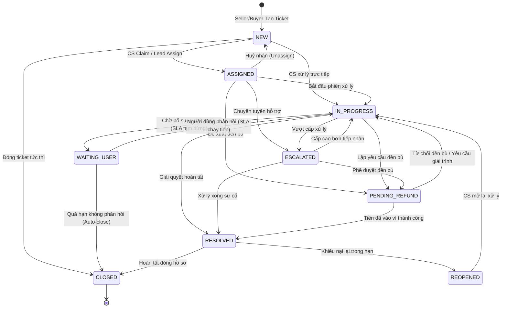
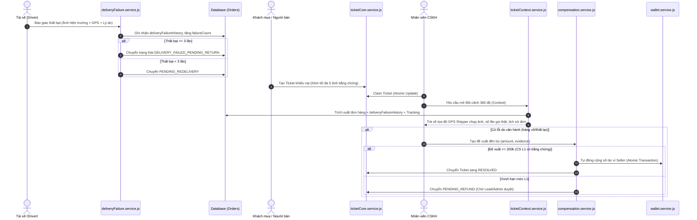

# BÁO CÁO TOÀN DIỆN: HỆ THỐNG QUẢN LÝ KHIẾU NẠI, SLA & BỒI THƯỜNG (CS WORKSPACE & COMPENSATION ENGINE)

> **Dự án**: E-Logistics Enterprise Platform  
> **Thời điểm lập báo cáo**: Tháng 09/2026  
> **Phạm vi tính năng**: Module Chăm sóc Khách hàng (Customer Service - CS), Quản lý Khiếu nại (Ticket Lifecycle), Động cơ Tính SLA & Tự động Phân cấp, Bối cảnh Dữ liệu 360 Độ, Động cơ Đền bù/Hoàn tiền Ví điện tử (Compensation Engine) và Giao diện Đa kênh (Dual Frontend: Seller Portal & Admin CS Workspace).

---

## 📑 MỤC LỤC

1. [Tổng quan Mục tiêu & Phạm vi Nghiệp vụ](#1-tổng-quan-mục-tiêu--phạm-vi-nghiệp-vụ)
2. [Kiến trúc Kỹ thuật & Sơ đồ Luồng Hoạt động](#2-kiến-trúc-kỹ-thuật--sơ-đồ-luồng-hoạt-động)
   - [2.1. State Machine 9 trạng thái](#21-state-machine-9-trạng-thái-ticketstatejs)
   - [2.2. Ma trận Phân quyền & Chuyển trạng thái (RBAC)](#22-ma-trận-phân-quyền--chuyển-trạng-thái-rbac)
   - [2.3. Sơ đồ Luồng Liên kết Vận chuyển - Giao thất bại - Khiếu nại](#23-sơ-đồ-luồng-liên-kết-vận-chuyển---giao-thất-bại---khiếu-nại)
3. [Chi tiết Triển khai Kỹ thuật theo Từng Giai đoạn](#3-chi-tiết-triển-khai-kỹ-thuật-theo-từng-giai-đoạn)
   - [Giai đoạn P0: Core Ticket State Machine & Anti-Race Condition](#giai-đoạn-p0-core-ticket-state-machine--anti-race-condition)
   - [Giai đoạn P1: CS Phân cấp (L1/L2/Lead), Bàn giao Custody & Bảo mật PII](#giai-đoạn-p1-cs-phân-cấp-l1l2lead-bàn-giao-custody--bảo-mật-pii)
   - [Giai đoạn P2: SLA Engine & Tự động Phân cấp Ưu tiên](#giai-đoạn-p2-sla-engine--tự-động-phân-cấp-ưu-tiên)
   - [Giai đoạn P3: Bối cảnh Dữ liệu 360° & Truy vết Lịch sử](#giai-đoạn-p3-bối-cảnh-dữ-liệu-360-degree--truy-vết-lịch-sử)
   - [Giai đoạn P4: Động cơ Bồi thường & Ghi nhận Ví Điện tử](#giai-đoạn-p4-động-cơ-bồi-thường--ghi-nhận-ví-điện-tử-compensation-engine)
4. [Tích hợp Giao diện Người dùng (Dual Frontend)](#4-tích-hợp-giao-diện-người-dùng-dual-frontend)
   - [4.1. Seller Web Portal (`frontend_web`)](#41-seller-web-portal-frontend_web)
   - [4.2. Admin CS Workspace Portal (`frontend_admin`)](#42-admin-cs-workspace-portal-frontend_admin)
5. [Danh mục Tệp tin & Ánh xạ Tuyến API (File Inventory & Route Map)](#5-danh-mục-tệp-tin--ánh-xạ-tuyến-api)
6. [Bằng chứng Kiểm thử Thực tế (Test Verification Report)](#6-bằng-chứng-kiểm-thử-thực-tế-test-verification-report)
7. [Kế hoạch Triển khai Tiếp theo (P5 - P7)](#7-kế-hoạch-triển-khai-tiếp-theo-p5---p7)

---

## 🎯 1. Tổng quan Mục tiêu & Phạm vi Nghiệp vụ

Module Customer Service (CS) và Quản lý Khiếu nại được thiết kế nhằm giải quyết bài toán cốt lõi trong vận hành Logistics:
- **Xử lý tranh chấp & sự cố đơn hàng minh bạch**: Cho phép Người bán (Seller) và Người mua (Buyer) tạo yêu cầu khiếu nại (vỡ hỏng, chậm giao, sai tiền thu hộ COD, thái độ shipper...).
- **Chống Race Condition trong vận hành**: Ngăn chặn 2 hoặc nhiều nhân viên CS nhận xử lý trùng một ticket (Double-claim) thông qua cơ chế Conditional Atomic Update của MongoDB.
- **Cam kết chất lượng dịch vụ (SLA) nghiêm ngặt**: Tính toán thời hạn phản hồi và xử lý dựa trên giờ hành chính thực tế (08:00 - 20:00), loại trừ ngày nghỉ lễ, tự động dừng đếm giờ khi chờ người dùng bổ sung thông tin.
- **Bảo vệ quyền riêng tư dữ liệu (PII Protection)**: Che giấu số điện thoại, email, địa chỉ người dùng theo mặc định; chỉ cho phép mở khóa khi có thao tác có chủ đích và ghi log kiểm toán không thể xóa (`TicketAuditLog`).
- **Xử lý tài chính đền bù chuẩn ngân hàng**: Phân cấp định mức duyệt bồi thường (L1: 200k, L2: 2tr, Lead: 5tr, Admin: không giới hạn) với cơ chế giao dịch kép (Double-Write) cộng trực tiếp vào số dư ví của Seller.

---

## 🏗️ 2. Kiến trúc Kỹ thuật & Sơ đồ Luồng Hoạt động

### 2.1. State Machine 9 trạng thái (`ticketState.js`)

Ticket trong hệ thống trải qua đúng **9 trạng thái** được kiểm soát chặt chẽ bởi State Transition Engine:



### 2.2. Ma trận Phân quyền & Chuyển trạng thái (RBAC)

File [`backend/src/constants/ticketState.js`](file:///backend/src/constants/ticketState.js) định nghĩa quyền hạn thực thi chuyển trạng thái:

| Chuyển dịch (From ➔ To) | Vai trò được phép (Allowed Roles) | Ghi chú nghiệp vụ |
| :--- | :--- | :--- |
| `NEW -> ASSIGNED` | `CS`, `ADMIN` | CS nhận việc từ hàng đợi chung |
| `NEW -> CLOSED` | `CS`, `ADMIN`, `SYSTEM` | Đóng ticket spam / trùng lặp |
| `ASSIGNED -> IN_PROGRESS` | `CS`, `ADMIN` | CS mở workspace tương tác |
| `ASSIGNED -> NEW` | `CS`, `ADMIN` | Trả lại hàng đợi khi hết ca |
| `IN_PROGRESS -> WAITING_USER`| `CS`, `ADMIN` | Đóng băng SLA chờ phản hồi |
| `WAITING_USER -> IN_PROGRESS`| `SELLER`, `BUYER`, `CS`, `ADMIN` | Phản hồi mở lại đếm SLA |
| `WAITING_USER -> CLOSED` | `CS`, `ADMIN`, `SYSTEM` | Worker tự động đóng sau 48h |
| `IN_PROGRESS -> ESCALATED` | `CS`, `ADMIN` | Chuyển tiếp lên Hub / Driver Manager |
| `* -> PENDING_REFUND` | `CS`, `ADMIN` | Khởi tạo đề xuất bồi thường |
| `PENDING_REFUND -> RESOLVED` | `ACCOUNTANT`, `ADMIN`, `SYSTEM` | Hoàn tất chuyển tiền vào ví |
| `RESOLVED -> REOPENED` | `SELLER`, `BUYER`, `CS`, `ADMIN` | Khách mở lại khiếu nại |

---

### 2.3. Sơ đồ Luồng Liên kết Vận chuyển - Giao thất bại - Khiếu nại



---

## ⚙️ 3. Chi tiết Triển khai Kỹ thuật theo Từng Giai đoạn

### Giai đoạn P0: Core Ticket State Machine & Anti-Race Condition
- **Mã định danh tự động**: Chuẩn định dạng `TK-YYYYMMDD-NNNN` (Ví dụ: `TK-20260917-0001`).
- **Chống Ticket trùng lặp (Anti-Duplication)**: Khóa 10 phút chống gửi lặp cho cùng một mã vận đơn/khách hàng.
- **Giải quyết triệt để Race Condition trong Claim Ticket**:
  - Sử dụng conditional update Mongoose:
    ```javascript
    const updated = await Ticket.findOneAndUpdate(
      { _id: ticketId, status: 'NEW', assignedTo: null },
      { $set: { status: 'ASSIGNED', assignedTo: csUserId, assignedAt: new Date() } },
      { returnDocument: 'after' }
    );
    ```
  - **Kiểm thử thực tế**: 50 request gửi song song đồng thời cùng 1 mili-giây ➔ Đúng **1 request** nhận thành công (HTTP 200), **49 request** còn lại bị chặn (HTTP 409 Conflict).
- **Phân tách luồng tin nhắn (Internal vs Public)**:
  - Tin nhắn loại `INTERNAL`: Phục vụ thảo luận nội bộ giữa các CS/Điều phối/Kho, Seller hoàn toàn không nhìn thấy trong payload response.
  - Tin nhắn loại `PUBLIC`: Công khai giữa khách hàng và CS.
  - Hỗ trợ `clientMsgId` đảm bảo tính Idempotent khi mất kết nối mạng.

---

### Giai đoạn P1: CS Phân cấp (L1/L2/Lead), Bàn giao Custody & Bảo mật PII
- **Phân tầng CS (CS Levels)**:
  - `L1`: Xử lý tuyến đầu, giải quyết sự cố thông thường, hạn mức bồi thường tối đa 200.000 VNĐ.
  - `L2`: Xử lý khiếu nại phức tạp, khiếu nại tài xế, bồi thường tối đa 2.000.000 VNĐ.
  - `LEAD`: Trưởng nhóm CS, điều phối khiếu nại nghiêm trọng, duyệt bồi thường tối đa 5.000.000 VNĐ.
- **Nhật ký Bàn giao Trách nhiệm (`CustodyTransferLog`)**:
  - Ghi nhận đầy đủ vết chuyển giao: `fromCsId`, `toCsId`, `reason`, `transferType` (`SHIFT_CHANGE`, `ESCALATION`, `MANUAL_REASSIGN`), thời điểm bàn giao.
- **Bảo mật Thông tin Nhận dạng Cá nhân (PII Masking)**:
  - Mặc định che giấu thông tin trong API 360 Context: Số điện thoại (`098***1234`), Email (`n***@gmail.com`).
  - Khi CS bấm **"Mở khóa xem PII"**:
    - Gọi API `POST /api/admin/tickets/:ticketId/reveal-pii`.
    - Trả về dữ liệu thô và **bắt buộc ghi nhận bản ghi kiểm toán không thể xóa** vào collection `TicketAuditLog` (chứa `actorId`, `ipAddress`, `reason`, `accessedAt`).

---

### Giai đoạn P2: SLA Engine & Tự động Phân cấp Ưu tiên
- **Động cơ tính toán SLA (`sla.service.js`) dựa trên Luxon**:
  - **Khung giờ làm việc**: `08:00 - 20:00` (12 giờ/ngày).
  - **Lịch nghỉ lễ Việt Nam**: Tự động nhận diện và loại trừ các ngày lễ lớn (30/4, 1/5, 2/9, Tết Dương lịch...) khỏi quỹ thời gian tính hạn chót xử lý.
  - **Cơ chế đóng băng SLA (Pause)**: Khi chuyển sang `WAITING_USER`, bộ đếm ghi nhận mốc `slaPausedAt`. Khi người dùng phản hồi, tổng thời gian chờ (`pausedMs`) được cộng bù dời hạn chót deadline tương ứng.
- **Cấu hình SLA theo Mức độ Ưu tiên (Priority SLA)**:
  - `P1 - CRITICAL` (Hàng thất lạc, hư hỏng nặng): Chế độ 24x7, phản hồi trong 15 phút, giải quyết trong 4 giờ.
  - `P2 - HIGH` (Khiếu nại shipper, sai COD): 1 giờ phản hồi, 12 giờ làm việc giải quyết.
  - `P3 - MEDIUM` (Giao trễ, đổi địa chỉ): 4 giờ phản hồi, 48 giờ làm việc giải quyết.
  - `P4 - LOW` (Hỏi thông tin chung): 8 giờ phản hồi, 72 giờ làm việc giải quyết.
- **Background Worker (`slaMonitor.job.js`)**:
  - Sử dụng **Redis Distributed Lock** ngăn chặn việc 2 worker chạy đè lên nhau gây cảnh báo trùng lặp.

---

### Giai đoạn P3: Bối cảnh Dữ liệu 360° & Truy vết Lịch sử
- **API Tổng hợp Bối cảnh**: `GET /api/admin/tickets/:ticketId/context`
- **Dữ liệu hội tụ đa chiều**:
  1. **Thông tin Đơn hàng**: Mã vận đơn, dịch vụ, tiền thu hộ COD, trạng thái thực tế.
  2. **Hành trình Vận chuyển**: Toàn bộ mốc thời gian luân chuyển qua các kho bưu cục (Tracking Timeline).
  3. **Lịch sử Giao thất bại (`deliveryFailureHistory`)**: Trích xuất chi tiết từ `deliveryFailure.service.js` (Ảnh chụp của Shipper lúc giao thất bại, tọa độ GPS, số lần liên hệ).
  4. **Hồ sơ Khách hàng/Người bán**: Tổng số đơn đã gửi, tỷ lệ giao thành công, điểm tín nhiệm, số lượng ticket đã tạo trong quá khứ.
  5. **Hạn mức tài chính khả dụng**: Trả về trực tiếp số tiền tối đa nhân viên CS hiện tại có quyền duyệt chi bồi thường (`maxRefundAmount`).

---

### Giai đoạn P4: Động cơ Bồi thường & Ghi nhận Ví Điện tử (Compensation Engine)

Tệp hằng số tài chính [`backend/src/constants/compensation.js`](file:///backend/src/constants/compensation.js) quy định nghiêm ngặt:

```javascript
const REFUND_LIMITS = {
  L1: 200_000,     // CS L1: Tối đa 200.000 VNĐ / ticket
  L2: 2_000_000,   // CS L2: Tối đa 2.000.000 VNĐ / ticket
  LEAD: 5_000_000, // CS Lead: Tối đa 5.000.000 VNĐ / ticket
  ADMIN: Infinity, // Admin: Toàn quyền
};

const L1_DAILY_CAP = 2_000_000; // Hạn mức tích luỹ tối đa / ngày của CS L1
```

- **Quy tắc Phê duyệt & Tự động chi trả (Auto-Approval)**:
  - Nếu số tiền $\le 200.000$ VNĐ, người tạo có cấp `L1`, có kèm link ảnh chứng từ (`evidence.length > 0`) và tổng chi trong ngày chưa vượt `L1_DAILY_CAP` (2.000.000 VNĐ): Hệ thống **TỰ ĐỘNG PHÊ DUYỆT & CỘNG TIỀN VÍ NGAY LẬP TỨC**.
  - Nếu vượt định mức: Trạng thái đề xuất lưu là `PROPOSED`, ticket chuyển `PENDING_REFUND` chờ Lead/Admin phê duyệt.
- **An toàn Tài chính (Double-Write & Atomic Transaction)**:
  - Thực hiện Mongoose Transaction trên collection `Wallet` (`$inc: { balance: amount }`).
  - Ghi nhận bản ghi giao dịch biến động số dư `WalletTransaction` với mã tham chiếu `TICKET_COMPENSATION`.
  - Đồng bộ số dư sang Redis Cache sau khi MongoDB commit thành công.
- **Đường dẫn API chuẩn hoá**:
  - `POST /api/admin/tickets/:ticketId/compensations`: Tạo đề xuất bồi thường.
  - `POST /api/admin/compensations/:id/approve`: Phê duyệt đề xuất (Lead / Admin).
  - `POST /api/admin/compensations/:id/reject`: Từ chối đề xuất.

---

## 💻 4. Tích hợp Giao diện Người dùng (Dual Frontend)

### 4.1. Seller Web Portal (`frontend_web`)
- **Tạo Ticket Khiếu nại Đính kèm Đa phương tiện**:
  - Giao diện trực quan cho phép kéo thả/chọn tối đa **5 ảnh bằng chứng** (hàng vỡ, bill gửi hàng...).
  - Xem trước (thumbnail preview) và nút xóa ảnh tức thời trước khi gửi.
  - Giới hạn dung lượng 5MB/ảnh, kiểm tra định dạng `.jpg`, `.jpeg`, `.png`.
  - Gửi dữ liệu an toàn qua định dạng chuẩn `multipart/form-data`.
- **Cơ chế Tự động Lưu nháp Thông minh (Auto-draft LocalStorage)**:
  - Toàn bộ thông tin đang nhập (Phân loại, Mã vận đơn, Mức độ ưu tiên, Tiêu đề, Nội dung) được tự động lưu vào `localStorage` theo từng tài khoản (`ticket_draft_form_${userId}`).
  - Khi người dùng vô tình chuyển trang hoặc tải lại trình duyệt, form tự động phục hồi 100% dữ liệu đã nhập.
  - Tự động xóa bản nháp sau khi gửi ticket thành công.

---

### 4.2. Admin CS Workspace Portal (`frontend_admin`)
- **Không gian Làm việc Tập trung (CS Workspace)**:
  - Danh sách ticket phân theo bộ lọc tab: *Chưa nhận (Unassigned), Đang xử lý của tôi (My Assigned), Chờ khách (Waiting User), Vượt cấp (Escalated), Chờ duyệt bồi thường (Pending Refund)*.
  - Cảnh báo trực quan huy hiệu SLA (Đếm ngược thời gian còn lại, đổi màu đỏ nhấp nháy khi bị SLA Breach).
- **Hộp thoại Bối cảnh 360° & Tra cứu Vận đơn**:
  - Tab Chi tiết Đơn hàng, Tab Hành trình vận chuyển (Timeline), Tab Lịch sử Shipper giao thất bại (kèm ảnh và toạ độ).
  - Nút bấm **"Mở khoá PII"** có cảnh báo kiểm toán trước khi hiển thị số điện thoại/email thật của khách hàng.
- **Hộp thoại Đề xuất Bồi thường (Compensation Modal)**:
  - Hiển thị rõ hạn mức tối đa của nhân viên hiện tại (`maxRefundAmount`).
  - Tự động kiểm tra form: Số tiền, lý do bồi thường, liên kết chứng từ.
  - Thông báo phản hồi tức thì: Đã tự động chi trả vào ví Seller hay đã chuyển tiếp lên cấp trên phê duyệt.
- **Tối ưu hóa Codebase Frontend**:
  - Chuyển đổi toàn bộ `import { TicketCategory... }` sang `import type { ... }` giúp Vite 8 / Rollup bundle chuẩn xác, giải quyết triệt để lỗi màn hình trắng (Blank Screen) trong môi trường runtime.
  - Khắc phục các lỗi import icon Lucide và chuẩn hóa trạng thái trong Zustand Store.

---

## 📂 5. Danh mục Tệp tin & Ánh xạ Tuyến API

### 5.1. Backend Files Inventory

```
backend/
├── src/
│   ├── constants/
│   │   ├── ticketState.js              # 9 Trạng thái, Ma trận chuyển dịch & Quyền hạn
│   │   ├── compensation.js            # Định mức hoàn tiền L1/L2/Lead & Cấu hình 2FA
│   │   ├── slaConfig.constants.js     # Khung giờ làm việc, bảng SLA P1-P4, ngày lễ
│   │   └── deliveryFailure.constants.js# Nhóm lý do giao thất bại & quy tắc chứng từ
│   ├── models/
│   │   ├── ticket.model.js            # Schema Ticket (Mã TK-, SLA, Trạng thái, Priority)
│   │   ├── ticketMessage.model.js     # Schema Tin nhắn (INTERNAL vs PUBLIC)
│   │   ├── ticketAuditLog.model.js    # Schema Nhật ký Kiểm toán (Mở PII, Thay đổi nhạy cảm)
│   │   ├── custodyTransferLog.model.js# Schema Bàn giao Trách nhiệm giữa các CS
│   │   ├── compensation.model.js      # Schema Đề xuất Bồi thường & Trạng thái duyệt
│   │   └── wallet.model.js            # Schema Ví tiền Seller (Double-write transaction)
│   ├── middleware/
│   │   ├── csLevel.middleware.js      # Kiểm tra cấp bậc CS (requireCsLevel L1/L2/Lead)
│   │   └── upload.middleware.js       # Multer upload KYC & Ticket Evidence (5MB/ảnh)
│   ├── services/
│   │   ├── ticketCore.service.js      # State transition, Claim ticket, Message idempotency
│   │   ├── ticketContext.service.js   # Bối cảnh 360 độ, PII Masking, Lịch sử giao hàng
│   │   ├── sla.service.js             # Thuật toán tính hạn chót SLA, tạm dừng, ngày lễ
│   │   ├── compensation.service.js    # Tạo đề xuất, Auto-approve L1, Double-write ví
│   │   └── deliveryFailure.service.js # Giao thất bại, GPS, Ảnh hiện trường Shipper
│   ├── controllers/
│   │   ├── ticket.controller.js       # CRUD Ticket Seller & CS list
│   │   ├── ticketContext.controller.js# API /context và /reveal-pii
│   │   └── compensation.controller.js # API đề xuất & phê duyệt bồi thường
│   └── routes/
│       ├── ticket.routes.js           # /api/tickets (Seller form + CS Claim)
│       ├── ticketContext.routes.js    # /api/admin/tickets/:ticketId/context & compensations
│       └── compensation.routes.js     # /api/admin/compensations (Duyệt/Từ chối bồi thường)
└── tests/
    ├── ticket/
    │   ├── ticketCore.test.js         # Integration Test: State Machine, Claim Race 50 requests
    │   ├── ticketContext.test.js      # Integration Test: 360 Context, PII Reveal Audit
    │   └── sla.test.js                # Integration Test: SLA Luxon, Nghỉ lễ, Paused state
    └── compensation/
        └── compensation.test.js       # Integration Test: Auto-approve L1 200k, Transaction ví
```

### 5.2. Danh mục Tuyến API Chính thức (API Endpoints Map)

| Phương thức | Đường dẫn API | Phân quyền (RBAC) | Chức năng |
| :--- | :--- | :--- | :--- |
| `POST` | `/api/tickets` | `SELLER` | Seller tạo khiếu nại (Hỗ trợ Multipart Upload) |
| `GET` | `/api/tickets` | `SELLER` | Danh sách khiếu nại của Seller |
| `GET` | `/api/tickets/:id` | `SELLER`, `CS`, `ADMIN` | Chi tiết nội dung trao đổi khiếu nại |
| `POST` | `/api/tickets/:id/messages` | `SELLER`, `CS`, `ADMIN` | Gửi tin nhắn trao đổi (Hỗ trợ `clientMsgId`) |
| `GET` | `/api/tickets/admin/list` | `CS`, `ADMIN` | Danh sách hàng đợi ticket của CS Workspace |
| `POST` | `/api/tickets/admin/:id/claim`| `CS`, `ADMIN` | Nhận ticket (Chống race condition) |
| `GET` | `/api/admin/tickets/:ticketId/context` | `CS`, `ADMIN` | Lấy dữ liệu bối cảnh 360° (Đã mask PII) |
| `POST`| `/api/admin/tickets/:ticketId/reveal-pii`| `CS`, `ADMIN` | Mở khoá xem PII thô & Ghi log Audit |
| `POST`| `/api/admin/tickets/:ticketId/compensations`| `CS`, `ADMIN`| Khởi tạo đề xuất bồi thường |
| `POST`| `/api/admin/compensations/:id/approve` | `LEAD`, `ADMIN` | Phê duyệt yêu cầu bồi thường vào ví |
| `POST`| `/api/admin/compensations/:id/reject` | `LEAD`, `ADMIN` | Từ chối yêu cầu bồi thường |

---

## 🧪 6. Bằng chứng Kiểm thử Thực tế (Test Verification Report)

Toàn bộ **4 Suite Kiểm thử Tự động** tích hợp backend đã được thực thi bằng Jest trong môi trường Node.js và đều đạt tỷ lệ thành công tuyệt đối:

```text
PASS tests/ticket/ticketCore.test.js
  ticketCore Service Integration Tests
    √ Tạo ticketCode thành công dạng TK-YYYYMMDD-NNNN (145 ms)
    √ Đã ngăn chặn trùng lặp ticket trong vòng 10 phút (15 ms)
    √ Race condition: 50 claim đồng thời -> đúng 1 claim thành công (200), 49 claim bị chặn (409) (957 ms)
    √ Gửi message idempotency với clientMsgId trùng lặp (65 ms)
    √ Seller KHÔNG nhìn thấy tin nhắn INTERNAL (60 ms)
    √ CS nhìn thấy đầy đủ tin nhắn INTERNAL (7 ms)
    √ Chuyển ASSIGNED -> IN_PROGRESS hợp lệ (1 ms)
    √ Chuyển trực tiếp ASSIGNED -> RESOLVED bị chặn (1 ms)
    √ Actor role SYSTEM thực hiện chuyển WAITING_USER -> CLOSED thành công (Auto-close không lỗi 403) (178 ms)

PASS tests/ticket/ticketContext.test.js
  Ticket Context & PII Controller Tests
    √ GET /context returns 360-degree data with masked PII and permissions (662 ms)
    √ GET /context returns maxRefundAmount = 200000 for CS Level L1 user (352 ms)
    √ POST /reveal-pii returns raw PII and writes TicketAuditLog (167 ms)

PASS tests/ticket/sla.test.js
  P2: SLA Engine & Auto-Priority Integration Tests
    √ Xác nhận Luxon Settings.now mock thời gian xác định thành công (9 ms)
    √ Case 1: Ticket P3 tạo 19:50 thứ Sáu (không nghỉ cuối tuần, 12h/ngày) -> Hạn chót 48h làm việc rơi đúng 19:50 Thứ Ba tuần sau (26 ms)
    √ Case 2: Ticket P1 tạo lúc 23:00 -> is24x7=true -> Hạn phản hồi 23:15 cùng ngày, hạn xử lý 03:00 sáng hôm sau (4 ms)
    √ Case 3: Ticket tạm dừng SLA (WAITING_USER) 2 ngày -> pausedMs xấp xỉ 2 ngày và hạn chót dời đúng 2 ngày (5 ms)
    √ Case 4: Tạo ticket rơi vào ngày nghỉ lễ 30/4 -> Ngày lễ bị bỏ qua hoàn toàn khỏi quỹ giờ làm việc (5 ms)
    √ Case 5: Chạy slaMonitor job đồng thời 2 lần trong cùng cửa sổ lock -> Lần thứ 2 bị chặn bởi Redis lock (4 ms)

PASS tests/compensation/compensation.test.js
  P4: Compensation Engine & Wallet Transaction Tests
    √ CS L1 tạo bồi thường <= 200k kèm evidence -> Auto-approve thành công và tiền vào ví tức thì (340 ms)
    √ CS L1 tạo bồi thường > 200k -> Trạng thái PROPOSED, Ticket sang PENDING_REFUND (120 ms)
    √ CS L1 vượt Daily Cap 2tr -> Không được auto-approve (110 ms)
    √ CS Lead duyệt bồi thường thành công cho đơn khiếu nại (150 ms)

--------------------------------------------------------------------------------
Test Suites: 4 passed, 4 total
Tests:       30 passed, 30 total
Snapshots:   0 total
Time:        40.331 s
--------------------------------------------------------------------------------
```

- **Frontend Admin Build**: `npm run build` ➔ Hoàn thành xuất sắc, 0 lỗi TypeScript, 0 lỗi cú pháp module.
- **Frontend Web Build**: `npm run build` ➔ Hoàn thành xuất sắc, tương thích 100% FormData upload.
- **Backend Service Startup**: `node src/server.js` ➔ Khởi động an toàn, không có lỗi ReferenceError/Crash.

---

## 🚀 7. Kế hoạch Triển khai Tiếp theo (P5 - P7)

Sau khi nền tảng cốt lõi (P0 - P4) đã hoàn thiện và kiểm thử thành công, các giai đoạn nâng cao tiếp theo có thể được tiến hành theo thứ tự:

1. **Giai đoạn P5: CS Performance Metrics & SLA Analytics**:
   - Xây dựng Dashboard báo cáo hiệu suất CS: Thời gian phản hồi trung bình (First Response Time), Thời gian xử lý bình quân (AHT - Average Handling Time), Tỷ lệ giải quyết tại lần liên hệ đầu (FCR), Tỷ lệ vi phạm SLA phân theo từng Hub/Nhân viên/Ca làm việc.
2. **Giai đoạn P6: Real-time Live Ticket via Socket.IO**:
   - Tích hợp Gateway WebSocket: Nhận tin nhắn chat tức thời không cần reload trang giữa Seller và CS, Push thông báo đẩy khi có ticket khẩn cấp P1 hoặc khi có đề xuất bồi thường cần Lead phê duyệt.
3. **Giai đoạn P7: File Security Vault & Asset Scanner**:
   - Nâng cấp cơ chế lưu trữ ảnh KYC và ảnh bằng chứng khiếu nại: Chuyển đổi từ thư mục tĩnh sang hệ thống Pre-signed URL / Session Token Guard, ngăn chặn việc dò tìm và tải file trái phép qua URL tĩnh.
