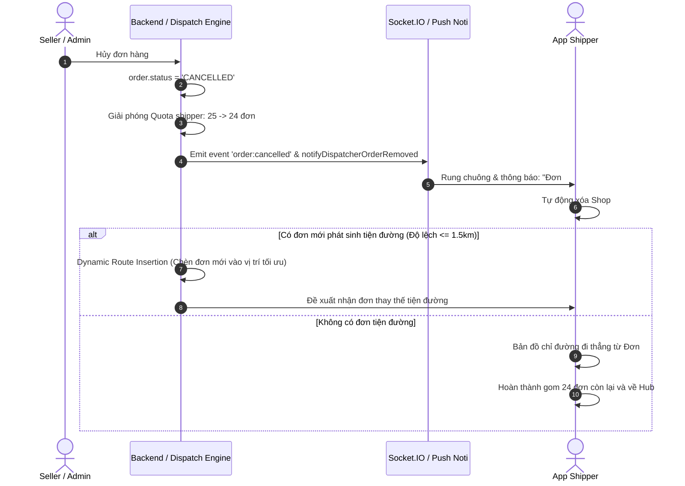

# Đặc Tả Kỹ Thuật: Cơ Chế Điều Phối Đơn & Gom Tuyến Khi Lượng Đơn Ít (Low-Density Dispatching)

Tài liệu này lưu trữ và đặc tả các giải pháp điều phối khi số lượng đơn hàng phát sinh tại các cụm tuyến (Geozone) ở mức thấp (dưới 5 - 10 đơn/zone), nhằm đảm bảo hiệu quả vận hành và thu nhập cho Shipper.

---

## 1. Đặt Vấn Đề (Problem Statement)
* **Thực trạng:** Tại các khu vực ngoại thành, vùng ven hoặc trong khung giờ thấp điểm, mỗi cụm tuyến nhỏ (Micro-zone / Phường / Cụm khu phố) chỉ có rải rác từ 2 đến 5 đơn hàng chờ lấy (`READY_TO_PICK`).
* **Hạn chế nếu gán 1 Shipper - 1 Zone:**
  * Shipper di chuyển đến địa bàn nhưng chỉ lấy được 2-3 đơn, không bõ công di chuyển và chi phí xăng xe.
  * Các cụm tuyến lân cận (cùng quận hoặc giáp ranh) cũng có đơn lẻ tẻ nhưng không có shipper gom kịp thời.
  * Đơn hàng bị trễ cam kết SLA lấy hàng trong ngày.

---

## 2. Các Giải Pháp Điều Phối Đề Xuất

### Phương Án A: Cho Phép Gom Tuyến Đa Cụm (Multi-Zone Selection) - *Khuyến Nghị Dễ Triển Khai Nhất*
* **Cơ chế:**
  * Trên màn hình `ShipperZonePage`, thay vì chỉ chọn duy nhất 1 cụm tuyến (Single Radio Select), cho phép Shipper tick chọn **2 đến 3 Cụm Tuyến liền kề** (Multi-select Checkboxes) trong cùng một Quận/Huyện.
  * *Ví dụ:* Shipper chọn cùng lúc:
    * `ZONE-SGN-TB1` (Phường 12, Tân Bình)
    * `ZONE-SGN-TB2` (Phường 13, Tân Bình)
  * Khi bấm *"Bắt Đầu Nhận Đơn Lấy Hàng"*, API sẽ nạp danh sách gộp tất cả các đơn của các zone này vào danh sách nhiệm vụ lấy hàng (`pickup-tasks`) của Shipper đó.

### Phương Án B: Tự Động Gom Cụm Tuyến Linh Hoạt (Dynamic Zone Clustering)
* **Cơ chế Backend:**
  * Hệ thống thiết lập ngưỡng tối thiểu: `MIN_PICKUP_BATCH = 10 đơn`.
  * Nếu một Zone có số đơn chờ $< MIN_PICKUP_BATCH$, thuật toán gom cụm tại Backend sẽ tự động gộp các Zone lân cận thành 1 **Super-Zone (Cụm Tuyến Mở Rộng)** cấp Quận.
  * Shipper thuộc cụm tuyến đó sẽ nhận được một danh sách hành trình gom đơn tối ưu (TSP - Travelling Salesperson Problem) đi qua các shop liền kề.

### Phương Án C: Ghép Chiều Lấy & Giao Tiện Chuyến (Combined Pickup & Delivery Run)
* **Cơ chế:**
  * Shipper không chạy cuốc rỗng: Khi Shipper đang đi giao các đơn trả hàng tại một phường, hệ thống hiển thị thêm các điểm lấy hàng của các Seller nằm ngay trên cung đường đó.
  * Shipper vừa giao xong kiện hàng, vừa ghé shop bên cạnh nhận đơn gửi đi Hub.

---

## 3. Câu Hỏi Nghiệp Vụ: "Nếu Shipper đang thực hiện gom đơn thứ 3, thì có nhận được đơn mới không?"

### 3.1. Theo Kiến Trúc Hệ Thống Hiện Tại:
* **CÓ NHẬN ĐƯỢC.**
* **Nguyên nhân kỹ thuật:**
  * Màn hình danh sách đơn lấy hàng của Shipper (`/orders/shipper/pickup-tasks`) truy vấn theo trạng thái `READY_TO_PICK` trong địa bàn hoạt động của Shipper.
  * Hạn mức lấy hàng tối đa của Shipper được cấu hình là **25 đơn/chuyến** (hiện tại shipper mới gom đến đơn thứ 3 $\rightarrow$ mới đạt 3/25 đơn, còn dư 22 suất).
  * Khi có shop mới bấm "Chuẩn Bị Xong", đơn mới sẽ lập tức xuất hiện trong danh sách lấy hàng của Shipper.

### 3.2. Quy Tắc Điều Phối Nghiệp Vụ Thực Tế (Business Rules):

| Tình Huống | Có Cho Nhận Đơn Mới? | Điều Kiện Áp Dụng |
| :--- | :---: | :--- |
| **Shop mới nằm tiện đường di chuyển** | ✅ **CÓ** | Shop mới nằm cùng phường hoặc cách lộ trình shipper đang đi $< 1.5\text{ km}$. Hệ thống tự động chèn thêm điểm lấy vào lộ trình (Dynamic Route Insertion). |
| **Còn chỗ trên thùng xe / Tải trọng cho phép** | ✅ **CÓ** | Khối lượng tổng các đơn đã lấy + đơn mới $\le 20\text{ kg}$ (ngưỡng an toàn xe máy). |
| **Shop mới ở quá xa / Ngược hướng đi** | ❌ **KHÔNG** | Shop mới cách $> 3\text{ km}$ ngược hướng đi $\rightarrow$ Hệ thống điều phối cho shipper khác để tránh làm trễ giờ hẹn của các shop đã nhận trước đó. |
| **Shipper đã chốt chuyến về Hub (Cut-off)** | ❌ **KHÔNG** | Khi Shipper đã bấm "Kết thúc ca gom hàng" và đang chạy về Hub để kịp giờ chuyến xe tải trung chuyển (Line-haul cutoff). |

---

## 4. Nghiệp Vụ Chuyên Sâu: Đạt Ngưỡng 25 Đơn & Cơ Chế Xử Lý Khi Hủy Đơn Giữa Chặng (Đơn #17)

### 4.1. Shipper đã nhận đủ 25 đơn và có lịch trình sẵn: Có được nhận thêm đơn không?

* **Quy tắc hệ thống tự động (Dispatch Engine):**
  * **MẶC ĐỊNH LÀ KHÔNG.**
  * **Cơ chế kỹ thuật:** Trong `dispatchEngine.service.js`, hệ thống kiểm tra điều kiện cứng (Hard Constraint):
    `if (taskType === 'PICKUP' && currentPickup >= maxPickup) return false;` (với `maxPickup = 25`).
  * **Lý do nghiệp vụ:**
    1. **An toàn tải trọng:** Thùng xe máy và giới hạn an toàn giao thông quy định tối đa $25\text{ đơn} \approx 45\text{ kg}$.
    2. **Đảm bảo cam kết thời gian (SLA):** Lộ trình 25 điểm lấy đã được tối ưu hóa theo thời gian hẹn với các shop. Nhận thêm đơn thứ 26 sẽ làm vỡ khung giờ hẹn của các shop còn lại.
    3. **Giờ chốt ca nhập kho (Inbound Cutoff):** Đảm bảo shipper hoàn thành đúng giờ để kịp chuyến xe tải trung chuyển xuất bến tại Hub.
* **Ngoại lệ:**
  * **Dispatcher can thiệp thủ công (Manual Override):** Điều phối viên tại Hub có quyền chỉ định thêm 1-2 đơn nếu shop đó ở sát vách và hàng siêu nhẹ.
  * **Chạy nhiều lượt trong ca (Multi-batch Run):** Sau khi shipper giao 25 đơn về Hub nhập kho (`Inbound Scan`), quota sẽ được reset về 0 để shipper bắt đầu chuyến gom thứ 2.

---

### 4.2. Cơ chế xử lý khi đang gom 25 đơn mà Đơn thứ 17 bị hủy:

Khi Shipper đang trên đường thực hiện lộ trình 25 đơn và Đơn #17 bị hủy (do Seller hết hàng / Khách hủy / Admin hủy), hệ thống vận hành theo quy trình sau:

#### Chi tiết từng bước kỹ thuật:

1. **Thông báo tức thì & Cập nhật App Shipper:**
   * Ngay khi đơn #17 chuyển sang `CANCELLED`, backend phát sự kiện qua `ioSingleton.emitOrderUpdate` và `notifyDispatcherOrderRemoved`.
   * App Shipper lập tức gỡ điểm dừng tại Shop 17 khỏi danh sách nhiệm vụ và bản đồ chỉ đường, tránh trường hợp shipper chạy đến nơi mất công.

2. **Hoàn trả Quota (Slot trống):**
   * Số lượng đơn đang nhận của Shipper tự động giảm từ **25 xuống 24 đơn**.
   * Trạng thái của Shipper chuyển từ "Đã đầy tải" sang **"Còn 1 slot nhận đơn"** (`remainingQuota = 1`).

3. **Cơ chế nhận đơn mới thay thế (Dynamic Insertion):**
   * **Nếu có đơn mới cùng tuyến (On-the-way):** Nếu trong khu vực có đơn hàng mới vừa bấm "Chuẩn Bị Xong" và vị trí của shop mới nằm tiện đường (giữa Shop 16 và Shop 18, hoặc gần vị trí hiện tại của shipper với độ lệch $< 1.5\text{ km}$):
     * Thuật toán Dispatch Engine sẽ tự động gán hoặc đề xuất đơn mới này vào vị trí thay thế.
     * Thuật toán định tuyến (TSP) tự động cập nhật lại thứ tự ghé lấy hàng.
   * **Nếu không có đơn tiện đường:**
     * Hệ thống **KHÔNG ÉP GÁN** một đơn ở quá xa hoặc ngược hướng.
     * Shipper tiếp tục di chuyển thẳng từ Shop 16 sang Shop 18, hoàn thành 24 đơn còn lại và quay về Hub bàn giao.

