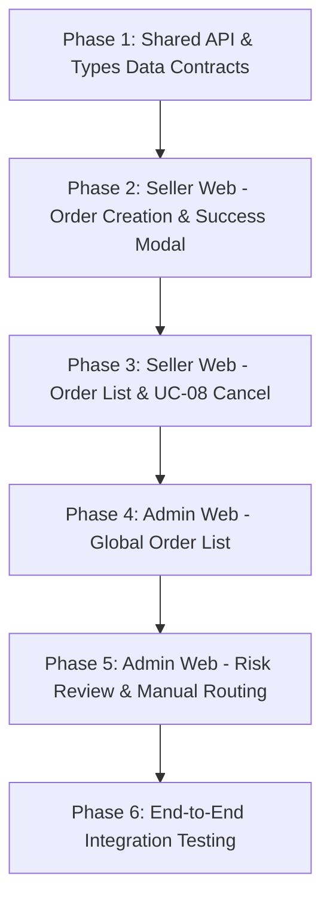

# 📐 KẾ HOẠCH TRIỂN KHAI FRONTEND (ORDER MODULE: UC-06, UC-07, UC-08)

Dựa trên 4 bản thiết kế Wireframe UI/UX bạn cung cấp, kế hoạch này quy định chi tiết cấu trúc Component, API Integration, State Management và luồng UI/UX cho hai ứng dụng Frontend: **`frontend_web` (Seller Portal)** và **`frontend_admin` (Admin Portal)**.

---

## 🎯 1. TỔNG QUAN CÁC MÀN HÌNH CẦN PHÁT TRIỂN

### A. SELLER WEB PORTAL (`frontend_web`)
1. **Màn hình 1 — Form Tạo Đơn Hàng Mới (`/orders/create`)** *(Khớp Wireframe 1)*:
   - Form Layout 2 cột (Main Form 8 phần + Sticky Sidebar Báo Giá 4 phần).
   - **Card 1: Pickup Address**: Sổ địa chỉ đã lưu, Tên/SĐT người gửi, Tỉnh/Quận/Phường, Địa chỉ chi tiết.
   - **Card 2: Delivery Address**: Tên/SĐT người nhận, Tỉnh/Quận/Phường, Địa chỉ chi tiết.
   - **Card 3: Items & Dimensions**: Bảng nhập sản phẩm linh hoạt (+ Thêm dòng), Kích thước Dài x Rộng x Cao ($L \times W \times H$), Tự động tính Trọng lượng quy đổi ($Volumetric = \frac{L \times W \times H}{5000}$) và Trọng lượng tính cước ($ChargeableWeight$).
   - **Card 4: COD & Value**: Checkbox Thu hộ COD, Giá trị khai báo hàng hóa, Ghi chú giao hàng, Mã giảm giá.
   - **Sticky Sidebar Báo Giá Realtime**: Tự động gọi `POST /api/orders/quote`, hiển thị phân rã cước phí (Cước gốc, Phí bảo hiểm, Giảm giá, Tổng cước), Bưu cục phục vụ dự kiến (`pickupHub`, `deliveryHub`), Nút "TẠO ĐƠN HÀNG".

2. **Màn hình 2 — Modal Tạo Đơn Thành Công & In Vận Đơn** *(Khớp Wireframe 2)*:
   - Pop-up Modal hiển thị ngay sau khi API `POST /api/orders` trả về `201 Created`.
   - Card Mã vận đơn (`ELG...VN`) kèm nút Copy & Mã vạch Barcode (render SVG).
   - Khối Tổng cước phí & Số tiền COD.
   - Các nút hành động: `Print Waybill Label` (mở Modal In Nhãn Vận Đơn A6), `Create Next Order`, `View Order List`.

3. **Màn hình 3 — Danh sách đơn hàng & Modal Hủy Đơn (UC-08)**:
   - Danh sách đơn hàng của Seller kèm nút Hủy đơn (Single Cancel & Bulk Cancel).
   - Modal Chọn lý do hủy (Đổi ý, Sai thông tin, Hết hàng, Lý do khác bắt buộc $\ge 5$ ký tự).

---

### B. ADMIN PORTAL (`frontend_admin`)
1. **Màn hình 1 — Global Order List (`/admin/orders`)** *(Khớp Wireframe 3)*:
   - Thanh bộ lọc (Filter Bar): Tìm kiếm Tracking/Phone/Name, Lọc Status (`CREATED`, `PENDING_VERIFICATION`, `READY_TO_PICK`...), Lọc Cờ Rủi Ro (`COD Anomaly`, `Fee Ratio Warning`), Lọc Hub.
   - Bảng dữ liệu (Data Table): Tracking Code & Date, Seller Info (Tên shop/ID), Recipient, Weight (Thực tế / Quy đổi), COD / Fee, Status & **Risk Flags Badges** (Tag màu đỏ/cam), Actions (`Approve`, `Edit`, `View`).

2. **Màn hình 2 — Review Order & Dispatch Control (`/admin/orders/:id/review`)** *(Khớp Wireframe 4)*:
   - Header: Mã đơn hàng + Status Badge `PENDING_VERIFICATION` + Các nút hành động (`Approve & Dispatch`, `Cancel Order`, `Request Seller Edit`).
   - **Automated Risk Engine Halt Card (Viền đỏ)**: Liệt kê các cờ rủi ro kích hoạt bởi Backend (COD Anomaly Detected, Fee Ratio Warning, Manual Routing Required).
   - **Consignment Manifest Table**: Bảng chi tiết sản phẩm và tổng giá trị khai báo.
   - **Resolution Actions Card**: Select Box phân công Bưu cục thủ công (`Select alternative hub`), Textarea ghi chú đè lý do, Nút bấm phê duyệt.
   - **Logistics Meta Card**: Thông tin chi tiết Người gửi, Người nhận, Cấp dịch vụ.

---

## 🛠️ 2. LỘ TRÌNH THỰC THI (PHASE-BY-PHASE ROADMAP)

---

### 📌 PHASE 1: CHUẨN HÓA DATA CONTRACT & API CLIENT (`frontend_web` & `frontend_admin`)
- **Tạo/Cập nhật Type Interfaces (`order.types.ts`)**:
  - `Order`, `OrderItem`, `Address`, `QuoteRequest`, `QuoteResponse`, `CreateOrderPayload`, `CancelOrderPayload`, `BulkCancelPayload`, `RiskFlags`.
- **Cập nhật Service Client (`order.api.ts`)**:
  - `getQuote(payload)` $\rightarrow$ `POST /api/orders/quote`
  - `createOrder(payload, idempotencyKey)` $\rightarrow$ `POST /api/orders` (Header `X-Idempotency-Key`)
  - `updateOrder(id, payload)` $\rightarrow$ `PUT /api/orders/:id`
  - `cancelOrder(id, payload)` $\rightarrow$ `DELETE /api/orders/:id/cancel`
  - `bulkCancelOrders(payload)` $\rightarrow$ `POST /api/orders/bulk-cancel`
  - `getPrintLabel(id)` $\rightarrow$ `GET /api/orders/:id/label`

---

### 📌 PHASE 2: PHÁT TRIỂN SELLER WEB — FORM TẠO ĐƠN & MODAL THÀNH CÔNG (`frontend_web`)
1. **Component `PickupAddressCard.tsx` & `DeliveryAddressCard.tsx`**:
   - Tích hợp Dropdown Tỉnh/Thành, Quận/Huyện, Phường/Xã Việt Nam.
   - Form validation bằng `react-hook-form` + `zod`.
2. **Component `ItemsDimensionsCard.tsx`**:
   - Bảng sản phẩm thêm/xóa dòng linh hoạt.
   - Tự động tính Trọng lượng quy đổi & Trọng lượng tính cước ngay trên UI.
3. **Component `PricePreviewSidebar.tsx`**:
   - Debounce input changes (300ms) để tự động gọi `getQuote` khi thông tin hợp lệ.
   - Hiển thị cước phí phân rã & Bưu cục dự kiến.
4. **Component `OrderSuccessModal.tsx` & Barcode Renderer**:
   - Pop-up hiển thị mã vận đơn, Barcode SVG, Nút Copy.
   - Modal xem & in Nhãn dán vận đơn A6 (Print layout CSS `@media print`).

---

### 📌 PHASE 3: SELLER WEB — QUẢN LÝ ĐƠN HÀNG & HỦY ĐƠN UC-08 (`frontend_web`)
1. **Màn hình `OrderListPage.tsx`**:
   - Bảng đơn hàng của Seller, tìm kiếm & phân trang.
2. **Component `CancelOrderModal.tsx`**:
   - Radio options cho Lý do hủy: `SELLER_CHANGED_MIND`, `WRONG_INFO`, `OUT_OF_STOCK`, `OTHER`.
   - Textarea nhập `customReason` bắt buộc $\ge 5$ ký tự nếu chọn `OTHER`.
3. **Chức năng Hủy hàng loạt (Bulk Cancel)**:
   - Checkbox chọn nhiều đơn $\rightarrow$ Nút "Hủy các đơn đã chọn" $\rightarrow$ Hiển thị kết quả chi tiết từng đơn (`successCount`, `failedCount`).

---

### 📌 PHASE 4: PHÁT TRIỂN ADMIN PORTAL — GLOBAL ORDER LIST (`frontend_admin`)
1. **Màn hình `GlobalOrderListPage.tsx`**:
   - Bảng dữ liệu Admin quản lý toàn bộ đơn hàng của tất cả Seller.
   - Thanh Filter Bar tìm kiếm đa tiêu chí.
   - Tag trạng thái & **Badge Cảnh báo Risk Flags** (`COD Anomaly`, `Fee Ratio Warning`).
   - Cột Thao tác: Nút `Approve`, `Review Risk`, `Cancel`.

---

### 📌 PHASE 5: ADMIN PORTAL — RISK REVIEW & MANUALLY ASSIGN HUB (`frontend_admin`)
1. **Màn hình `RiskReviewPage.tsx`**:
   - **Risk Engine Halt Card**: Box viền đỏ hiển thị các cờ rủi ro được kích hoạt.
   - **Resolution Actions Card**: Form cho Admin chọn Hub thay thế (`pickupHub`, `deliveryHub`), nhập lý do đè cờ, bấm `Approve & Assign Hub`.
   - Gợi ý & Cảnh báo sức chứa Hub.

---

### 📌 PHASE 6: E2E INTEGRATION & VERIFICATION
1. Kiếm thử luồng Tạo đơn $\rightarrow$ Báo giá Realtime $\rightarrow$ Lưu DB $\rightarrow$ In Nhãn A6.
2. Kiểm thử luồng Đơn bị cờ rủi ro $\rightarrow$ Admin Review $\rightarrow$ Gán Hub thủ công $\rightarrow$ Duyệt đơn.
3. Kiểm thử luồng Hủy đơn (Single & Bulk) $\rightarrow$ Atomic status lock $\rightarrow$ OrderLog.

---

## 👥 PHÂN CÔNG THỰC THI

| Bước | Nhiệm vụ | Repository | Output |
| :--- | :--- | :--- | :--- |
| **1** | Định nghĩa API & Types (`order.types.ts`, `order.api.ts`) | `frontend_web` & `frontend_admin` | Data Contract Types & Client API Methods |
| **2** | Dựng Form Tạo đơn hàng & Sidebar Báo giá | `frontend_web` | `/orders/create` Page (Wireframe 1) |
| **3** | Dựng Modal Tạo thành công & In nhãn A6 | `frontend_web` | Success Modal & Print Label Component (Wireframe 2) |
| **4** | Dựng Modal Hủy đơn (UC-08 Single & Bulk) | `frontend_web` | Cancel Order Dialog Component |
| **5** | Dựng Bảng Danh sách Đơn hàng Global | `frontend_admin` | `/admin/orders` Page (Wireframe 3) |
| **6** | Dựng Màn hình Phê duyệt Rủi ro & Gán Hub | `frontend_admin` | `/admin/orders/:id/review` Page (Wireframe 4) |
