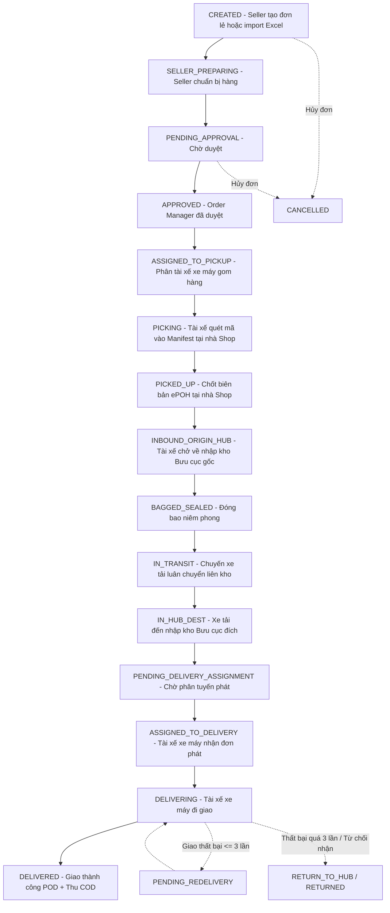

# E-LOGISTIC — TÀI LIỆU ĐẶC TẢ KIẾN TRÚC & HỆ THỐNG TOÀN DIỆN (MASTER SYSTEM SPECIFICATION)

> **TÀI LIỆU NGUỒN CHUẨN DUY NHẤT (SINGLE SOURCE OF TRUTH)**  
> **Dự án:** Khóa luận tốt nghiệp K18 — Hệ thống Quản lý Vận chuyển & Kho vận Thương mại Điện tử (E-Logistics System)  
> **Phạm vi khởi tạo đơn hàng:** Seller trực tiếp thao tác tạo **Đơn lẻ (Single Order)** hoặc **Đơn hàng loạt (Batch Order qua file Excel)** trên Portal, **HOÀN TOÀN KHÔNG TÍCH HỢP VỚI SÀN TMĐT BÊN NGOÀI**.  
> **Dùng cho:**  
> 1. Chương 3 & Chương 4 — Phân tích, Thiết kế & Cài đặt hệ thống (Quyển báo cáo Khóa luận)  
> 2. Ngữ cảnh kiến trúc chuẩn mực cho Lập trình, Review mã nguồn và Phân chia Sprint  
> **Phiên bản:** 3.1 (Đã chốt phạm vi khởi tạo đơn: Chỉ Seller tạo đơn lẻ / hàng loạt, loại bỏ Sàn TMĐT)  
> **Ngày cập nhật:** 2026-09-06

---

## 1. TỔNG QUAN KIẾN TRÚC & TECH STACK THỰC TẾ

### 1.1 Mô hình Monorepo (3 Ứng dụng độc lập)
```
e_logistic/
├── backend/src/                  # RESTful API + Socket.io Server (Port 5000)
│   ├── config/                   # db.js (Kết nối MongoDB Mongoose)
│   ├── controllers/              # 21 Controllers tiếp nhận req/res
│   ├── services/                 # 13 Business Logic Services (Single Source of Truth)
│   ├── models/                   # 19 Mongoose Schemas (Validation, Index, Hooks)
│   ├── routes/                   # 17 Express Routes
│   ├── middleware/                # protect, authorize, hubScope, rateLimit, kyc, error
│   ├── jobs/                     # 4 Cron Jobs (Timeout kiểm kê kho, Reset quota tài xế...)
│   ├── validations/              # Joi Schemas (Inbound, Outbound, Bag, Audit, Inventory)
│   ├── websocket/                # tracking.gateway.js (Live GPS Telematics)
│   └── lib/                      # ioSingleton (Chia sẻ Socket.io instance)
│
├── frontend_web/src/             # Portal dành cho Khách hàng & Người bán hàng (Port 5173)
│   ├── pages/seller/             # 9 trang: Dashboard, CreateOrder (Đơn lẻ), BatchOrder (Excel), OrderList, Profile, Wallet...
│   ├── pages/public/             # Tra cứu hành trình công khai (Public Tracking)
│   ├── pages/auth/               # Đăng ký, Đăng nhập, Quên mật khẩu
│   ├── components/               # UI components, Modals, Forms, OrderSubNav
│   ├── api/                      # Axios Client modules (order, auth, seller, wallet...)
│   └── context/                  # AuthContext, ThemeContext
│
├── frontend_admin/src/           # Portal Điều hành Vận hành & Quản trị Nội bộ (Port 5174)
│   ├── pages/warehouse/          # 5 trang: Inbound, Outbound, Bagging, Audit, Inventory Dashboard
│   ├── pages/orders/             # GlobalOrderList, RiskReview
│   ├── pages/dispatch/           # DispatchControl (Bảng điều phối phân tài xế gom/giao)
│   ├── pages/driver/             # DriverPickup (ePOH 2 pha), DriverHandoff
│   ├── pages/dashboard/          # OperationsDashboard
│   ├── pages/users/              # UserManagement (RBAC Admin)
│   ├── pages/reports/            # Báo cáo SLA & Doanh thu
│   ├── api/                      # 14 API service modules
│   └── layouts/                  # AdminLayout, DriverLayout
│
└── docs/                         # Tài liệu đặc tả chuẩn hóa & Hướng dẫn kiểm thử E2E
```

### 1.2 Tech Stack chi tiết
*   **Backend:** Node.js, Express 5.2.1, MongoDB qua Mongoose 9.9.1 (Hỗ trợ MongoDB Multi-document Transactions và Atomic Conditional Updates).
*   **Bảo mật:** `bcryptjs` (hash mật khẩu qua pre-save hook), `jsonwebtoken` (JWT Access Token + Refresh Token thu hồi), `express-rate-limit`, `cors`, `helmet`.
*   **Realtime Telematics:** `socket.io` 4.x hỗ trợ cập nhật tọa độ GPS tài xế và trạng thái đơn hàng thời gian thực.
*   **Frontend (Web & Admin):** React 19, Vite, TypeScript, TailwindCSS 4, React Router 7, Zustand, React Hook Form, Zod.
*   **Thư viện chuyên dụng:** `leaflet` (Bản đồ số OpenStreetMap), `html5-qrcode` (Quét QR/Barcode qua camera), Súng quét mã vạch USB HID (tự động nhận phím Enter), `xlsx` (xử lý import đơn hàng loạt Excel).

---

## 2. HỆ THỐNG VAI TRÒ (RBAC) & 3 VAI TRÒ QUẢN LÝ TRUNG GIAN

### 2.1 Bảng phân quyền các Roles trong hệ thống

| # | Role (Enum trong Code) | Tên tiếng Việt | Loại Actor | Phạm vi phân quyền (Scope) |
|---|---|---|---|---|
| 1 | `SELLER` | Nhà bán hàng | Người dùng | Tạo đơn lẻ, Import đơn hàng loạt Excel, Ví COD, Quản lý chi nhánh lấy hàng, KYC |
| 2 | `BUYER` | Người mua / Người nhận | Người dùng | Tra cứu công khai hành trình vận đơn (OTP/4 số cuối SĐT), nhận hàng |
| 3 | `DRIVER` | Tài xế gom/giao chặng cuối | Người dùng | **Phương tiện: Xe máy (MOTORBIKE)**. Luồn lách ngõ hẻm đến tận nhà Shop lấy hàng ePOH và giao hàng POD cho Buyer. Tuyệt đối không dùng xe tải gom tận nhà. |
| 4 | `LINE_HAUL_DRIVER` | Tài xế trung chuyển liên kho | Người dùng | **Phương tiện: Xe tải (TRUCK)**. Nhận chuyến xe trung chuyển (`Trip`), vận chuyển các bao hàng lớn (`Bag`) giữa các Hub bưu cục. |
| 5 | `HUB_STAFF` | Nhân viên kho | Người dùng | Quét nhập kho, đóng bao niêm phong, xuất kho tại Hub trực thuộc (`hubId`) |
| 6 | `HUB_COORDINATOR` | Điều phối viên kho Tổng | Người dùng | Điều phối luồng hàng liên tỉnh, lập chuyến xe `Trip`, cân bằng tải các Hub |
| 7 | **`ORDER_MANAGER`** | Quản trị viên duyệt đơn | Người dùng (Nội bộ) | **Toàn hệ thống:** Duyệt đơn hàng loạt từ Seller, kiểm tra rủi ro đơn hàng lớn |
| 8 | **`DRIVER_MANAGER`** | Quản lý Tài xế (Dispatcher) | Người dùng (Nội bộ) | **Theo Khu vực (`serviceAreas`):** Phân công tài xế gom/giao, duyệt từ chối đơn |
| 9 | **`WAREHOUSE_MANAGER`** | Quản lý Bưu cục / Kho | Người dùng (Nội bộ) | **Gắn với 1 Hub cụ thể (`assignedHubId`):** Phê duyệt nhập/xuất kho bất thường |
| 10| `CS` | Nhân viên CSKH | Người dùng | Toàn hệ thống: Tra cứu lịch sử vận đơn, xử lý sự cố bưu kiện, bồi thường |
| 11| `ACCOUNTANT` | Kế toán | Người dùng | Quản lý đối soát COD theo ca tài xế, duyệt rút tiền ví Seller, báo cáo dòng tiền |
| 12| `ADMIN` | Quản trị viên hệ thống | Người dùng | Toàn quyền cấu hình hệ thống, quản lý tài khoản người dùng, xem audit logs |
| — | *(internal subsystem)* | «System» AI/ML Engine | Hệ thống nội bộ | Chạy thuật toán tối ưu tuyến (VRP Heuristic), dự báo nhu cầu đơn hàng |

> **💡 Lưu ý bảo vệ đồ án:**  
> Hệ thống phục vụ mô hình vận chuyển khép kín giữa Người bán (Seller) và Công ty Logistics. Seller trực tiếp tạo đơn lẻ hoặc import hàng loạt từ Excel trên Web Portal, không phụ thuộc vào API sàn TMĐT bên ngoài.

---

## 3. MA TRẬN ACTOR × LUỒNG NGHIỆP VỤ (CROSS-CUTTING MATRIX)

Ký hiệu:  
*   ● **Chủ trì (Primary):** Thực hiện hành động chính quyết định chuyển dịch trạng thái  
*   ○ **Tham gia (Secondary):** Tương tác dữ liệu, nhận thông báo hoặc phối hợp xử lý  
*   *(Trống)*: Không liên quan  

| Actor \ Luồng | (1) Auth | (2) Quản lý Đơn hàng | (3) Pickup & Delivery | (4) Kho vận | (5) Line-haul | (6) Điều phối/VRP | (7) Dự báo | (8) CSKH | (9) Tài chính | (10) Quản trị |
|---|:---:|:---:|:---:|:---:|:---:|:---:|:---:|:---:|:---:|:---:|
| **Seller** | ● | ● | | | | | | ○ | ● | |
| **Buyer** | ○ | ○ | ○ | | | | | ○ | | |
| **Driver** | ● | ○ | ● | | | ○ | | | ○ | |
| **AI/ML (Nội bộ)** | | | | | | ● | ● | | | |
| **Admin** | ● | ○ | | | | | ○ | | | ● |
| **Line-haul Driver** | ● | | | ○ | ● | | | | | |
| **Nhân viên Kho** | ● | | | ● | ○ | | | | | |
| **Hub Coordinator** | ● | | | ○ | ● | ○ | ○ | | | |
| **Driver Manager** | ● | | ● | | | ● | | | | |
| **Nhân viên CSKH** | ● | ○ | | | | | | ● | | |
| **Kế toán** | ● | | | | | | | | ● | ○ |

> **Quy luật kiến trúc:** Backend tổ chức theo Luồng/Domain (`order.service`, `inboundCore.service`...), kiểm soát quyền qua Middleware, tuyệt đối không chia code theo vai trò để đảm bảo tính nhất quán của State Machine.

---

## 4. VÒNG ĐỜI ĐƠN HÀNG & STATE MACHINE TOÀN DIỆN

### 4.1 Hai tầng trạng thái (Dual-Layer Status Architecture)
1. **Tầng Khách hàng (Customer-facing Status — 8 trạng thái):**  
   `Chờ lấy hàng` $\to$ `Đang lấy hàng` $\to$ `Đang luân chuyển` $\to$ `Đang giao hàng` $\to$ `Giao thành công` / `Giao thất bại` $\to$ `Đang hoàn hàng` / `Đã hủy`.
2. **Tầng Vận hành Nội bộ (Internal Operational Status — ~35 trạng thái):**  
   Kiểm soát chi tiết vị trí bưu phẩm và trách nhiệm đền bù giữa các mắt xích.

### 4.2 Luồng Vận hành: Thu gom về Kho trước (Hub-Routed Pipeline)

> **⚠️ LƯU Ý ĐIỀU CHỈNH NGHIỆP VỤ (V3.2):**  
> Nhánh giao thẳng `DIRECT` (`ASSIGNED_TO_PICKUP_AND_DELIVERY`) **tạm thời được tắt** để khớp hoàn toàn với thực tế vận hành: Một tài xế khi đang chạy ca gom hàng (Pickup Shift) chở thùng hàng luồn lách ngõ hẻm lấy bưu kiện của nhiều Shop không thể kết hợp vừa gom vừa đi giao lẻ cho người mua được.  
> **100% bưu kiện sau khi lấy thành công (`PICKED_UP`) bắt buộc phải được tài xế xe máy chở về Bưu cục gốc (`INBOUND_ORIGIN_HUB`)** để kiểm cân, quét barcode nhập kho và phân tuyến trước khi gán cho tài xế giao hàng chặng cuối.



### 4.3 Quy trình Từ chối đơn & Quota Tài xế (Driver Rejection Management)
*   Mỗi tài xế có quota tối đa **3 lượt từ chối đơn/ngày** (`rejectionQuota = 3`).
*   Khi tài xế bấm từ chối: Đơn chuyển sang trạng thái `REJECT_REQUESTED`.
*   **Driver Manager** xem xét lý do trên bảng điều phối:
    *   *Duyệt từ chối (`APPROVED`):* Quota của tài xế bị trừ 1, đơn tự động thu hồi và quay về hàng đợi chờ phân tài xế khác.
    *   *Bác bỏ từ chối (`REJECTED`):* Tài xế bắt buộc phải tiếp tục thực hiện đơn hàng.
*   **Hệ thống Cron Job tự động:** Reset quota của toàn bộ tài xế về 3 vào lúc `00:00` mỗi ngày.

### 4.4 Quy trình Xử lý Giao hàng Thất bại (Delivery Failure Flow)
*   Khi giao thất bại, tài xế bắt buộc phải chụp ảnh bằng chứng và chọn mã lý do (`Khách hẹn lại`, `Không liên lạc được`, `Sai địa chỉ`, `Khách từ chối`).
*   Lần 1 & 2: Chuyển sang `PENDING_REDELIVERY`, tự động lên lịch giao lại vào ngày làm việc tiếp theo.
*   Lần 3 hoặc Khách từ chối nhận: Chuyển sang `DELIVERY_FAILED_PENDING_RETURN` $\to$ Tạo luồng hoàn hàng về Shop.

---

## 5. CHI TIẾT 10 LUỒNG NGHIỆP VỤ HỆ THỐNG

### 5.1 Xác thực & Phân quyền (Auth & RBAC) — [✅ HOÀN HẢO]
*   Đăng ký tài khoản Seller với OTP xác minh email trước khi tạo hồ sơ.
*   Đăng nhập hỗ trợ Email/SĐT, cơ chế khóa tạm 5 phút sau 5 lần đăng nhập sai.
*   Bảo mật 2 lớp 2FA TOTP (chuẩn Google Authenticator) kèm 10 mã dự phòng (Backup Codes).
*   Refresh Token lưu DB, hỗ trợ thu hồi toàn bộ phiên (Revocation) khi Logout hoặc Đổi mật khẩu.

### 5.2 Quản lý Đơn hàng: Đơn lẻ & Hàng loạt (Order Management) — [🔄 BE XONG, ĐANG GHÉP NỐI FE]
*   **Tạo đơn lẻ (Single Order - UC-06):** Form nhập 2 cột, hỗ trợ sổ địa chỉ lưu sẵn, tính trọng lượng quy đổi ($L \times W \times H / 5000$), tính cước tự động realtime qua thuật toán Dijkstra theo Hub tier, Idempotency Key chống tạo trùng.
*   **Tạo đơn hàng loạt (Batch Order via Excel):** Seller tải template file Excel chuẩn, import hàng loạt đơn, hệ thống validate từng dòng dữ liệu, sinh mã vận đơn hàng loạt trong 1 Transaction và hỗ trợ in nhãn hàng loạt (Bulk Label Print).
*   **In nhãn vận đơn:** Định dạng chuẩn A6 có Barcode Code128 SVG render tự động.
*   **Tra cứu công khai:** Public Tracking che số điện thoại PII, bảo mật thông tin bằng 4 số cuối SĐT.

### 5.3 Thu gom & Giao hàng chặng cuối (Pickup & Delivery) — [✅ ĐÃ CODE THẬT VÀO DB]
*   **Nguyên tắc phương tiện (Vehicle Rule):** Bắt buộc chỉ phân công **Xe máy (`MOTORBIKE`)** của Shippers / Drivers nội thành để luồn lách ngõ hẻm vào tận nhà/cửa hàng của Shop lấy bưu phẩm. Định mức ca gom: 15 - 20 đơn/ca. Giới hạn bưu kiện an toàn xe máy: $\le 30$ kg/đơn (nếu vượt quá, yêu cầu Shop chia kiện hoặc gửi tại bưu cục; tuyệt đối không điều xe tải lớn vào hẻm gom lẻ).
*   **Phiên lấy hàng 2 pha (2-Phase Session):**
    *   Pha 1: Tài xế quét barcode từng đơn $\to$ API `processItemScan` kiểm tra tính hợp lệ và thêm vào biên bản `PickupManifest` đang mở (`OPEN`). Đơn chuyển sang `PICKING`.
    *   Pha 2: Bàn giao hàng $\to$ API `completePickupManifest` chốt danh sách, ghi nhận chữ ký điện tử Seller, ảnh chụp thực tế và tọa độ GPS $\to$ Đơn chuyển sang `PICKED_UP`.
*   Giao hàng chặng cuối: Tiếp tục sử dụng **Xe máy** để giao bưu phẩm đến tận tay người nhận kèm ảnh ký nhận POD (Proof of Delivery).

### 5.4 Vận hành Kho bãi (Warehouse Operations) — [✅ HOÀN TẤT 5 DỊCH VỤ LÕI]
*   **Inbound (UC-16):** Quét mã vạch nhập kho bưu phẩm lẻ hoặc theo bao, tích hợp súng quét USB HID tự động bắt Enter, xử lý sự cố hàng hỏng/rách tem (`EXCEPTION_INBOUND`).
*   **Bagging:** Đóng bao tải hàng gom nhiều kiện, tạo mã bao, niêm phong mã Seal.
*   **Outbound:** Quét xuất kho theo chuyến xe trung chuyển, kiểm soát đủ số lượng trước khi xuất bến.
*   **Inventory:** Giám sát tồn kho lão hóa (Aging list theo 24h, 48h, 72h), cảnh báo hàng ứ đọng.
*   **Audit (Kiểm kê):** Mở phiên kiểm kê đối soát giữa hàng quét thực tế và tồn kho lý thuyết trên hệ thống, xử lý chênh lệch thừa/thiếu.

### 5.5 Trung chuyển liên kho (Line-haul) — [✅ ĐÃ CÓ MODEL + CONTROLLER]
*   **Nguyên tắc phương tiện (Vehicle Rule):** Sử dụng **Xe tải (`TRUCK`)** (tải trọng 1.5T - 5T hoặc xe chuyên dụng) do tài xế trung chuyển chuyên trách (`LINE_HAUL_DRIVER`) điều khiển.
*   Tạo chuyến xe trung chuyển `Trip` nối giữa Hub gốc và Hub đích.
*   Gán danh sách mã vận đơn / mã bao tải (`plannedTrackingCodes`) và phân công tài xế xe tải liên tỉnh.
*   Tài xế trung chuyển nhận chuyến, xác nhận xuất bến và xác nhận bàn giao tại kho đích.

### 5.6 Điều phối & Tối ưu tuyến (Dispatch & VRP) — [💡 ĐIỂM CỘNG KHOA HỌC]
*   Thuật toán **Nearest Neighbor kết hợp 2-opt** viết nội bộ trong Node.js để giải bài toán lộ trình xe có giới hạn tải trọng (CVRP).
*   Đầu vào: Tọa độ bưu cục xuất phát, tọa độ các điểm nhận/giao hàng, tải trọng tối đa của xe tài xế.
*   Đầu ra: Thứ tự điểm dừng tối ưu giảm thiểu tổng quãng đường di chuyển và thời gian giao hàng.

### 5.7 Dự báo nhu cầu đơn hàng (Demand Forecasting) — [💡 ĐIỂM CỘNG KHOA HỌC]
*   Áp dụng phương pháp chuỗi thời gian đơn giản hóa (Moving Average / Exponential Smoothing) trên dữ liệu tổng hợp (Synthetic Data) theo từng Hub và ngày trong tuần để gợi ý phân bổ tài xế dự phòng.

### 5.8 Chăm sóc khách hàng (Customer Service) — [📋 TỐI GIẢN THEO DỮ LIỆU SỰ CỐ]
*   Gom các bản ghi sự cố từ kho (`EXCEPTION_INBOUND`) và lịch sử giao thất bại (`deliveryFailure`) hiển thị lên bảng điều khiển CSKH để theo dõi khiếu nại và lập biên bản bồi thường.

### 5.9 Tài chính & Đối soát (Finance & COD) — [🔄 MỘT PHẦN HOÀN THÀNH]
*   Ví COD Seller (`wallet.controller.js`): Xem số dư thực tế, gửi yêu cầu rút tiền với điều kiện **Atomic Conditional Update** (`walletBalance: { $gte: amount }`) loại bỏ hoàn toàn lỗi rút tiền 2 lần khi bấm liên tục.
*   Đối soát tài xế: Tổng hợp số tiền COD tài xế thu trong ca để đối chiếu nộp về quỹ bưu cục.

### 5.10 Quản trị hệ thống & Báo cáo SLA (Admin & Analytics) — [🔄 MỘT PHẦN HOÀN THÀNH]
*   Quản trị người dùng: Tạo tài khoản nội bộ có mật khẩu tạm, khóa/mở khóa tài khoản có cơ chế chặn Admin tự khóa chính mình (Self-lock Prevention).
*   Tổng hợp báo cáo hiệu suất giao hàng (SLA) theo Hub và theo từng tài xế.

---

## 6. CẤU TRÚC CƠ SỞ DỮ LIỆU (19 MONGOOSE SCHEMAS)

```
[User] (12 Roles, KYC, SubAccount, Wallet)
  │
  ├── [Order] (TrackingCode, Status, Dimensions, Fees, COD) ──── [OrderLog] (Audit State Transitions)
  │     │                                                   └── [OrderTrackingLog] (Public GPS Timeline)
  │     ├── ref: Hub (originHubId, destinationHubId, currentHubId)
  │     └── ref: PickupManifest (manifestCode, ePOH Signature)
  │
  ├── [Hub] ──── [HubCoverage] (Vùng phủ sóng Tỉnh/Huyện)
  │     │   └── [HubConnection] (Khoảng cách km, ETA -> Ma trận Dijkstra)
  │     │   └── [Zone] (Khu vực phân loại trong kho)
  │     │
  │     ├── [Bag] (Mã bao tải, Mã Seal niêm phong, orders[])
  │     ├── [Trip] (Chuyến xe liên kho, driverId, plannedCodes[])
  │     └── [AuditSession] (Phiên kiểm kê kho, Discrepancies)
  │
  └── [Security & Preferences]
        ├── [PasswordResetOtp] (Hashed OTP, TTL Index tự hủy sau 10 phút)
        ├── [AuthLog] (Lịch sử IP, User-Agent khi đăng nhập)
        ├── [KYC] (Định danh doanh nghiệp/cá nhân Seller)
        ├── [PickupAddress] (Sổ địa chỉ kho gom hàng của Shop)
        ├── [NotificationPreference] (Cấu hình kênh thông báo)
        └── [SystemConfig] (Cấu hình tham số hệ thống key-value)
```

---

## 7. QUY CHUẨN GIAO TIẾP DỮ LIỆU (DATA CONTRACT)

Mọi API RESTful trong hệ thống tuân thủ 100% cấu trúc phản hồi thống nhất:
```json
{
  "success": true,
  "message": "Thông báo thân thiện cho người dùng",
  "data": { ... },
  "pagination": {
    "page": 1,
    "limit": 10,
    "total": 45,
    "totalPages": 5
  }
}
```
Khi phát sinh lỗi, HTTP Status Code phản ánh đúng bản chất (400, 401, 403, 404, 409, 500) kèm mã lỗi nội bộ:
```json
{
  "success": false,
  "message": "Số dư ví không đủ để rút",
  "code": "INSUFFICIENT_BALANCE"
}
```

---

## 8. 11 NGUYÊN TẮC VÀNG & CHECKLIST GIÁM SÁT LỖI (QUALITY ASSURANCE)

| # | Loại lỗi cần kiểm soát | Biện pháp kỹ thuật chuẩn mực |
|---|---|---|
| 1 | **Mass Assignment** (Lỗ hổng leo quyền) | Whitelist rõ ràng các trường được phép cập nhật ở Controller, cấm dùng `...req.body` trực tiếp. |
| 2 | **IDOR** (Truy cập trái phép tài nguyên) | Dữ liệu cá nhân/Shop luôn lấy từ `req.user._id` (JWT Token), không tin tưởng ID gửi lên từ URL client. |
| 3 | **Race Condition / Thiếu Idempotency** | Sử dụng MongoDB Unique Index (bắt mã lỗi `E11000`) và Atomic Conditional Update (`$inc`, `$set` có điều kiện kèm theo). |
| 4 | **Băm đè mật khẩu (Bcrypt Double-Hash)** | Luôn bọc điều kiện `if (!this.isModified('password')) return next();` trong pre-save hook của Mongoose. |
| 5 | **Hardcode Secret / Fallback nguy hiểm** | Cấm dùng cú pháp `JWT_SECRET || 'default'`, bắt buộc ứng dụng phải crash ngay khi khởi động nếu thiếu biến môi trường. |
| 6 | **Thu hồi Token ảo (Fake Revocation)** | Endpoint `/refresh` bắt buộc phải tra cứu sự tồn tại và tính hợp lệ của Refresh Token trong Database trước khi cấp mới Access Token. |
| 7 | **Admin tự khóa chính mình (Self-Lock)** | Kiểm tra nếu `targetUserId === req.user._id` thì chặn hành động khóa tài khoản hoặc hạ role. |
| 8 | **Race Condition ở State Machine** | Kiểm tra trạng thái hiện tại ngay trong câu lệnh `findOneAndUpdate({ _id, status: 'EXPECTED_STATUS' })`. |
| 9 | **Lỗi N+1 Query trong thao tác hàng loạt** | Dùng `bulkWrite()` hoặc `updateMany()` thay vì dùng vòng lặp `for` gọi `save()` từng bản ghi. |
| 10| **Rò rỉ thông tin cá nhân (PII Leak)** | API tra cứu công khai bắt buộc dùng `.select('-customerPhone -detailAddress')` hoặc che số điện thoại (`09****1234`). |
| 11| **Tách biệt Transaction & Audit Log** | Bọc tác vụ ghi nhật ký phụ trong khối `try/catch` riêng để sự cố ghi log không làm rollback nghiệp vụ chính. |

---

## 9. MA TRẬN PHÂN KỲ SPRINT & CHECKLIST TIẾN ĐỘ THỰC THI

### 🎯 Ưu tiên 1: Khóa chắc 3 Luồng Core Bắt buộc (DoD: Video Demo E2E thật)
- [x] **1.1** Hoàn thiện 14 modules Backend và Schema DB tương ứng.
- [x] **1.2** Kiểm thử logic lấy hàng UC-12 thực tế ghi nhận vào MongoDB.
- [ ] **1.3** Sửa 2 lỗi logic đã flag ở Backend: Thêm 3 roles vào `VALID_ROLES` (`admin.controller.js`) và chuẩn hóa check `isAdmin` (`order.controller.js`).
- [ ] **1.4** Thay thế Mock Data tĩnh (`INITIAL_ORDERS`) ở trang `DispatchControlPage.tsx` bằng API thật kết nối `driverManager.routes.js`.
- [ ] **1.5** Chạy kiểm thử E2E liên hoàn không lỗi: Seller tạo đơn (đơn lẻ / import Excel) $\to$ Duyệt/Phân tài xế (Dispatch) $\to$ Gom hàng (Driver) $\to$ Nhập kho (Hub Staff) $\to$ Tra cứu đơn (Buyer).

### 🎯 Ưu tiên 2: Điểm cộng Khoa học (DoD: Demo thuật toán)
- [ ] **2.1** Cài đặt thuật toán VRP Heuristic (Nearest Neighbor + 2-opt) trong Node.js.
- [ ] **2.2** Hiển thị trực quan gợi ý thứ tự giao hàng tối ưu trên bản đồ Admin.
- [ ] **2.3** Sinh dữ liệu mô phỏng (Synthetic data) và viết script dự báo nhu cầu đơn hàng.

### 🎯 Ưu tiên 3: Hoàn thiện Báo cáo & Đóng gói Triển khai
- [ ] **3.1** Màn hình CSKH tổng hợp báo cáo sự cố bưu kiện từ kho và giao hàng thất bại.
- [ ] **3.2** Biểu đồ doanh thu và đối soát COD cho Kế toán.
- [ ] **3.3** Viết `docker-compose.yml` đóng gói Backend + Frontend + MongoDB phục vụ hội đồng chấm thi.
