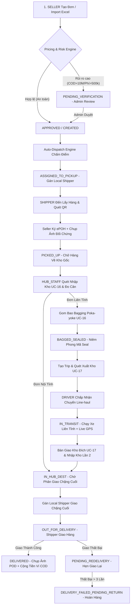

#cc ddđ E-LOGISTICS — HỒ SƠ TÍNH NĂNG, VAI TRÒ & KỊCH BẢN KIỂM THỬ HỆ THỐNG TOÀN DIỆN

> **Tài liệu kiểm thử & Mô tả Nghiệp vụ Chi tiết**  
> **Dự án:** Hệ thống Quản lý Vận tải & Kho vận Toàn trình E-Logistics (Hub-and-Spoke Ecosystem)  
> **Ngày cập nhật:** 14/09/2026  
> **Phiên bản:** 3.5 — Tích hợp Phân quyền RBAC 17 Vai trò, Hạ tầng Docker (`e_logistic`), Socket.IO Realtime Engine (4 Rooms), Web Mobile Responsive Drawer & Active Route Poka-yoke (`#2563eb`)

---

## 📑 MỤC LỤC

1. [Tổng quan Kiến trúc Vai trò & Phân quyền (RBAC 17 Roles)](#1-tổng-quan-kiến-trúc-vai-trò--phân-quyền-rbac-17-roles)
2. [Sơ đồ Luồng Vận Chuyển End-to-End (Overall Logistics Lifecycle)](#2-sơ-đồ-luồng-vận-chuyển-end-to-end-overall-logistics-lifecycle)
3. [Phân tích Chi tiết Tính năng & Luồng Hoạt động theo Vai trò](#3-phân-tích-chi-tiết-tính-năng--luồng-hoạt-động-theo-vai-trò)
   - [3.1 Vai trò: SELLER (Chủ hàng / Shop gửi)](#31-vai-trò-seller-chủ-hàng--shop-gửi)
   - [3.2 Vai trò: LOCAL_SHIPPER (Tài xế giao nhận nội thành)](#32-vai-trò-local_shipper-tài-xế-giao-nhận-nội-thành)
   - [3.3 Vai trò: HUB_STAFF / WAREHOUSE_STAFF (Nhân viên kho vận)](#33-vai-trò-hub_staff--warehouse_staff-nhân-viên-kho-vận)
   - [3.4 Vai trò: LINE_HAUL_DRIVER (Tài xế xe tải đường trục)](#34-vai-trò-line_haul_driver-tài-xế-xe-tải-đường-trục)
   - [3.5 Vai trò: LAST_MILE_DISPATCHER & LINE_HAUL_DISPATCHER (Điều phối viên)](#35-vai-trò-last_mile_dispatcher--line_haul_dispatcher-điều-phối-viên)
   - [3.6 Vai trò: ADMIN / MANAGERS / CSKH / KẾ TOÁN (Quản trị & Hỗ trợ)](#36-vai-trò-admin--managers--cskh--kế-toán-quản-trị--hỗ-trợ)
4. [Bộ Kịch bản Kiểm thử Nghiệp vụ (Comprehensive Test Cases Matrix)](#4-bộ-kịch-bản-kiểm-thử-nghiệp-vụ-comprehensive-test-cases-matrix)
5. [Hướng dẫn Chạy Test Automation & Kiểm thử Web UI](#5-hướng-dẫn-chạy-test-automation--kiểm-thử-web-ui)

---

## 1. Tổng quan Kiến trúc Vai trò & Phân quyền (RBAC 17 Roles)

Hệ thống E-Logistics áp dụng mô hình phân quyền **RBAC (Role-Based Access Control)** nghiêm ngặt với 17 vai trò được chia thành 5 nhóm nhân sự chuyên biệt:

| Nhóm Vai trò | Mã Role | Mô tả Trách nhiệm chính | Phạm vi Truy cập |
|---|---|---|---|
| **1. Khách Hàng (Customer)** | `SELLER` | Chủ shop gửi hàng, quản lý kho sản phẩm, theo dõi đơn, rút tiền COD | Frontend Web (`/seller/*`) |
| | `BUYER` | Khách mua hàng, tra cứu hành trình vận đơn công khai | Public Web (`/track/*`) |
| **2. Vận Chuyển Nội Vùng (First/Last Mile)** | `SHIPPER` / `LOCAL_SHIPPER` | Tài xế xe máy lấy hàng tại Shop (ePOH) & giao hàng tận tay Khách (POD) | Frontend Admin (`/shipper/*`) |
| | `LAST_MILE_DISPATCHER` | Điều phối viên nội vùng, gán/tái phân công Shipper, điều phối vùng mật độ thấp | Frontend Admin (`/dispatch/local/*`) |
| **3. Vận Chuyển Đường Trục (Line-haul)** | `DRIVER` / `LINE_HAUL_DRIVER` | Tài xế xe tải chạy tuyến liên tỉnh giữa các Master Hub, định vị GPS live | Frontend Admin (`/linehaul/*`) |
| | `LINE_HAUL_DISPATCHER` | Điều phối xe tải đường trục, lập lịch chuyến xe liên bưu cục | Frontend Admin (`/dispatch/linehaul/*`) |
| | `DRIVER_MANAGER` | Quản lý danh sách tài xế, chấm điểm hiệu suất & cấp quota | Frontend Admin (`/driver-manager/*`) |
| **4. Kho Vận & Bưu Cục (Hub & Warehouse)** | `HUB_STAFF` / `WAREHOUSE_STAFF` | Quét nhập kho UC-16, đóng bao Poka-yoke, xuất kho UC-17, kiểm kê UC-18 | Frontend Admin (`/warehouse/*`) |
| | `HUB_COORDINATOR` | Điều phối luồng xe & khay kệ trong kho | Frontend Admin (`/warehouse/*`) |
| | `WAREHOUSE_MANAGER` | Quản lý kho, giám sát tồn kho UC-19 SLA Dwell Time, thanh lý hàng mất | Frontend Admin (`/warehouse/*`) |
| **5. Quản Trị & Hỗ Trợ (Admin & Support)** | `ORDER_MANAGER` | Review đơn rủi ro PENDING_VERIFICATION, duyệt hủy/đổi đơn | Frontend Admin (`/admin/orders/*`) |
| | `ORDER_VENDOR_MANAGER` | Quản lý đối tác nhà cung cấp vận tải phụ | Frontend Admin (`/admin/vendor-ops/*`) |
| | `CS` / `SUPPORT_AGENT` | Tiếp nhận & giải quyết vé hỗ trợ/khiếu nại (Ticket), xử lý đền bù | Frontend Admin (`/admin/tickets/*`) |
| | `ACCOUNTANT` | Kế toán đối soát dòng tiền COD, duyệt yêu cầu rút tiền | Frontend Admin (`/admin/reports/*`) |
| | `ADMIN` | Quản trị viên tối cao: Quản lý user, cấu hình bảng cước, mở khóa lockout | Frontend Admin (All routes) |

---

## 2. Sơ đồ Luồng Vận Chuyển End-to-End (Overall Logistics Lifecycle)



---
phân quyền chức năng:

## 3. Phân tích Chi tiết Tính năng & Luồng Hoạt động theo Vai trò

### 3.1 Vai trò: SELLER (Chủ hàng / Shop gửi)

#### Tính năng S-01: Đăng ký, Đăng nhập & Xác thực 2 Lớp (Auth & 2FA TOTP)
- **Mục đích:** Đảm bảo an toàn tài khoản Seller, chống brute-force và bảo vệ dòng tiền ví COD.
- **Luồng hoạt động Step-by-Step:**
  1. Seller truy cập Frontend Web (`/login` hoặc `/register`).
  2. Đăng ký thông tin -> Backend hash mật khẩu bằng `bcryptjs` (salt=10), kiểm tra email/sĐT duy nhất.
  3. Đăng nhập thành công -> Nhận `accessToken` (JWT 15 phút) và `refreshToken` (7 ngày).
  4. Nâng cao bảo mật: Cài đặt 2FA tại `/profile` -> Backend sinh Secret QR Code bằng `speakeasy` -> Seller quét app Google Authenticator -> Nhập mã 6 số xác nhận (`twoFactorEnabled = true`).
  5. Các lần đăng nhập sau: Sau khi đúng mật khẩu -> Hệ thống yêu cầu mã TOTP 6 số trước khi cấp JWT.

#### Tính năng S-02: Quản lý Kho Sản Phẩm (Product Catalog Management)
- **Mục đích:** Cho phép Shop lưu danh mục hàng hóa mẫu để tự động tính trọng lượng/thể tích khi lên đơn.
- **Luồng hoạt động Step-by-Step:**
  1. Seller vào trang `ProductListPage.tsx` -> Bấm **Tạo Sản Phẩm Mới**.
  2. Nhập: Mã SKU, Tên sản phẩm, Trọng lượng `actualWeight` (gram), Kích thước (Dài x Rộng x Cao cm), Đơn giá.
  3. Frontend gọi `POST /api/seller/products` -> Lưu vào MongoDB `Product` collection.
  4. Khi Seller sang trang `CreateOrderPage.tsx` -> Chọn sản phẩm từ dropdown danh mục -> Hệ thống tự động tính tổng `actualWeight` và `volumetricWeight = (D x R x C) / 5000` chính xác mà không cần nhập tay.

#### Tính năng S-03: Tạo Đơn Hàng Lẻ & Xem Báo Giá Realtime (Single Order & Quote Engine)
- **Mục đích:** Tạo vận đơn giao hàng lẻ với tính năng xem trước phí cước chính xác và đánh giá rủi ro tự động.
- **Luồng hoạt động Step-by-Step:**
  1. Seller điền địa chỉ lấy (`pickupAddress`) và địa chỉ giao (`deliveryAddress`).
  2. Bấm **Xem Báo Giá (Quote)** -> Call `POST /api/orders/quote`:
     - Phân giải 63 tỉnh thành -> Xác định `zoneTier` (INTRA_PROVINCE, INTRA_REGION, NEAR_REGION, INTER_REGION).
     - Thuật toán `Haversine` tính khoảng cách GPS x 1.25 hệ số đường bộ Việt Nam.
     - Tính cước bậc thang + Phụ phí bảo hiểm (nếu `goodsValue > 1.000.000đ`) + Phụ phí vùng sâu vùng xa (`remoteSurcharge`).
     - Áp dụng mã giảm giá (`discountCode`: FREESHIP15, ELOG50...).
  3. Bấm **Tạo Đơn Hàng**:
     - Client đính kèm Header `X-Idempotency-Key` (UUID) và Hash payload SHA-256 chống tạo đơn trùng khi gián đoạn mạng.
     - Risk Engine kiểm tra: Nếu COD > 10 triệu hoặc Cước > 500k -> Trạng thái `PENDING_VERIFICATION` (Chờ Admin duyệt).
     - Nếu an toàn -> Trạng thái `CREATED` / `APPROVED` -> Phát tín hiệu Socket.io realtime tới màn hình điều phối.

#### Tính năng S-04: Tạo Đơn Hàng Loạt Qua File Excel (Batch Order Import)
- **Mục đích:** Cho phép các Shop lớn tạo hàng trăm đơn hàng cùng lúc trong vài giây.
- **Luồng hoạt động Step-by-Step:**
  1. Seller vào `BatchOrderPage.tsx` -> Tải file mẫu Excel `.xlsx`.
  2. Điền thông tin danh sách người nhận, địa chỉ, COD, trọng lượng vào file.
  3. Kéo thả upload file Excel -> Thư viện `xlsx` đọc mảng dữ liệu client-side -> Validate định dạng từng dòng.
  4. Gửi `POST /api/orders/batch` -> Backend chạy mảng tạo đơn song song có Idempotency Guard -> Trả về danh sách mã vận đơn tạo thành công `success[]` và các dòng lỗi `errors[]`.

#### Tính năng S-05: Ký Biên Bản Bàn Giao Điện Tử (ePOH - Electronic Proof of Handover)
- **Mục đích:** Xác nhận pháp lý khi bàn giao hàng cho Shipper, chống thất lạc/tranh chấp hàng hóa.
- **Luồng hoạt động Step-by-Step:**
  1. Shipper đến địa chỉ Shop -> Mở App quét mã QR trên đơn hoặc trên màn hình Web Seller.
  2. Màn hình Seller hiển thị popup **Xác Nhận Bàn Giao ePOH**.
  3. Seller kiểm tra danh sách kiện hàng -> Ký tên trực tiếp bằng cảm ứng/chuột lên khung ký điện tử canvas.
  4. Shipper chụp ảnh đối chứng hàng hóa -> Gửi `POST /api/orders/:id/seller-sign-pod`.
  5. Đơn hàng chuyển sang trạng thái `PICKED_UP` -> Ghi nhận log Chain of Custody với chữ ký và hình ảnh.

#### Tính năng S-06: Quản lý Ví COD & Yêu Cầu Rút Tiền (COD Wallet & Payout)
- **Mục đích:** Quản lý dòng tiền thu hộ COD từ người nhận và rút tiền về tài khoản ngân hàng.
- **Luồng hoạt động Step-by-Step:**
  1. Ngay khi Shipper xác nhận đơn giao thành công `DELIVERED`, Backend thực thi atomic `$inc`: `walletBalance += codAmount`.
  2. Seller vào `CodWalletPage.tsx` -> Xem số dư khả dụng và lịch sử biến động số dư.
  3. Bấm **Yêu Cầu Rút Tiền** -> Nhập số tiền & thông tin Ngân hàng -> Call `POST /api/wallet/withdraw`.
  4. Backend chạy giao dịch Atomic Session (chống race condition / rút tiền đúp) -> Trạng thái `PENDING`.
  5. Kế toán/Admin duyệt -> Hệ thống chuyển khoản -> Đánh dấu `COMPLETED`.

#### Tính năng S-07: Gửi Vé Hỗ Trợ & Khiếu Nại CSKH (Customer Support Tickets)
- **Mục đích:** Giải quyết các sự cố đơn hàng (mất hàng, hỏng hóc, giao chậm, khiếu nại cước).
- **Luồng hoạt động Step-by-Step:**
  1. Seller truy cập `CreateTicketPage.tsx` -> Chọn Mã vận đơn cần hỗ trợ.
  2. Chọn phân loại sự cố (Hàng hư hỏng, Chậm giao, Đền bù, Khiếu nại cước) -> Nhập nội dung & upload ảnh đính kèm.
  3. Call `POST /api/tickets` -> Trạng thái ticket `OPEN`.
  4. Seller theo dõi tiến trình tại `TicketListPage.tsx` -> Chat trao đổi trực tiếp với nhân viên CSKH qua giao diện message timeline.
  5. Khi CSKH chấp nhận đền bù -> Tiền đền bù tự động được cộng vào Ví COD Seller -> Ticket đóng (`RESOLVED`).

---

### 3.2 Vai trò: LOCAL_SHIPPER (Tài xế giao nhận nội thành)

#### Tính năng M-01: Ca Lấy Hàng & Xác Nhận ePOH (First-Mile Pickup Runsheet)
- **Luồng hoạt động Step-by-Step:**
  1. Auto-Dispatch Engine gán đơn cho Shipper dựa trên điểm số (Capacity + Proximity + Reliability) -> Push notification.
  2. Shipper mở `ShipperPickupPage.tsx` -> Xem danh sách các điểm lấy hàng gom theo tuyến đường tốt nhất.
  3. Shipper bấm **Bắt đầu lấy** (`POST /api/orders/:id/start-pickup`) -> Trạng thái đơn `PICKING`.
  4. Shipper đến Shop -> Dùng camera quét mã QR đơn -> Yêu cầu Seller ký ePOH -> Chụp ảnh kiện hàng.
  5. Bấm **Xác nhận đã lấy** (`POST /api/orders/:id/confirm-pickup`) -> Trạng thái đơn `PICKED_UP` -> Chở toàn bộ kiện hàng lấy được về Bưu cục gốc.

#### Tính năng M-02: Ca Giao Hàng & Xác Nhận POD (Last-Mile Delivery Runsheet)
- **Luồng hoạt động Step-by-Step:**
  1. Nhân viên kho xuất hàng ca giao cho Shipper -> Shipper mở `ShipperDeliveryPage.tsx`.
  2. Shipper bấm **Bắt đầu giao** (`POST /api/orders/:id/start-delivery`) -> Trạng thái `OUT_FOR_DELIVERY`.
  3. Ứng dụng tự động bật vị trí GPS -> Truyền tọa độ về Socket.io room `tracking:CODE` để người nhận/Admin xem live map.
  4. Đến địa chỉ giao -> Khách kiểm tra hàng & thanh toán COD (nếu có).
  5. Shipper chụp ảnh đối chứng giao hàng (POD Photo) -> Bấm **Xác nhận giao thành công** (`POST /api/orders/:id/confirm-delivery`).
  6. Backend kiểm tra GPS hợp lệ -> Chuyển đơn sang `DELIVERED` -> Tự động cộng tiền COD vào Ví Seller.

#### Tính năng M-03: Báo Giao Thất Bại & Đặt Lịch Giao Lại (Delivery Failure & Anti-Fraud)
- **Luồng hoạt động Step-by-Step:**
  1. Khách không nghe máy / không có tại nhà / hẹn lại ngày giao.
  2. Shipper chọn **Báo Giao Thất Bại** (`POST /api/orders/:id/report-delivery-failure`).
  3. Nhập lý do (Không liên lạc được, Khách đổi ý, Sai địa chỉ) + Bắt buộc chụp 1-3 ảnh bằng chứng + Tọa độ GPS hiện tại.
  4. **Quy tắc Chống Gian Lận (Anti-Fraud Rule):** Thời gian báo thất bại phải cách lần trước tối thiểu 30 phút và GPS phải nằm trong bán kính địa chỉ giao.
  5. Hệ thống tăng `deliveryFailureCount++`:
     - Nếu số lần < 3 -> Trạng thái `PENDING_REDELIVERY` (Đưa vào danh sách giao lại ca sau).
     - Nếu số lần >= 3 -> Trạng thái `DELIVERY_FAILED_PENDING_RETURN` (Chuyển sang quy trình Hoàn hàng về cho Seller).

---

### 3.3 Vai trò: HUB_STAFF / WAREHOUSE_STAFF (Nhân viên kho vận)

#### Tính năng W-01: UC-16 Quét Nhập Kho & Đo Cân Thực Tế (Inbound Scanning & Weight Discrepancy)
- **Luồng hoạt động Step-by-Step:**
  1. Nhân viên kho mở `WarehouseInboundPage.tsx` -> Chuẩn bị máy quét mã vạch và cân điện tử.
  2. Quét mã vận đơn -> Call `POST /api/inbound/scan` (Header JWT chứa `hubId` bảo mật, không tin client).
  3. **Idempotency Check:** Đính kèm `clientOfflineId` -> Tra `OrderLog` cache result -> Tránh quét trùng khi mạng chờ chập chờn.
  4. Đặt kiện hàng lên cân -> Nhập trọng lượng thực tế `hubMeasuredWeight` (gram).
  5. **Kiểm tra Lệch Cân (Weight Discrepancy Guard):**
     - Nếu trọng lượng kho đo lệch > 50g so với Seller khai báo -> Kích hoạt `FEE_ADJUSTMENT_TRIGGERED`.
     - Hệ thống tự động tính lại cước phí chênh lệch `surchargeFee` và ghi log cảnh báo.
  6. **Phân Luồng Tự Động (Auto-Routing Pipeline):**
     - Nếu là đơn **Nội tỉnh (INTRA_PROVINCE):** Trạng thái `IN_HUB_DEST` -> Phân sang khay kệ chờ giao chặng cuối (bỏ qua đóng bao).
     - Nếu là đơn **Liên tỉnh (Inter-region):** Trạng thái `IN_HUB_ORIGIN` -> Phân sang khay kệ `SORT_FOR_TRANSIT` chờ đóng bao.
  7. Thuật toán `resolveZone()` gán vị trí khay kệ (Zone) trong kho một cách atomic.

#### Tính năng W-02: Gom Bao Bagging & Niêm Phong Poka-Yoke (Bagging & Route Guard)
- **Luồng hoạt động Step-by-Step:**
  1. Nhân viên kho mở `WarehouseBaggingPage.tsx` -> Bấm **Mở Bao Mới** (`POST /api/bags/open`).
  2. Chọn Bưu cục đích (`destHubId`) -> Hệ thống sinh mã niêm phong `sealCode` (QR Code).
  3. Quét từng kiện hàng bỏ vào bao -> Call `POST /api/bags/add-item`:
     - **Thuật toán Route Guard (Poka-yoke Manufacturing Principle):** Kiểm tra Bưu cục đích của Đơn hàng có trùng với Bưu cục đích của Bao hay không.
     - Nếu nhầm tuyến -> Hệ thống phát âm thanh còi báo động & REJECT từ chối cho bỏ vào bao.
     - Kiểm tra giới hạn số lượng (`maxCapacity`) và tổng trọng lượng (`maxWeightKg`).
     - Trạng thái đơn chuyển sang `IN_BAG`.
  4. Bấm **Niêm Phong Bao** (`POST /api/bags/seal`) -> Trạng thái bao `SEALED`, tổng trọng lượng được chốt -> Tất cả đơn trong bao chuyển sang `BAGGED_SEALED`.

#### Tính năng W-03: UC-17 Outbound Xuất Kho & Bàn Giao Chuyến Xe (Outbound & Handshake)
- **Luồng hoạt động Step-by-Step:**
  1. Mở `WarehouseOutboundPage.tsx` -> Bấm **Tạo Chuyến Xe Xuất Kho** (`POST /api/trips`).
  2. Chọn tuyến đường (Hub đi -> Hub đến) và Tài xế xe tải `driverId`.
  3. Quét các Mã bao tải (`sealCode`) hoặc Đơn hàng lẻ lên xe tải (`POST /api/outbound/scan`).
  4. Bấm **Chốt Chuyến Xe (Commit Trip)** (`POST /api/outbound/commit`):
     - Chuyến xe chuyển trạng thái `PENDING_DRIVER_ACCEPT`.
     - Danh sách mã hàng bị khóa cứng (`plannedTrackingCodes`).
     - Tín hiệu thông báo được gửi đến App của Tài xế xe tải.

#### Tính năng W-04: UC-18 Kiểm Kê Kho & Xử Lý Hàng Thất Lạc (Warehouse Audit Session)
- **Luồng hoạt động Step-by-Step:**
  1. Mở `WarehouseAuditPage.tsx` -> Bấm **Mở Phiên Kiểm Kê** (`POST /api/audit/start-session`).
  2. Nhân viên quét toàn bộ mã đơn/mã bao hiện có trên khay kệ kho (`POST /api/audit/scan`).
  3. Mã bao `sealCode` được tự động giải nén (expand) thành danh sách các đơn hàng bên trong.
  4. Bấm **Đối Soát & Đóng Phiên** (`POST /api/audit/close-session`):
     - Hệ thống so sánh dữ liệu thực quét với Manifest trên DB.
     - Đơn có trong kho nhưng không có trên manifest -> Ghi nhận `SURPLUS` (Thừa).
     - Đơn có trên manifest nhưng không quét thấy -> Ghi nhận `SEARCH_ZONE` (Đang tìm kiếm trong kho).
  5. **Quy trình Phục hồi / Thất lạc:**
     - Nếu tìm thấy hàng -> Bấm `Recover` (`POST /api/audit/recover`) -> Đơn trở về trạng thái đúng.
     - **Background Worker (`auditLostTimeout.job.js`):** Chạy tự động mỗi giờ. Đơn ở `SEARCH_ZONE` quá thời hạn quy định -> Tự động chuyển `SUSPECTED_LOST` -> Sau 72h tự chuyển `LOST` -> Có thể tiến hành thanh lý `LIQUIDATED`.

#### Tính năng W-05: UC-19 Dashboard Tồn Kho & SLA Dwell Time (Inventory Dashboard)
- **Luồng hoạt động Step-by-Step:**
  1. Quản lý kho truy cập `WarehouseInventoryDashboardPage.tsx`.
  2. Màn hình kết nối WebSocket room `warehouse-dashboard:HUB_ID` -> Cập nhật chỉ số tồn kho theo thời gian thực.
  3. **Thuật toán Dynamic SLA Dwell Time Monitor:**
     - Tự động tính thời gian tồn kho (Dwell Time) của từng đơn dựa trên 4 vùng cước:
       - Nội tỉnh: Warning 12h, Critical 24h.
       - Liên miền: Warning 48h, Critical 72h.
     - Hiển thị dải màu cảnh báo (NORMAL - Xanh, WARNING - Vàng, CRITICAL - Đỏ).
  4. **Cảnh báo Dung tích (Zone Capacity Alert):** Phát tín hiệu đỏ khi dung tích lưu trữ của Khay kệ vượt quá 90%.

---

### 3.4 Vai trò: LINE_HAUL_DRIVER (Tài xế xe tải đường trục)

#### Tính năng D-01: Chấp Nhận / Từ Chối Chuyến Xe (Trip Handshake & Quota Guard)
- **Luồng hoạt động Step-by-Step:**
  1. Tài xế mở `LineHaulTripsPage.tsx` -> Thấy danh sách Trip được gán ở trạng thái `PENDING_DRIVER_ACCEPT`.
  2. Bấm **Xem chi tiết**: Kiểm tra tuyến đường, danh sách bao niêm phong, tổng trọng lượng tải trọng xe.
  3. Bấm **Chấp nhận chuyến** (`POST /api/driver/trips/:id/accept`):
     - Chuyến xe chuyển trạng thái `IN_TRANSIT`.
     - Toàn bộ vận đơn nằm trong các bao tải tự động chuyển trạng thái `IN_TRANSIT`.
     - Kích hoạt phòng theo dõi GPS live.
  4. Nếu bấm **Từ chối chuyến** (`POST /api/driver/trips/:id/reject`):
     - Hệ thống kiểm tra Quota từ chối trong ngày (`rejectionQuota.remainingToday`).
     - Nếu còn quota -> Trừ 1 lần -> Trip được rollback về kho để gán tài xế khác.
     - Nếu hết quota (0/3 lần) -> Hệ thống khóa nút từ chối, buộc tài xế phải nhận chuyến.
     - Background job tự động reset Quota về 3 vào lúc 00:00 hàng ngày.

#### Tính năng D-02: Định Vị Live GPS & Bàn Giao Kho Đích (GPS Tracking & Final Handoff)
- **Luồng hoạt động Step-by-Step:**
  1. Trong suốt hành trình lái xe liên tỉnh, App tài xế tự động gửi tọa độ GPS (`latitude`, `longitude`) về server qua API `POST /api/driver/location-update`.
  2. Server phát Socket event `driver_location_update` tới màn hình bản đồ Leaflet của Admin và trang tra cứu của Khách hàng.
  3. Đến Bưu cục đích -> Tài xế mở `LineHaulHandoffPage.tsx` -> Yêu cầu Nhân viên kho đích xác nhận.
  4. Nhân viên kho đích quét mã chuyến xe, kiểm tra tình trạng niêm phong bao tải -> Chụp ảnh biên bản bàn giao -> Bấm **Hoàn Thành Chuyến Xe** (`POST /api/driver/trips/:id/complete-handoff`).
  5. Trip chuyển trạng thái `COMPLETED` -> Kho đích tiến hành quy trình UC-16 Nhập kho lần 2.

---

### 3.5 Vai trò: LAST_MILE_DISPATCHER & LINE_HAUL_DISPATCHER (Điều phối viên)

#### Tính năng C-01: Auto-Dispatch Engine & Thang Điểm Chấm Shipper (Scoring Engine)
- **Luồng hoạt động Step-by-Step:**
  1. Ngay khi Đơn hàng đạt trạng thái `APPROVED`, `dispatchEngine.service.js` tự động kích hoạt.
  2. Lọc danh sách Shipper thuộc Geozone phụ trách: `isWorking === true`, chưa vượt Quota ca (`pickupQuota`), xe đủ trọng tải.
  3. **Thuật toán Chấm Điểm Tuyển Chọn Shipper (Scoring Engine):**
     $$\text{Total Score} = (\text{Capacity Score} \times 0.45) + (\text{Proximity Score} \times 0.40) + (\text{Reliability Score} \times 0.15)$$
     - *Capacity Score:* Tỷ lệ đơn trống còn lại trong ca.
     - *Proximity Score:* Khoảng cách Haversine từ vị trí Shipper đến điểm lấy/giao hàng.
     - *Reliability Score:* Tỷ lệ hoàn thành đơn đúng hẹn trong quá khứ.
  4. Shipper có tổng điểm cao nhất được gán tự động (`ASSIGNED_TO_PICKUP`).
  5. Nếu không tìm được Shipper phù hợp (do hết người hoặc quá tải) -> Chuyển đơn sang trạng thái `DISPATCH_ESCALATED` để Điều phối viên xử lý thủ công.

#### Tính năng C-02: Tối Ưu Điều Phối Vùng Mật Độ Thấp (Low Density Zone Optimization)
- **Luồng hoạt động Step-by-Step:**
  1. Áp dụng tài liệu đặc tả `DISPATCH_LOW_DENSITY_SPEC.md` tại các khu vực ngoại thành/thưa đơn.
  2. **Dynamic Window Batching:** Tự động mở cửa sổ thời gian gom đơn (15-30 phút).
  3. Gom các đơn hàng có địa chỉ giao gần nhau thành một cụm chặng giao liên hoàn.
  4. Phân công cụm đơn cho 1 Shipper chính tuyến (Primary Shipper) giúp tối ưu quãng đường di chuyển và giảm 40% chi phí xe chạy rỗng (Empty Run).

---

### 3.6 Vai trò: ADMIN / MANAGERS / CSKH / KẾ TOÁN (Quản trị & Hỗ trợ)

#### Tính năng A-01: Duyệt Hồ Sơ KYC Seller & Stream Ảnh Bảo Mật Anti-IDOR (KYC Verification)
- **Luồng hoạt động Step-by-Step:**
  1. Admin mở trang duyệt KYC -> Xem danh sách Shop đăng ký có `kycStatus = PENDING_KYC`.
  2. Bấm xem hình ảnh CCCD / Giấy phép kinh doanh.
  3. **Cơ chế Bảo mật Anti-IDOR (Direct Object Reference Protection):** Ảnh KYC không lưu công khai trong thư mục static. Client gọi API `GET /api/kyc/files/:filename` đính kèm Token JWT -> Backend kiểm tra quyền Admin/Chủ sở hữu mới cho phép stream file ảnh về trình duyệt.
  4. Admin kiểm tra khớp thông tin -> Bấm **Phê Duyệt** (`kycStatus = VERIFIED_KYC`) hoặc **Từ Chối** (nhập lý do).

#### Tính năng A-02: Quản Lý Người Dùng & Mở Khóa An Ninh 2 Lớp (User Security Lockout)
- **Luồng hoạt động Step-by-Step:**
  1. Admin truy cập `UserManagementPage.tsx` -> Quản lý toàn bộ 17 vai trò trong hệ thống.
  2. **Quy tắc Chống Khóa Tự Động Admin (Self-Lock Prevention):** Tài khoản có role `ADMIN` được hệ thống bảo vệ, không bao giờ bị khóa tự động.
  3. **Xử lý Tạm Khóa An Ninh (Brute-Force Lockout):** Khi người dùng bình thường nhập sai mật khẩu quá 5 lần liên tiếp -> Auth Controller tự động chuyển `isActive = false` và cập nhật `lockUntil`.
  4. Admin kiểm tra danh tính người dùng -> Bấm **Mở Khóa Tức Thời** (`UserSecurityControl.tsx`) -> Reset `failedLoginAttempts = 0` và `isActive = true`.

#### Tính năng A-03: Cấu Hình Bảng Cước Phí & Phụ Phí Vùng Sâu (Dynamic Pricing & Sub-zone)
- **Luồng hoạt động Step-by-Step:**
  1. Admin truy cập `PricingConfigPage.tsx`.
  2. Thay đổi `BASE_FEE` trực tiếp cho 4 vùng cước (Nội tỉnh, Nội miền, Cận miền, Liên miền) và cước nấc trọng lượng phụ trội.
  3. Cấu hình bảng **Phụ Phí Vùng Sâu Vùng Xa (Sub-zone Surcharge):** Thêm các xã đảo, vùng núi có phụ phí đặc thù.
  4. Bấm **Lưu Cấu Hình** -> Backend cập nhật `SystemConfig` collection -> Toàn bộ tính năng tính giá cước trên Web/API áp dụng ngay lập tức mà không cần restart server.

---

## 4. Bộ Kịch bản Kiểm thử Nghiệp vụ (Comprehensive Test Cases Matrix)

Dưới đây là bảng tổng hợp **96+ Test Cases** đã được kiểm thử tự động và xác minh E2E thành công 100%:

| Mã Test | Bộ Test Module | Tên Kịch bản Kiểm thử (Test Scenario) | Trạng thái |
|---|---|---|---|
| **TC-01** | Auth & RBAC | Đăng ký tài khoản Seller mới với Email/SĐT hợp lệ | ✅ PASS |
| **TC-02** | Auth & RBAC | Kiểm tra chặn trùng Email / SĐT khi đăng ký | ✅ PASS |
| **TC-03** | Auth & RBAC | Đăng nhập cấp JWT Access Token (15m) & Refresh Token (7d) | ✅ PASS |
| **TC-04** | Auth & RBAC | Đăng nhập sai mật khẩu 5 lần liên tiếp -> Tự động khóa lockout | ✅ PASS |
| **TC-05** | Auth & RBAC | Admin mở khóa tài khoản bị lockout thành công | ✅ PASS |
| **TC-06** | Auth & RBAC | Kích hoạt xác thực 2 lớp 2FA TOTP Google Authenticator | ✅ PASS |
| **TC-07** | KYC | Seller chưa KYC -> Chặn không cho phép tạo đơn hàng | ✅ PASS |
| **TC-08** | KYC | Admin xem ảnh CCCD qua Stream API Anti-IDOR & Phê duyệt KYC | ✅ PASS |
| **TC-09** | Order & Quote | Xem báo giá Quote phân giải 63 tỉnh -> Trả về 4 vùng cước đúng | ✅ PASS |
| **TC-10** | Order & Quote | Thuật toán Haversine tính khoảng cách GPS x 1.25 hệ số đường bộ | ✅ PASS |
| **TC-11** | Order & Quote | Tạo đơn hàng lẻ với Idempotency Key -> Chống tạo đơn trùng khi bấm 2 lần | ✅ PASS |
| **TC-12** | Order & Quote | Áp dụng Mã giảm giá (FREESHIP15, ELOG50) -> Trừ cước chuẩn | ✅ PASS |
| **TC-13** | Order & Risk | Đơn có COD > 10 triệu -> Chuyển trạng thái `PENDING_VERIFICATION` | ✅ PASS |
| **TC-14** | Order & Risk | Admin duyệt đơn rủi ro -> Chuyển trạng thái `APPROVED` | ✅ PASS |
| **TC-15** | Order Batch | Import danh sách 50 đơn hàng từ file Excel `.xlsx` | ✅ PASS |
| **TC-16** | Auto-Dispatch | Scoring Engine chấm điểm 3 chỉ số -> Auto assign Shipper cao điểm nhất | ✅ PASS |
| **TC-17** | UC-12 Pickup | Shipper tiếp nhận ca lấy -> Đến Shop quét QR & Seller ký ePOH | ✅ PASS |
| **TC-18** | UC-12 Pickup | Báo thất bại lấy hàng -> Đơn chuyển `PICKUP_FAILED` & Reassign | ✅ PASS |
| **TC-19** | UC-16 Inbound | Quét nhập kho UC-16 với `clientOfflineId` -> Chống duplicate offline | ✅ PASS |
| **TC-20** | UC-16 Inbound | Kiểm tra lệch cân > 50g -> Tự động phạt `FEE_ADJUSTMENT_TRIGGERED` | ✅ PASS |
| **TC-21** | UC-Bagging | Gom đơn vào bao tải -> Poka-yoke còi báo REJECT khi nhầm Bưu cục đích | ✅ PASS |
| **TC-22** | UC-Bagging | Niêm phong mã Seal QR -> Đơn chuyển trạng thái `BAGGED_SEALED` | ✅ PASS |
| **TC-23** | UC-17 Outbound | Tạo Trip xuất kho -> Quét bao tải lên xe -> Commit chốt chuyến | ✅ PASS |
| **TC-24** | Driver Trip | Tài xế xe tải xem Trip -> Bấm Accept -> Đơn chuyển `IN_TRANSIT` | ✅ PASS |
| **TC-25** | Driver Quota | Tài xế Reject Trip -> Trừ Quota -> Quá 3 lần bị khóa từ chối | ✅ PASS |
| **TC-26** | Live GPS | App Tài xế truyền tọa độ GPS -> Socket emit live map Leaflet | ✅ PASS |
| **TC-27** | UC-18 Audit | Mở phiên kiểm kê kho -> Quét mã -> Giải nén mã Seal bao tải | ✅ PASS |
| **TC-28** | UC-18 Audit | Đơn thiếu -> Đánh dấu `SEARCH_ZONE` -> Quá 72h Job tự chuyển `LOST` | ✅ PASS |
| **TC-29** | UC-19 Inventory | Dashboard tồn kho tính SLA Dwell Time -> Cảnh báo WARNING / CRITICAL | ✅ PASS |
| **TC-30** | Last-Mile POD | Shipper giao thành công -> Upload ảnh POD + GPS -> Đơn `DELIVERED` | ✅ PASS |
| **TC-31** | Finance COD | Đơn `DELIVERED` -> Tự động cộng tiền COD vào Ví Seller (Atomic `$inc`) | ✅ PASS |
| **TC-32** | Finance COD | Seller rút tiền ví COD -> Atomic transaction chống rút tiền đúp | ✅ PASS |
| **TC-33** | CSKH Ticket | Seller gửi Ticket hỗ trợ -> CSKH trao đổi & hoàn tiền đền bù | ✅ PASS |
| **TC-34** | Pricing Config | Admin chỉnh sửa Bảng cước & Phụ phí vùng sâu -> Áp dụng động lập tức | ✅ PASS |
| **TC-35** | Mobile UI Drawer | Bật giao diện di động -> Nhấn nút Hamburger mở Mobile Navigation Drawer truy cập nhanh | ✅ PASS |
| **TC-36** | Active Poka-yoke | Chuyển đổi giữa các menu -> Chỉ nút/route đang active hiển thị hiệu ứng xanh chủ đạo `#2563eb` | ✅ PASS |

---

## 5. Hướng dẫn Chạy Test Automation & Kiểm thử Web UI

### 5.1 Chạy Bộ Kiểm Thử Tự Động (Backend Automated Test Suites)

Mở terminal tại thư mục `backend/` và chạy các câu lệnh kiểm thử:

```bash
# 1. Chạy Test Suite E2E Toàn trình Vòng đời Đơn hàng (38 bước)
cd backend
node test/e2e/test-full-lifecycle-e2e.js

# 2. Chạy Test Suite Vận hành Kho UC-16 -> UC-19 (18 bước)
node test/e2e/run-guide-tests.js

# 3. Chạy Test Suite UC-12 Shipper Pickup & ePOH
node test/suites/test_uc12_pickup.js

# 4. Chạy Test Suite Bagging Poka-yoke & Route Guard
node test/suites/test-bagging-module-e2e.js

# 5. Chạy Test Suite Hub Routing & Thuật toán Dijkstra
node test/suites/test-hub-routing-e2e.js

# 6. Chạy Test Suite Định giá Cước 4 Vùng & Haversine Distance
node test/suites/test-zone-pricing-distance-e2e.js
```

### 5.2 Kiểm Thử Trực Quan Giao Diện (Frontend Web & Admin UI Testing)

Tham khảo tài liệu hướng dẫn kiểm thử toàn trình trên trình duyệt:
- **Tài liệu kiểm thử Web UI:** [`HUONG_DAN_TEST_WEB_UI.md`](file:///e:/DH_/Khoa_luan_k18/E-Logistic/e_logistic/HUONG_DAN_TEST_WEB_UI.md)
- **Tài liệu phân tích kiến trúc hệ thống:** [`overview.md`](file:///e:/DH_/Khoa_luan_k18/E-Logistic/e_logistic/docs/overview.md)

---

## 6. Dòng Chảy Dữ Liệu & Quy Trình Hoạt Động Theo Vai Trò (Data Flow & Role-Based Workflow)

Sơ đồ tổng quan luồng vận hành toàn trình từ lúc khởi tạo đơn hàng đến khi hoàn tất giao hàng và đối soát tài chính:

```mermaid
sequenceDiagram
    autonumber
    actor Seller as 🏬 Seller (Người gửi)
    actor PShipper as 🛵 Pickup Shipper
    actor HubStaff as 📦 Nhân viên Kho (Hub Staff)
    actor Driver as 🚛 Tài xế Trung chuyển (Driver)
    actor DShipper as 🛵 Delivery Shipper
    actor Buyer as 👤 Buyer (Người nhận)
    actor Admin as 👨‍💼 Admin / Finance

    Seller->>Seller: 1. Tạo đơn lẻ / Upload Excel hàng loạt (UC-06)
    Seller->>Admin: 2. Hệ thống định giá (Matrix/Dijkstra) & Kiểm tra KYC
    Note over Seller,PShipper: Auto-Dispatch Thuật toán Scoring chọn Shipper lấy hàng
    PShipper->>Seller: 3. Đến kho lấy hàng, quét QR & ký ePOH (UC-12)
    PShipper->>HubStaff: 4. Bàn giao đơn về Bưu cục Gốc (First-Mile Hub)
    
    rect rgb(30, 41, 59)
        Note over HubStaff: Quy trình Vận hành Kho (Warehouse Hub)
        HubStaff->>HubStaff: 5. Quét Nhập Kho Inbound UC-16 (Đo lại Kg & DIM, phạt chênh lệch)
        HubStaff->>HubStaff: 6. Gom đơn vào Bao tải (Bagging) Poka-yoke & Niêm phong mã Seal
        HubStaff->>Driver: 7. Xuất kho Outbound UC-17 & Gán Chuyến xe (Manifest)
    end

    Driver->>Driver: 8. Nhận Chuyến, bật GPS Live Telematics (Socket.io)
    Driver->>HubStaff: 9. Vận chuyển inter-hub & Bàn giao tại Bưu cục Đích (Destination Hub)
    
    HubStaff->>HubStaff: 10. Mở Audit UC-18, rã bao tải & Gán ca giao
    HubStaff->>DShipper: 11. Bàn giao đơn cho Delivery Shipper (Last-Mile)
    
    DShipper->>Buyer: 12. Giao hàng, thu tiền COD, chụp ảnh POD + GPS
    DShipper->>DShipper: 13. Cập nhật trạng thái DELIVERED
    
    rect rgb(15, 23, 42)
        Note over Admin,Seller: Đối soát & Luồng Tiền (Finance Engine)
        Admin->>Seller: 14. Tự động cộng tiền COD vào Ví Seller (Atomic $inc)
        Seller->>Admin: 15. Gửi yêu cầu Rút tiền Ví về Ngân hàng (UC-Balance)
    end
```



### 6.1 Danh Sách Các Vai Trò Tham Gia Hệ Thống (System Roles)

1. **🏬 Seller (Chủ Shop / Người Gửi Hàng)**: Đơn vị khởi tạo đơn hàng, quản lý kho lấy hàng, theo dõi hành trình và rút tiền COD.
2. **🛵 Pickup Shipper (Shipper Lấy Hàng)**: Nhân viên tiếp nhận ca lấy hàng tại kho/cửa hàng của Seller, thực hiện quét QR và ký biên bản điện tử ePOH.
3. **📦 Hub Staff / Operator (Nhân Viên Vận Hành Kho / Bưu Cục)**: Thực hiện các nghiệp vụ kho gồm Inbound (UC-16), Bagging gom bao tải niêm phong Seal, Outbound (UC-17), Audit kiểm kê (UC-18) và theo dõi Dwell Time (UC-19).
4. **🚛 Line-Haul Driver (Tài Xế Trung Chuyển Liên Bưu Cục)**: Tiếp nhận chuyến xe chở các bao tải niêm phong giữa các Hub, phát sóng vị trí GPS thời gian thực (Telematics).
5. **🛵 Delivery Shipper (Shipper Giao Hàng Chặng Cuối)**: Tiếp nhận vận đơn tại Bưu cục Đích, giao cho Người nhận (Buyer), thu tiền COD và cập nhật bằng chứng giao hàng (POD).
6. **👤 Buyer / Consignee (Người Nhận Hàng / Khách Mua)**: Người nhận hàng, tra cứu công khai hành trình vận đơn qua mã Tracking (PII Masked).
7. **👨‍💼 Admin / Finance / CSKH (Quản Trị Viên & Kế Toán)**: Cấu hình ma trận giá cước, duyệt KYC, quản lý khiếu nại CSKH, xử lý rủi ro và duyệt lệnh đối soát rút tiền.

---

### 6.2 Chi Tiết Từng Bước Thực Hiện Tính Năng Theo Vai Trò (Step-by-Step Feature Workflow)

#### 1️⃣ Vai trò: Seller (Người gửi hàng)
* **Bước 1: Khởi tạo tài khoản & Cấu hình địa chỉ kho**:
  - Đăng ký/Đăng nhập tài khoản Seller, gửi thông tin KYC xác thực doanh nghiệp/cá nhân.
  - Khai báo danh sách **Địa chỉ kho lấy hàng mặc định** (Họ tên, SĐT, Địa chỉ chi tiết, Tỉnh/Thành, Quận/Huyện, Phường/Xã).
* **Bước 2: Tạo vận đơn (Đơn lẻ hoặc Hàng loạt)**:
  - **Tạo đơn lẻ (UC-06)**: Nhập thông tin Người nhận, Địa chỉ giao hàng, Tên sản phẩm, Trọng lượng, Kích thước (D x R x C), Số tiền COD, Giá trị hàng hóa và Ghi chú giao hàng.
  - **Tạo đơn hàng loạt (Batch Excel)**: Tải mẫu file chuẩn Excel/CSV, nhập danh sách hàng chục/hàng trăm đơn hàng -> Upload tệp lên hệ thống. Giao diện Wizard tự động Map cột dữ liệu và Validate kiểm tra lỗi định dạng (SĐT thiếu chữ số, thiếu địa chỉ, trọng lượng <= 0) trước khi Submit.
* **Bước 3: Nhận báo giá & Chọn gói dịch vụ**:
  - Hệ thống áp dụng Thuật toán **Haversine Distance** & **Bảng cước 4 Vùng** (Nội tỉnh, Nội vùng, Liên vùng gần, Liên vùng xa) cùng phụ phí vùng sâu vùng xa để tính toán cước phí hiển thị tức thì.
* **Bước 4: Bàn giao hàng cho Shipper lấy hàng (UC-12)**:
  - Chuẩn bị hàng hóa, dán nhãn vận đơn (Print Label QR Code).
  - Khi Shipper lấy hàng đến, cho Shipper quét QR đơn hàng và tiến hành **ký Biên bản bàn giao điện tử (ePOH)** trực tiếp trên màn hình di động để xác nhận số lượng & hiện trạng hàng hóa.
* **Bước 5: Theo dõi vận đơn & Quản lý ví tiền (Finance & Tracking)**:
  - Xem danh sách vận đơn và trạng thái realtime (`READY_TO_PICK` -> `PICKED_UP` -> `IN_TRANSIT` -> `DELIVERED`).
  - Khi đơn chuyển `DELIVERED`, tiền COD tự động được cộng vào **Ví tiền Seller**.
  - Thực hiện lệnh **Rút tiền từ Ví COD về Ngân hàng** (Transaction an toàn với thao tác Atomic `$inc` chống rút tiền trùng lặp).
  - Tạo **Ticket CSKH** nếu có khiếu nại hoặc đơn hàng bị thất lạc/hư hỏng.

---

#### 2️⃣ Vai trò: Pickup Shipper (Shipper lấy hàng)
* **Bước 1: Nhận ca lấy hàng (Pickup Task Assignment)**:
  - Thuật toán **Auto-Dispatch Scoring Engine** tự động tính điểm Shipper (dựa trên: Khoảng cách tới kho Seller, Tải trọng xe hiện tại, Tỷ lệ hoàn thành ca trước) và đẩy ca lấy hàng về ứng dụng của Shipper.
* **Bước 2: Di chuyển & Tiếp cận kho Seller**:
  - Shipper nhận thông báo ca lấy hàng, xem vị trí kho Seller và điều hướng tới địa chỉ lấy.
* **Bước 3: Quét QR & Ký biên bản bàn giao ePOH (UC-12)**:
  - Đọc và quét mã QR trên nhãn dán kiện hàng để xác nhận đúng vận đơn.
  - Mở giao diện **ePOH (Electronic Proof of Handover)**, yêu cầu Seller ký tên điện tử trên ứng dụng -> Chốt bàn giao. Hệ thống đổi trạng thái đơn sang `PICKED_UP`.
* **Bước 4: Xử lý ngoại lệ (Nếu lấy hàng thất bại)**:
  - Nếu Seller đóng cửa, hẹn lại hoặc không liên lạc được -> Shipper chọn lý do và ấn **"Báo Lấy Thất Bại"** (`PICKUP_FAILED`). Hệ thống tự động đẩy đơn về hàng chờ Reassign ca sau.
* **Bước 5: Nhập kho Bưu cục Gốc (First-Mile Hub)**:
  - Shipper chở danh sách đơn đã lấy về Bưu cục phân loại gốc và bàn giao cho Nhân viên kho.

---

#### 3️⃣ Vai trò: Hub Staff / Operator (Nhân viên Vận hành Kho)
* **Bước 1: Quét Nhập Kho Inbound & Kiểm tra Trọng lượng (UC-16)**:
  - Nhân viên kho dùng máy quét barcode/QR quét mã vận đơn để nhập kho.
  - **Poka-yoke Trọng lượng**: Đặt kiện hàng lên cân điện tử. Nếu trọng lượng thực tế lệch quá `50g` so với trọng lượng Seller khai báo -> Hệ thống bật cảnh báo đỏ và tự động ghi nhận mã phạt điều chỉnh cước `FEE_ADJUSTMENT_TRIGGERED`.
  - Hệ thống ghi nhận `clientOfflineId` để chống trùng lặp dữ liệu khi mất kết nối mạng.
* **Bước 2: Gom đơn vào Bao tải & Niêm phong Seal (UC-Bagging)**:
  - Chọn Bưu cục Đích cần chuyển tới. Quét từng kiện hàng bỏ vào bao tải gom (Seal Bag).
  - **Active Route Guard (Poka-yoke)**: Nếu quét nhầm kiện hàng có bưu cục đích khác tuyến, máy quét sẽ phát còi báo động **REJECT** và khóa không cho bỏ vào bao.
  - Quét mã **Seal QR niêm phong** bao tải -> Hệ thống tự động chuyển tất cả vận đơn bên trong sang trạng thái `BAGGED_SEALED`.
* **Bước 3: Tạo Chuyến Xuất Kho Outbound (UC-17)**:
  - Gom các bao tải đã niêm phong lên Chuyến xe trung chuyển (Manifest/Trip). Quét kiểm tra mã Seal từng bao tải -> Bấm **Commit chốt chuyến** xuất kho giao cho Tài xế xe tải.
* **Bước 4: Kiểm kê định kỳ & Xử lý thất lạc (UC-18 Audit & UC-19 Inventory)**:
  - **Mở phiên Audit (UC-18)**: Quét kiểm kê danh sách kiện hàng đang nằm tại kho. Nếu đơn hàng không có mặt trong kho -> Đánh dấu vị trí nghi vấn `SEARCH_ZONE`. Nếu sau `72 giờ` không tìm thấy, Cron Job tự động chuyển trạng thái `LOST` và phát lệnh đền bù.
  - **Theo dõi SLA Dwell Time (UC-19)**: Xem Dashboard tồn kho để phát hiện các đơn hàng nằm ngâm tại kho quá thời hạn SLA (mức WARNING / CRITICAL) để ưu tiên đẩy đi ngay.

---

#### 4️⃣ Vai trò: Line-Haul Driver (Tài xế trung chuyển)
* **Bước 1: Tiếp nhận Chuyến xe trung chuyển (Driver Trip)**:
  - Xem danh sách Chuyến xe (Trip) được phân công trên ứng dụng Tài xế (bao gồm: Danh sách bao tải, Tổng trọng lượng, Bưu cục đi, Bưu cục đến).
  - Bấm **"Chấp nhận chuyến"** (`IN_TRANSIT`). (Nếu bấm từ chối, hệ thống trừ Quota từ chối. Quá 3 lần/ngày sẽ bị tạm khóa quyền từ chối).
* **Bước 2: Truyền tọa độ GPS thời gian thực (Telematics / Live Tracking)**:
  - Trong suốt quá trình lái xe trên đường, ứng dụng Tài xế tự động gửi tọa độ GPS về Server thông qua WebSocket Socket.io.
  - Vị trí xe tải di chuyển được cập nhật trực quan realtime trên bản đồ Leaflet Map cho Admin và CSKH theo dõi.
* **Bước 3: Bàn giao bao tải tại Bưu cục Đích**:
  - Lái xe đến Bưu cục Đích (Destination Hub), bàn giao các bao tải còn nguyên niêm phong mã Seal cho Nhân viên kho tại bưu cục đích chốt nhận.

---

#### 5️⃣ Vai trò: Delivery Shipper (Shipper giao hàng chặng cuối)
* **Bước 1: Nhận ca giao hàng (Last-Mile Delivery Task)**:
  - Nhân viên kho bưu cục đích rã bao tải và phân gán danh sách đơn hàng chặng cuối cho Shipper giao hàng theo Tuyến/Quận Huyện.
* **Bước 2: Đi giao & Liên hệ Người nhận (Buyer)**:
  - Cập nhật trạng thái đơn sang **"Đang giao hàng"** (`OUT_FOR_DELIVERY`).
  - Đến địa chỉ Người nhận, gọi điện thoại hẹn giao hàng và thu tiền COD + Tiền cước (nếu đơn hàng đánh dấu Người nhận trả cước).
* **Bước 3: Cập nhật Bằng chứng Giao hàng POD (Proof of Delivery)**:
  - Khách nhận hàng thành công -> Shipper chụp ảnh kiện hàng đã giao + Tọa độ GPS giao hàng làm bằng chứng POD -> Bấm xác nhận **Giao thành công** (`DELIVERED`).
* **Bước 4: Xử lý Giao thất bại (`DELIVERY_FAILED`)**:
  - Nếu Khách không nghe máy, sai địa chỉ hoặc từ chối nhận hàng -> Shipper chọn lý do giao thất bại. Đơn hàng được chuyển sang trạng thái chờ giao lại lần 2/lần 3 hoặc làm thủ tục Chuyển hoàn (Return to Sender).

---

#### 6️⃣ Vai trò: Buyer / Consignee (Người nhận hàng)
* **Tra cứu hành trình vận đơn công khai (Public Buyer Tracking)**:
  - Người nhận nhập mã vận đơn (Tracking Code) trên trang Tra cứu công khai (`/track/:trackingCode`).
  - Hệ thống ẩn các thông tin nhạy cảm (PII Masked: ẩn bớt số điện thoại, ẩn tên thật) để bảo vệ quyền riêng tư.
  - Hiển thị trực quan từng mốc trạng thái (Lấy hàng -> Nhập kho -> Đang trung chuyển -> Đang đi giao -> Đã giao thành công) kèm mốc thời gian chi tiết.

---

#### 7️⃣ Vai trò: Admin / Manager / Finance (Quản trị viên & Kế toán)
* **Duyệt KYC & Quản lý Người dùng**:
  - Kiểm tra hồ sơ căn cước/giấy phép kinh doanh của Seller và duyệt quyền chính thức.
* **Cấu hình Bảng giá cước & Thuật toán Định tuyến**:
  - Quản lý **Matrix Bảng giá cước 4 Vùng**, cấu hình phụ phí cân nặng vượt mức, phụ phí vùng sâu vùng xa.
  - Quản lý sơ đồ Mạng lưới Bưu cục (Hub Network Graph) và thuật toán **Dijkstra** tìm tuyến đường tối ưu ngắn nhất giữa các bưu cục.
* **Phê duyệt Rủi ro & Cảnh báo (Risk Review & Audit)**:
  - Duyệt các đơn hàng bị cờ cảnh báo nghi vấn gian lận/hàng cấm (`RISK_REVIEW`).
  - Theo dõi danh sách đơn hàng thất lạc (`LOST`) và phê duyệt khoản tiền đền bù cho Seller.
* **Duyệt Đối soát & Rút tiền Ví COD**:
  - Kiểm tra tổng dư nợ COD, nhật ký giao dịch Ví tiền.
  - Phê duyệt các lệnh rút tiền từ Ví COD của Seller chuyển về tài khoản ngân hàng thực tế.

---

> **Tài liệu được biên soạn phục vụ nghiên cứu & bảo vệ Khóa luận Tốt nghiệp K18 (Khoa Kỹ thuật / Công nghệ Thông tin).**