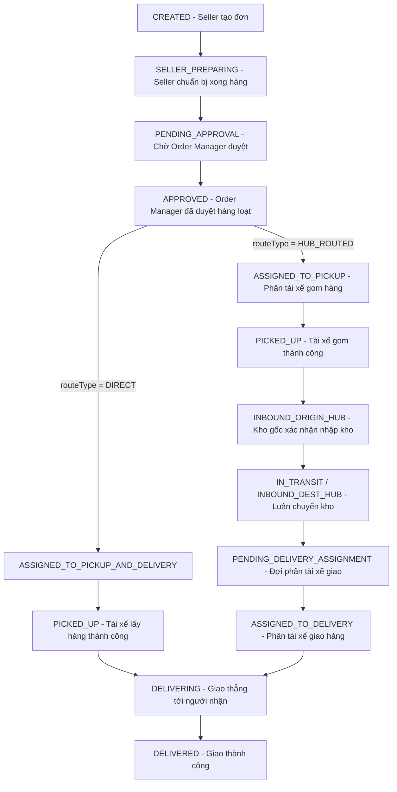

# BẢN PHÂN TÍCH VÀ CHỐT KẾ HOẠCH LUỒNG NGHIỆP VỤ ĐƠN HÀNG + 3 VAI TRÒ QUẢN LÝ TRUNG GIAN

> **Trạng thái:** ĐÃ THỐNG NHẤT & CHỐT PHƯƠNG ÁN (Sẵn sàng triển khai code)  
> **Hệ thống target:** Backend Node.js/Express + MongoDB (Mongoose) + Frontend React/TypeScript

---

## 1. TỔNG QUAN & NGUYÊN TẮC GIỮ NGUYÊN HẠ TẦNG

1. **Giữ nguyên hạ tầng Đa Kho (Multi-Hub Infrastructure):**
   - Giữ nguyên các Model & Logic lõi: `Hub`, `HubCoverage`, `HubConnection`, `routeNodes`, thuật toán `Dijkstra` tính tuyến đường.
   - Giữ nguyên các Use Case lõi đã hoàn thiện: UC06 (Tạo đơn), UC12 (Tài xế gom hàng), UC13-15 (Giao hàng/Giao lại/Thất bại/Hoàn), UC16 (Nhập kho Origin/Dest).
2. **Bổ sung Lớp Điều phối Trung gian (Human Coordination Layer):**
   - Chèn thêm 3 vai trò quản lý độc lập vào giữa Seller và Driver để kiểm soát luồng vận hành, phân quyền chính xác và chống sót/lỗi đơn.

---

## 2. PHÂN CÔNG VAI TRÒ QUẢN LÝ & PHẠM VI TRUY CẬP (SCOPE)

| Vai trò | Tên Tiếng Việt | Nhiệm vụ chính | Phạm vi phân quyền (Scope) |
| :--- | :--- | :--- | :--- |
| **`ORDER_MANAGER`** | Quản lý Đơn hàng | Review & Duyệt đơn hàng loạt từ Seller. | **Toàn hệ thống** (Không chặn theo khu vực, hỗ trợ lọc UI theo tỉnh/thành `groupBy=region`). |
| **`DRIVER_MANAGER`** | Quản lý Tài xế / Dispatcher | Phân công tài xế gom/giao theo khu vực; Duyệt yêu cầu từ chối đơn của tài xế. | **Theo Khu vực** (`serviceAreas: [{ province, district }]`). |
| **`WAREHOUSE_MANAGER`** | Quản lý Kho | Xác nhận Nhập/Xuất kho tại bưu cục phụ trách. | **Gắn với 1 Hub cụ thể** (`assignedHubId`). Áp dụng middleware `requireOwnHub`. |

---

## 3. STATE MACHINE & 2 NHÁNH ĐƠN HÀNG (`DIRECT` vs `HUB_ROUTED`)

Trường `routeType` được hệ thống tự động xác định khi tạo/tính route:
- **`DIRECT`**: Địa chỉ lấy và giao thuộc cùng 1 Hub quản lý (Giao thẳng, không qua kho).
- **`HUB_ROUTED`**: Đơn hàng liên khu vực / liên tỉnh (Bắt buộc luân chuyển qua 1 hoặc nhiều Hub).



---

## 4. CHI TIẾT QUY TRÌNH XỬ LÝ TỪ CHỐI ĐƠN & QUOTA TÀI XẾ

### 4.1 Luồng xử lý Yêu cầu Từ chối (Rejection Request Flow)
1. **Tài xế gửi yêu cầu:** Tài xế bấm "Từ chối nhận đơn" + nhập lý do.
   - Cập nhật `pickupAssignment.status` (hoặc `deliveryAssignment.status`) thành `'REJECT_REQUESTED'`.
   - Trạng thái tổng của đơn KHÔNG đổi (vẫn giữ `ASSIGNED_TO_PICKUP` / `ASSIGNED_TO_DELIVERY`).
2. **Quyết định chốt về Quota:**
   - **Trừ quota ngay khi gửi yêu cầu (Option A - Đã chọn):** Trừ 1 lượt `rejectionQuota.remainingToday` ngay tại mốc bấm gửi yêu cầu từ chối để ngăn chặn hành vi từ chối thử / spam yêu cầu lên hệ thống.
3. **Driver Manager duyệt yêu cầu:**
   - **DENY (Từ chối yêu cầu từ chối):** Trạng thái assignment quay về `'ASSIGNED'`, buộc tài xế cũ phải tiếp tục thực hiện đơn.
   - **APPROVE (Chấp thuận từ chối):** Trạng thái assignment thành `'REJECTED_CONFIRMED'`, đơn hàng quay về `'APPROVED'` (với pickup) hoặc `'PENDING_DELIVERY_ASSIGNMENT'` (với delivery), đồng thời Driver Manager gán ngay tài xế mới trong cùng 1 request.

### 4.2 Cơ chế Reset Quota từ chối (3 lần/ngày/tài xế)
- **Cơ chế 1 (Cron job chính):** Chạy định kỳ lúc `00:00` hàng ngày để reset `remainingToday = 3` cho tất cả User role `DRIVER`.
- **Cơ chế 2 (Lazy Reset):** Tại API xử lý từ chối, kiểm tra `lastResetDate`. Nếu khác ngày hiện tại, tự động reset quota về 3 trước khi thực hiện trừ (Phòng trường hợp Cron job bị hoãn/trễ).

---

## 5. THAY ĐỔI SCHEMA (MODEL BLUEPRINT)

### 5.1 `user.model.js`
```javascript
// Bổ sung các Role mới
role: {
  type: String,
  enum: [
    'SELLER', 'BUYER', 'DRIVER', 'LINE_HAUL_DRIVER', 
    'HUB_STAFF', 'HUB_COORDINATOR', 'CS', 'ACCOUNTANT', 'ADMIN',
    'ORDER_MANAGER', 'DRIVER_MANAGER', 'WAREHOUSE_MANAGER'
  ],
  default: 'BUYER'
},

// Dành riêng cho WAREHOUSE_MANAGER - Kho được giao quản lý
assignedHubId: {
  type: mongoose.Schema.Types.ObjectId,
  ref: 'Hub',
  default: null
},

// Dành cho DRIVER_MANAGER & DRIVER - Khu vực hoạt động / phụ trách
serviceAreas: [{
  province: { type: String, required: true },
  district: { type: String, required: true }
}],

// Dành cho DRIVER - Quota từ chối đơn hàng trong ngày
rejectionQuota: {
  remainingToday: { type: Number, default: 3 },
  lastResetDate: { type: Date, default: Date.now }
}
```

### 5.2 `order.model.js`
```javascript
// Cập nhật Enum status & routeType
routeType: {
  type: String,
  enum: ['DIRECT', 'HUB_ROUTED'],
  default: 'HUB_ROUTED'
},

status: {
  type: String,
  enum: [
    'DRAFT', 'CREATED', 'SELLER_PREPARING', 'PENDING_APPROVAL', 'APPROVED',
    'ASSIGNED_TO_PICKUP', 'ASSIGNED_TO_PICKUP_AND_DELIVERY', 'PICKED_UP',
    'INBOUND_ORIGIN_HUB', 'IN_TRANSIT', 'INBOUND_DEST_HUB',
    'PENDING_DELIVERY_ASSIGNMENT', 'ASSIGNED_TO_DELIVERY',
    'DELIVERING', 'DELIVERED',
    'PENDING_REDELIVERY', 'DELIVERY_FAILED_PENDING_RETURN', 'CANCELLED'
  ]
},

sellerPreparedAt: { type: Date, default: null },

// Bước duyệt đơn hàng bởi Order Manager
orderApproval: {
  approvedBy: { type: mongoose.Schema.Types.ObjectId, ref: 'User', default: null },
  approvedAt: { type: Date, default: null }
},

// Phân công chặng lấy hàng (Pickup) - Thay thế hoàn toàn assignedShipperId cũ
pickupAssignment: {
  driverId: { type: mongoose.Schema.Types.ObjectId, ref: 'User', default: null },
  assignedBy: { type: mongoose.Schema.Types.ObjectId, ref: 'User', default: null },
  assignedAt: { type: Date, default: null },
  status: { 
    type: String, 
    enum: ['ASSIGNED', 'REJECT_REQUESTED', 'REJECTED_CONFIRMED'], 
    default: 'ASSIGNED' 
  },
  rejectReason: { type: String, default: null }
},

// Phân công chặng giao hàng (Delivery)
deliveryAssignment: {
  driverId: { type: mongoose.Schema.Types.ObjectId, ref: 'User', default: null },
  assignedBy: { type: mongoose.Schema.Types.ObjectId, ref: 'User', default: null },
  assignedAt: { type: Date, default: null },
  status: { 
    type: String, 
    enum: ['ASSIGNED', 'REJECT_REQUESTED', 'REJECTED_CONFIRMED'], 
    default: 'ASSIGNED' 
  },
  rejectReason: { type: String, default: null }
}
```

---

## 6. DANH SÁCH API CẦN TRIỂN KHAI PHÍA BACKEND

### 6.1 API dành cho Seller
- `PATCH /api/orders/:id/mark-prepared`
  - **Auth:** `SELLER`
  - **Logic:** Đơn ở trạng thái `CREATED` → Chuyển sang `PENDING_APPROVAL`, ghi nhận `sellerPreparedAt`.

### 6.2 API dành cho Order Manager
- `GET /api/order-manager/pending-approval?groupBy=region`
  - **Auth:** `ORDER_MANAGER`
  - **Logic:** Lấy danh sách đơn hàng `PENDING_APPROVAL`, hỗ trợ gom nhóm theo tỉnh/thành phố để hiển thị tab UI.
- `POST /api/order-manager/bulk-approve`
  - **Auth:** `ORDER_MANAGER`
  - **Body:** `{ orderIds: String[] }`
  - **Logic:** Kiểm tra atomic từng đơn `PENDING_APPROVAL` → Chuyển thành `APPROVED`, set `orderApproval`. Trả về kết quả tổng hợp `approvedCount` và danh sách đơn bị skip.

### 6.3 API dành cho Driver Manager
- `GET /api/driver-manager/pending-pickup-assignment`
  - **Auth:** `DRIVER_MANAGER` (Lọc theo `serviceAreas` của Manager).
- `GET /api/driver-manager/pending-delivery-assignment`
  - **Auth:** `DRIVER_MANAGER` (Lọc theo `serviceAreas` của Manager).
- `GET /api/driver-manager/drivers-by-area?province=&district=`
  - **Auth:** `DRIVER_MANAGER`
- `POST /api/driver-manager/assign-pickup`
  - **Body:** `{ orderIds: String[], driverId: String }`
  - **Logic:** Với đơn `DIRECT` → Chuyển `ASSIGNED_TO_PICKUP_AND_DELIVERY`. Với đơn `HUB_ROUTED` → Chuyển `ASSIGNED_TO_PICKUP`.
- `POST /api/driver-manager/assign-delivery`
  - **Body:** `{ orderIds: String[], driverId: String }`
  - **Logic:** Đơn `HUB_ROUTED` ở `PENDING_DELIVERY_ASSIGNMENT` → Chuyển `ASSIGNED_TO_DELIVERY`.
- `POST /api/driver-manager/review-rejection`
  - **Body:** `{ orderId, assignmentType: 'PICKUP'|'DELIVERY', decision: 'DENY'|'APPROVE', newDriverId? }`
- `GET /api/driver-manager/drivers-quota-exhausted`
  - **Auth:** `DRIVER_MANAGER` / `ADMIN`
  - **Logic:** Trả về danh sách tài xế đã dùng hết 3 lượt từ chối trong ngày để theo dõi hiệu suất.

### 6.4 API dành cho Driver
- `POST /api/driver/pickup/:orderId/reject` & `POST /api/driver/delivery/:orderId/reject`
  - **Body:** `{ reason: String }`
  - **Logic:** Trừ 1 quota (nếu `remainingToday > 0`), set `status = 'REJECT_REQUESTED'`, bắn notification tới Driver Manager.

### 6.5 Middleware Bảo vệ Kho cho Warehouse Manager
- `requireOwnHub` Middleware:
```javascript
exports.requireOwnHub = (req, res, next) => {
  const requestedHubId = req.body.hubId || req.params.hubId || req.query.hubId;
  if (req.user.role === 'WAREHOUSE_MANAGER') {
    if (!req.user.assignedHubId || req.user.assignedHubId.toString() !== requestedHubId?.toString()) {
      return res.status(403).json({ message: 'Không có quyền thao tác trên bưu cục/kho này' });
    }
  }
  next();
};
```

---

## 7. ĐÁNH GIÁ VÀ KẾT LUẬN

Plan trên đã giải quyết triệt để bài toán hổng nghiệp vụ điều phối trung gian, giữ trọn vẹn hạ tầng Đa kho và Routing hiện có, tối ưu hóa trải nghiệm giao hàng nội tỉnh (`DIRECT`) và liên tỉnh (`HUB_ROUTED`), đồng thời bổ sung cơ chế kiểm soát từ chối đơn tài xế chặt chẽ.
